# Introduction to Deep Learning Concepts

## Overview

- **Focus**: High-level understanding of deep learning models.
- **Aim**: Provide a conceptual foundation before diving into math and implementation.

## Key Concepts

### Artificial Neural Networks (ANN)

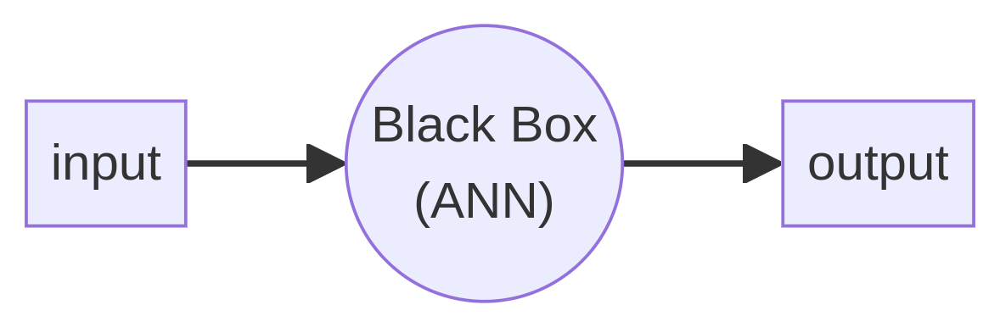

- **Function**: Transform input data into output predictions.
- **Learning Mechanism**: Involves a series of computations that can appear complex but rely on simple mathematics.

### Input/Output Transformation Examples

1. **Web Browsing Predictions**:
   

2. **Medical Diagnosis**:
   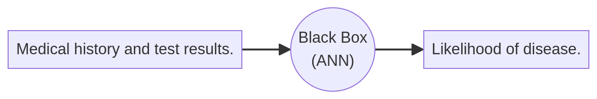

3. **Self-Driving Cars**:
   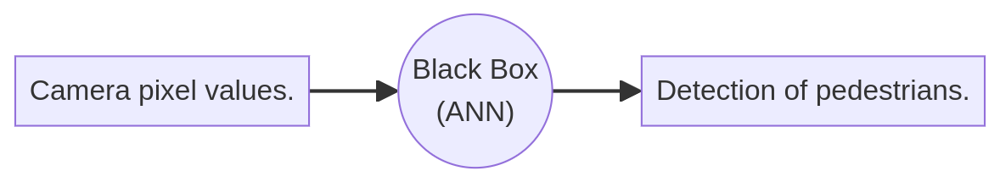

## Visualization of Concepts

### Example: Student Exam Prediction

- **Input Features**: Hours studied and hours slept.
- **Output**: Pass/Fail prediction.
  
| X1 (Hours Studied) | X2 (Hours Slept) | Y (Result) |
|---------------------|------------------|------------|
| 2                   | 4                | Success    |
| 6                   | 5.5              | Fail       |
| 8.5                 | 7.2              | Success    |

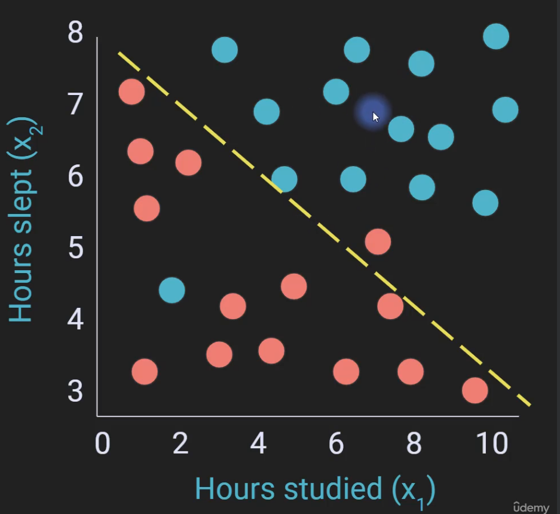

### Decision Boundary

- Linear solution: A line separating the two classes.
- Not perfect but effective.

### Non-Linear Solutions

- **Trickier Problem**:
  - Example: Classifying yellow squares from blue dots (not linearly separable).
  - Deep learning excels at finding complex non-linear solutions.

## Basic Mathematical Representation

- **Prediction Equation**:
$$\hat{y} = x_1 \times w_1 + x_2 \times w_2 $$
  - $\hat{y}$: Model's output.
  - $x$: Input data.
  - $w$: Weights (importance of each feature).

- **Learning Weights**:
  - Weights are learned through a process called backpropagation.
  - Irrelevant features (e.g., unusual variables) are assigned a weight of zero.

## Deep Learning Architecture

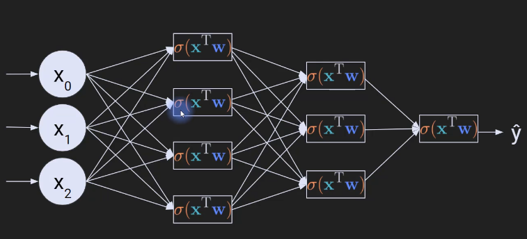

- **Building Blocks**:
  - Each neuron represents a simple equation (weighted sum + non-linearity).
  - Complex models are built by stacking these neurons (layers).

- **Different Architectures**:
  - Various visual representations exist for different models.
  - All share underlying mathematical principles.

- **Analogy**:

  - Different buildings (models) serve different purposes but share common utilities (e.g., electricity, plumbing).
  
### Model Families

1. **ANN**: General-purpose for tabular data.
2. **CNN (Convolutional Neural Network)**: For image data.
3. **RNN (Recurrent Neural Network)**: For sequential data (e.g., Audio, text).

# How Models Learn

## Overview

- Key concepts: Forward Propagation and Backward Propagation (Back Prop).
- Use of analogies to simplify complex ideas.

## Silly Analogy: Peanut Butter and Jelly Sandwich

- Imagine being a chef specializing in PB&J sandwiches.
- Goal: Make the best sandwiches by iterating based on customer feedback.
- Note that:
  - Analogies are useful for initial understanding.
  - All analogies break down at some point; they serve as mnemonic devices.

### Learning Process

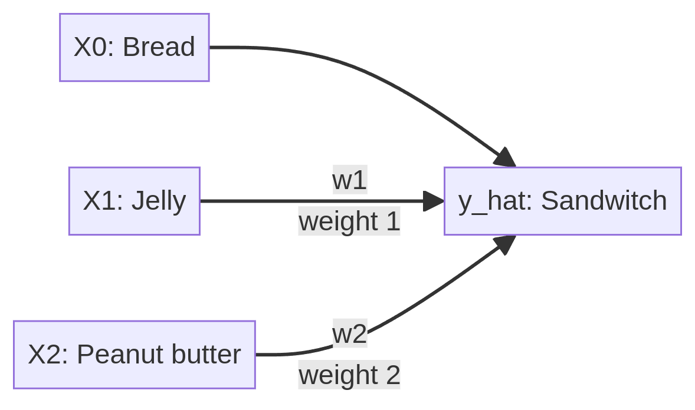

- **Feedback Loop**:
  - Customer provides feedback (e.g., "Too sweet").
  - Adjust ingredients (jelly or peanut butter) based on feedback.
  - Continue iterating until customer is satisfied.

## Mapping the Analogy to Deep Learning

### Forward Propagation

- **Output**: The sandwich (final product).
- **Inputs**: Ingredients (data points).
  - $X_0$: Bread (constant, no weight).
  - $X_1$: Jelly (weighted).
  - $X_2$: Peanut butter (weighted).
- **Weights**:
  - $w_1$: Amount of jelly.
  - $w_2$: Amount of peanut butter.
- **Process**:
  - Combine inputs with their weights to create the output (sandwich).
  - Forward Propagation moves from inputs to outputs.

### Backward Propagation

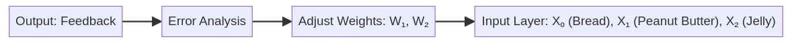

- **Error Message**:
  - Feedback (e.g., "Too sweet") is sent back through the model.
- **Adjustment of Weights**:
  - Adjust $w_1$ and $w_2$ based on feedback.
  - Involves calculus and optimization (gradient descent).
  
## Expanded Analogy: A Business Model

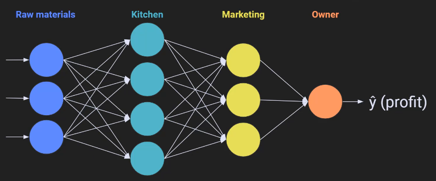

- Imagine running a PB&J sandwich business with multiple departments:
  - **Raw Ingredients**: Bread, peanut butter, jelly.
  - **Kitchen Staff**: Assembling sandwiches.
  - **Marketing Team**: Promoting the sandwiches.
  - **CEO**: You, monitoring profits.

### Flow of Information

- **Forward Propagation**:
  - Money, services, and labor flow through the business.
  - Combine resources to predict profit.
  
- **Backward Propagation**:
  - When profits drop, feedback flows from CEO to marketing to kitchen.
  - Each department must evaluate and adjust based on feedback.

## Key Takeaways

- **Forward Propagation**: Flow of information from inputs to outputs in one direction.
- **Backward Propagation (Back Prop)**: Single feedback signal flows back to adjust the model.
  
# Philosophy of Deep Learning

- Deep learning is linked to the pursuit of general intelligence or consciousness.
- It challenges traditional scientific approaches to knowledge discovery:
  - **Traditional Approach**:
    - Develop theories based on first principles.
    - Run experiments to validate or refute theories.
  - **Deep Learning Approach**:
    - Empirical, data-driven method.
    - Construct models and feed them vast amounts of data to learn.
  
### From First Principles to Empirical Learning

- Example: Distinguishing between BMWs and Mercedes.
  - **First Principles**: Identify features and create a mathematical model.
  - **Deep Learning**: Provide numerous images and feedback; model learns from data without explicit feature definitions.

## Radical Paradigm Shift

- Historically, knowledge generation relied on rigorous theories.
- **Deep Learning** represents a shift towards empirical approximations:
  - Replaces theoretical frameworks with **black box** models.
  - Models learn complexities without human-imposed theories.

## Universal Approximation Theorem

- A fundamental principle in deep learning: A sufficiently complex model can approximate any mathematical function.

## Implications for Science and Engineering

- **Trusting Deep Learning**:
  - Blind trust in complex models may be concerning; understanding remains limited.
  - Distinction between understanding everyday technology (cars, phones) and complex AI systems.
  
### Benefits of Deep Learning

- Despite its challenges, deep learning may enhance scientific discovery, Examples include:
  - Solving complex molecular biology problems (DNA packing, protein folding).

## Types of Deep Learning Researchers

1. **Theory-Driven Researchers**
   - Focus heavily on theoretical frameworks and mathematical development.
   - Often write publications rich in formulas and theoretical insights.

2. **Ecological Researchers**
   - Utilize existing trained models and apply them to new datasets.
   - Involves **transfer learning** (to be covered later in the course).

3. **Experimental Researchers**
   - Systematically modify model parameters and observe outcomes.
   - Collect data to empirically determine optimal model configurations.

## Parametric Experiments

### Definition

- **Parametric Experiment**: Repeat an experiment multiple times while systematically varying specific parameters.
  
### Key Components

- **Independent Variables**: Parameters manipulated during experiments (e.g., learning rate).
- **Dependent Variables**: Outcome measures used to assess model performance (e.g., accuracy).

#### Methodology

- Each experiment produces data points indicating model accuracy across different parameter settings.
- Success can be indicated by identifying ranges of parameters that yield correct results.

   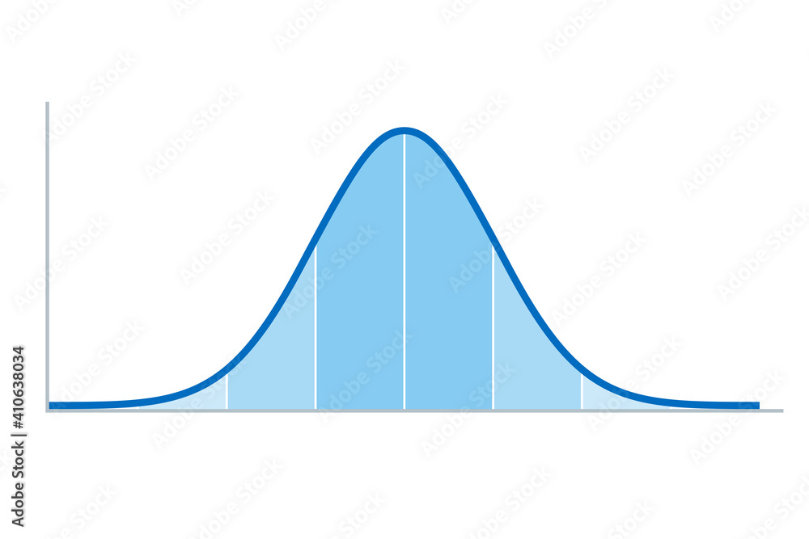

## Conclusion from Parametric Experiments

- **Correct Interpretations**:
  - Identify the best parameter set for specific models and datasets.
  - Recognize patterns likely to generalize across models and datasets.

- **Incorrect Interpretations**:
  - Avoid claims of exact optimal parameters universally applicable to all models and datasets.

## Limitations of the Experimental Approach

1. **Feasibility**:
   - Small models can be trained quickly; larger models take significantly longer (e.g., 30 minutes).
   - Running many experiments with long training times can be impractical.

2. **Generalizability**:
   - Findings from one model may not apply to others with different architectures or parameters.

## Addressing Limitations

- Use the experimental approach to build **intuition** and **expertise** about deep learning.
- Focus on understanding general principles rather than memorizing specific models.

# Understanding Neurons and Artificial Neural Networks

- The term **artificial neural networks** is misleading and does not accurately represent biological neurons.

## Biological Neurons
### Structure of Neurons
- **Soma (Cell Body)**: The central part of the neuron.
- **Dendrites**: Branch-like structures that receive signals from other neurons.
- **Synapses**: Points of contact where neurons connect with each other.

### Diversity of Neurons

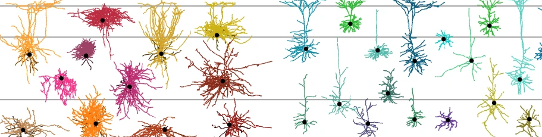

- No two neurons are identical; there is incredible diversity among neuron types.
- Hundreds to thousands of neuron types exist, with ongoing research into categorization.

### Neuron Functionality

- Neurons have unique morphologies, activity patterns, and molecular signatures.
- Neurons can be classified based on:
  - Shape and morphology
  - Connectivity with other neurons
  - Molecular markers
  - Functional electrochemical properties

## Neuronal Computation

### Capabilities of Real Neurons

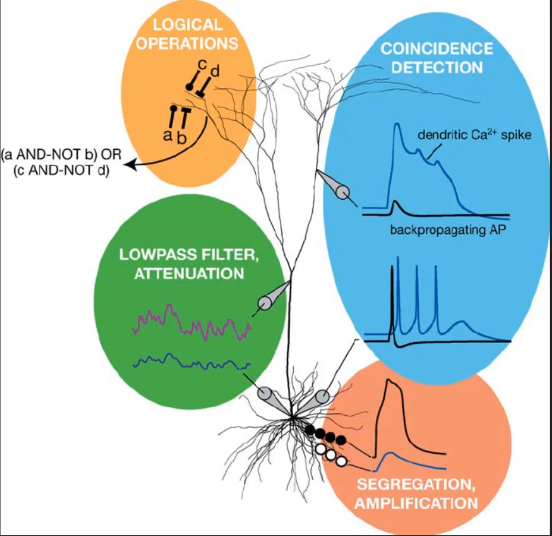

- Neurons perform a variety of computations, including:
  - **Coincidence Detection**: Similar to a correlation coefficient.
  - **Logical Operations**: Implement AND/OR functions.
  - **Filtering/Attenuation**: Respond selectively to specific frequencies.
  - **Segregation/Amplication**: Distinguish between inputs 

### Neuronal Membrane Structure

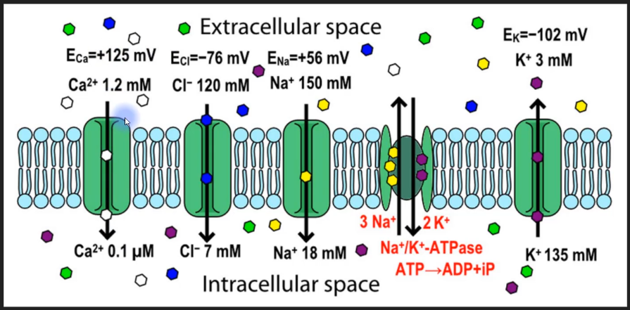

- The **membrane** separates intracellular and extracellular environments.
- Contains selective ion channels that regulate ion flow based on various factors:
  - Chemical, physical, and electrical properties.
  - Interactions among channels affect their operation.

## Artificial Neurons

### Limitations of Artificial Neurons

- Simplistic models do not capture the complexity and diversity of biological neurons.
- The term "artificial neuron" is seen as a misnomer and oversimplifies true neuronal function.

### Historical Context

- The concept of artificial neurons was developed by **McCulloch and Pitts** in the 1930s.
  - Their model was groundbreaking given the limited knowledge of neurons at the time.
  - Based primarily on imagination rather than empirical data.

### Conclusion

- Comparing real neurons to artificial neurons is like contrasting a child's drawing with a masterpiece.
- The complexity of real biological systems is far greater than the simplified models used in deep learning.
