# Math Prerequisites for Deep Learning

## Table of Contents

- [Terminology in Linear Algebra and Computer Science for Deep Learning](#terminology-in-linear-algebra-and-computer-science-for-deep-learning)
- [Deep Learning: Representing Reality with Numbers](#deep-learning-representing-reality-with-numbers)
- [The Transpose Operation](#the-transpose-operation)
- [Understanding the Dot Product](#understanding-the-dot-product)
- [Matrix Multiplication](#matrix-multiplication)
- [Softmax Function](#softmax-function)
- [Logarithms in Machine Learning and Deep Learning](#logarithms-in-machine-learning-and-deep-learning)
- [Entropy in Deep Learning](#entropy-in-deep-learning)
- [Argmin, Argmax, Min, Max Functions](#argmin-argmax-min-max-functions)
- [Mean, Variance, and Measures of Variability](#mean-variance-and-measures-of-variability)
- [Sampling Variability in Deep Learning](#sampling-variability-in-deep-learning)
- [Randomness and Reproducibility](#randomness-and-reproducibility)
- [T-tests & P-Value](#t-tests--p-value)
- [Understanding Derivatives for Deep Learning](#understanding-derivatives-for-deep-learning)

## Overview

This document provides an outline of the mathematical concepts essential for understanding deep learning, along with their implementation in Python using NumPy, PyTorch and TensorFlow.

## Key Concepts in Mathematics for Deep Learning

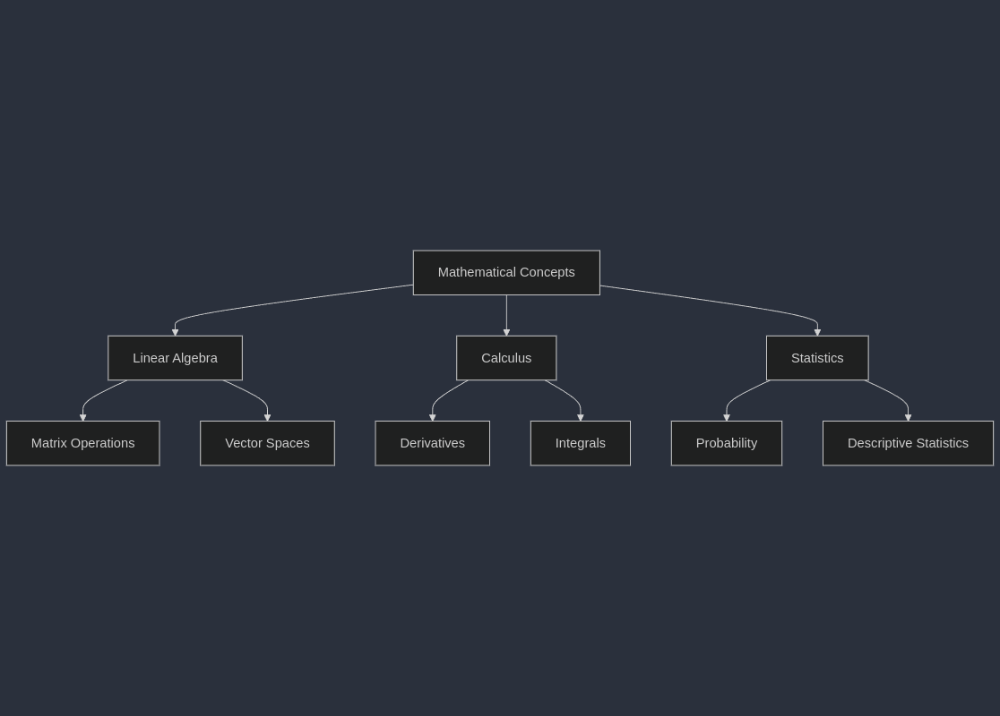

## Spectral Theories in Mathematics

- **Definition**: Decomposing complicated systems into simple components.
- **Philosophical Discussion**:
  - Spectral theories allow for understanding complex phenomena through simpler parts.

### Examples of Spectral Theories

1. **Fourier Transform**:
   - Used in signal processing, time series, and image analysis.
   - Decomposes complicated signals into sine waves (frequency, phase, amplitude).

     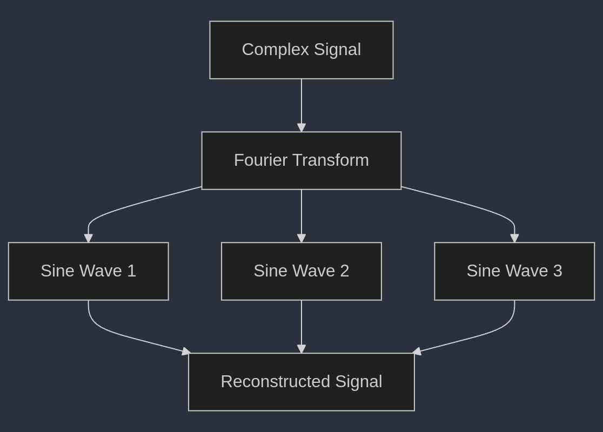

## Deep Learning and Spectral Theories

- **Visual Model Representation**:
  - Deep learning models are depicted with nodes (units) representing simple mathematical operations.
  
       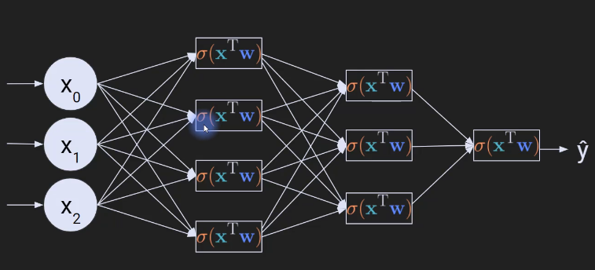

- **Operations Involved**:
  - **Dot Product**: Simple multiplication and addition.

  - **Non-linear Activation Functions**: Simple transformations (e.g., rectification).

### Complicated vs. Complex Systems

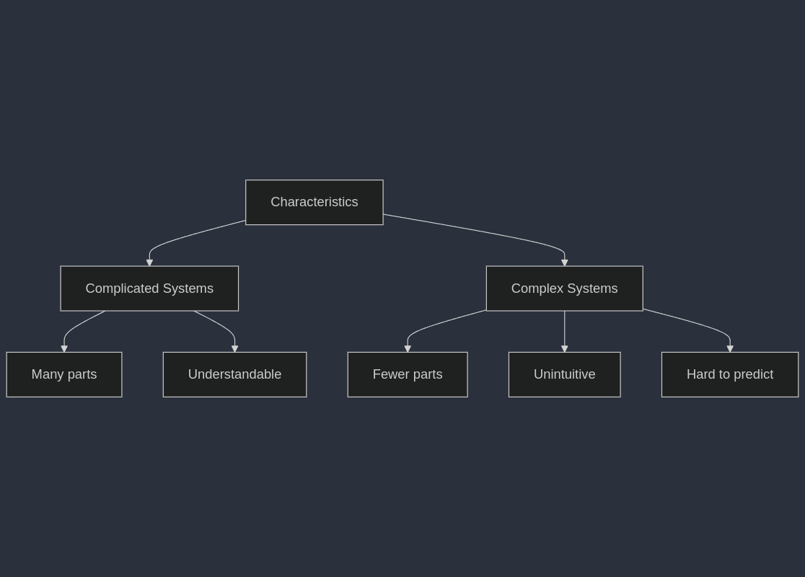

- **Complicated Systems**:
  - Many parts but intuitive and understandable.
  - **Example**: A car—complex mechanics but learnable.

- **Complex Systems**:
  - Fewer parts, many non-linearities, often unintuitive and unpredictable.
  - **Example**: **Conway's Game of Life**:
    - Simple rules lead to intricate and unpredictable outcomes.

# Terminology in Linear Algebra and Computer Science for Deep Learning

## Overview
This lecture introduces essential terminology in linear algebra and computer science, particularly as they relate to deep learning.

## Key Concepts

### 1. **Basic Terminology**

  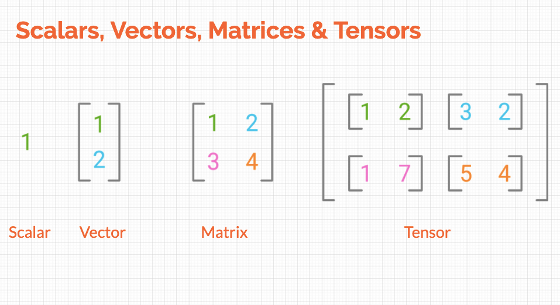

- **Scalar**
  - Definition: A single number.
  - Geometric Interpretation: Used to stretch or shrink a vector.

- **Vector**
  - Definition: A list of numbers arranged in one dimension (either as a column or a row).
  - Types:
    - **Column Vector**: Vertical arrangement of numbers.
    - **Row Vector**: Horizontal arrangement of numbers.

- **Matrix**
  - Definition: A two-dimensional array of numbers (think of it as an Excel spreadsheet).
  
- **Tensor**
  - Definition: An n-dimensional array (e.g., a cube of numbers for a 3D tensor).
  - Applications: Frequently used in data analysis, signal processing, and physics.

### 2. **Images as Matrices**

  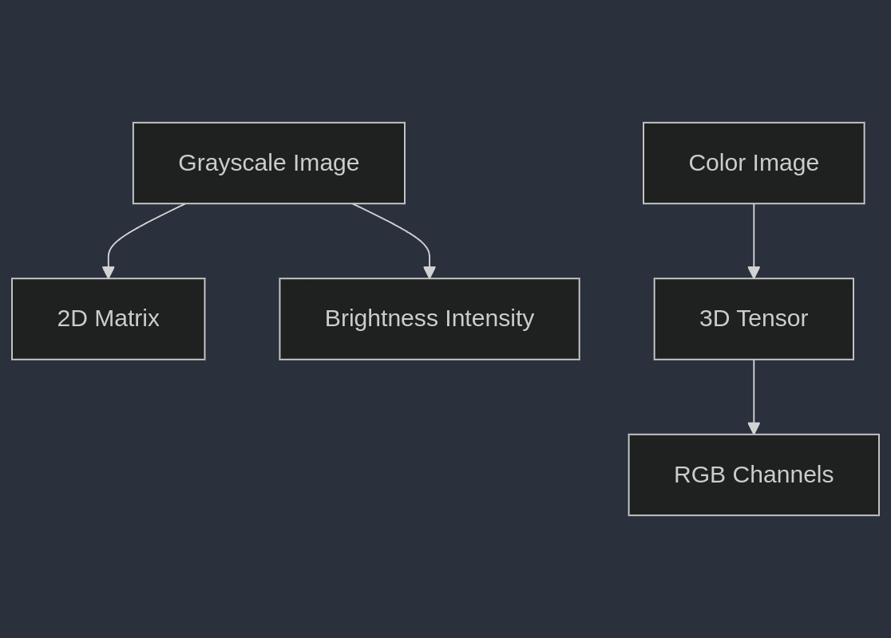

- **Grayscale Images**
  - Representation: Stored as a two-dimensional matrix.
  - Interpretation: Each number represents brightness intensity (darker for smaller numbers, lighter for larger).

- **Color Images**
  - Representation: Stored as a three-dimensional tensor (e.g., for RGB channels).
  - Interpretation: Each channel (Red, Green, Blue) is a separate two-dimensional matrix.

### 3. **Data Types**

- **In Computer Science**
  - Definition: Refers to the format of data storage and implications for operations.
  - Examples:
    - Floating-point numbers
    - Boolean
    - Strings

- **In Statistics**
  - Definition: Refers to the category of data and statistical procedures applicable.
  - Examples:
    - Categorical
    - Numerical
    - Ratio

- **Important Note**: In this notes, "data type" refers only to the computer science interpretation.

### 4. **Data Types in Python**

- Different data types in Python include:
  - **Lists**
  - **NumPy Arrays**
  - **PyTorch Tensors**
  
- **Importance of Data Types**
  - Different operations may only work on specific data types.
  - Example: Converting lists into NumPy arrays or PyTorch tensors is often necessary for compatibility.

### 5. **Correspondence Between Terminology**

| Linear Algebra  | NumPy                 | PyTorch           | TensorFlow       |
|------------------|----------------------|-------------------|------------------|
| Scalar           | Array                | Tensor            | Tensor           |
| Vector           | Array                | Tensor            | Tensor           |
| Matrix           | ND Array             | Tensor            | Tensor           |
| Tensor           | ND Array             | Tensor            | Tensor           |

# Deep Learning: Representing Reality with Numbers

## 1. Introduction

- **Philosophical Discussion**: The nature of reality and its representation as numbers is complex and largely philosophical.
- **Focus of this Section**: Understanding how to translate or represent different types of reality in numbers, essential for deep learning.

## 2. Types of Reality

  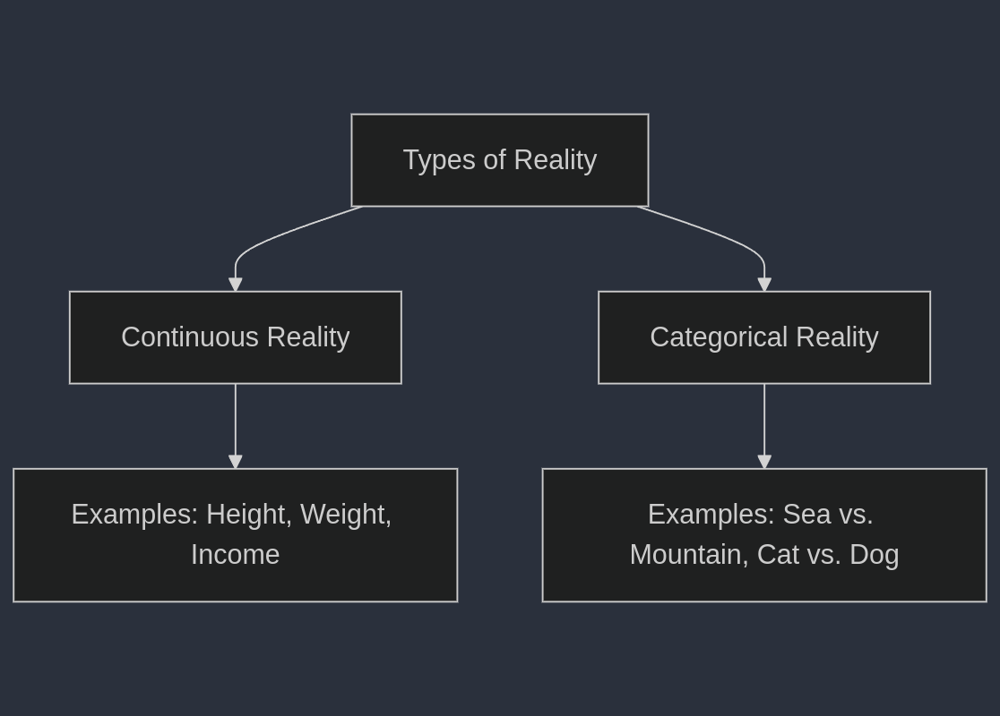
  
### A. Continuous Reality

- **Definition**: Numeric representation with potentially infinite distinct values.
- **Examples**:
  - Height
  - Weight
  - Income
  - Exam scores
  - Review scores (e.g., product ratings)

### B. Categorical Reality

- **Definition**: Discrete values with a limited number of distinct categories.
- **Examples**:
  - Types of landscapes (e.g., sea vs. mountain)
  - Object identity (e.g., cat vs. dog)
  - Disease diagnosis (e.g., present or absent)

## 3. Representing Continuous Reality

- **Method**: Straightforward numeric representation using actual values.

## 4. Representing Categorical Reality

- **Methods**:
  - **Dummy Coding**:
    - Represents categories with binary values (0 or 1).
    - **Examples**:
      - Pass/Fail (1 for pass, 0 for fail)
      - Sold/Available (1 for sold, 0 for available)
      - Transaction (1 for fraud, 0 for normal)

  - **One-Hot Encoding**:
    - Extends dummy coding to multiple categories.
    - Creates a matrix where each category is represented as a binary vector.

  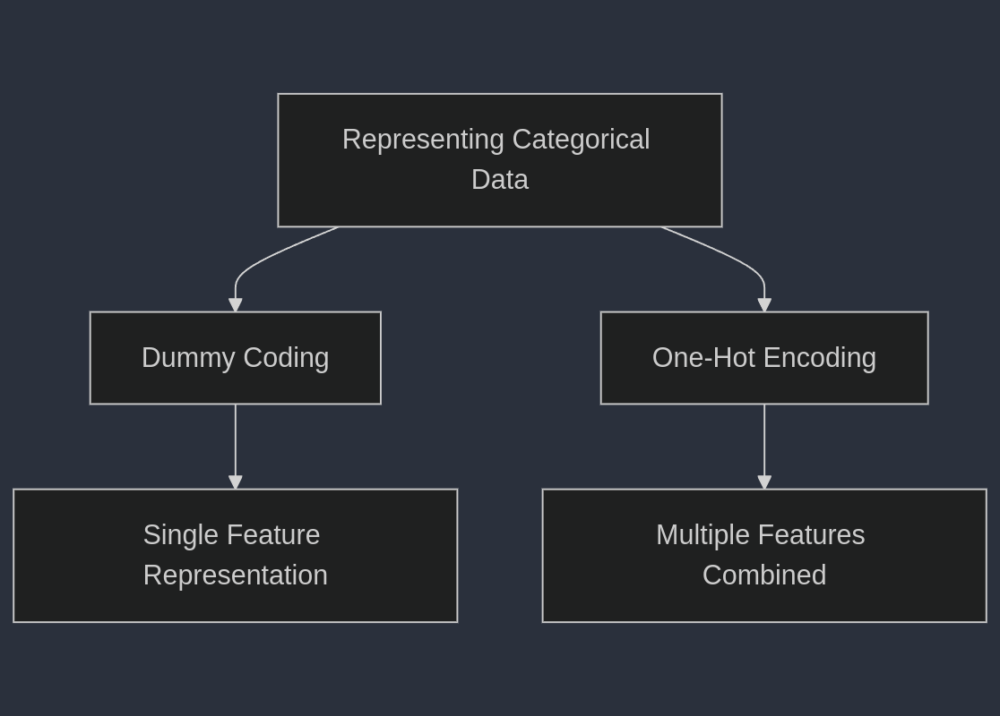

### 4.1 Example of Dummy Coding

- **Data Representation**:
  
  | Student | Pass/Fail |
  |---------|-----------|
  | 1       | 1         |
  | 2       | 1         |
  | 3       | 0         |

### 4.2 Example of One-Hot Encoding

- **Genre Classification of Movies**:

  | Movie | History | Sci-Fi | Kids |
  |-------|---------|--------|------|
  | y1    | 0       | 1      | 0    |
  | y2    | 0       | 0      | 1    |
  | y3    | 1       | 0      | 0    |

# The Transpose Operation

## Overview

- The transpose operation is a fundamental concept in linear algebra.
- It is essential for understanding matrix operations in deep learning.

## 1. What is Transposition?

- **Definition**: Transposing involves converting rows into columns and columns into rows.

- **Notation**: The transpose of a matrix or vector is denoted using a capital "T" in superscript (e.g., $A^T$).

### 1.1 Column and Row Vectors
- **Column Vector**: A matrix with a single column.
- **Row Vector**: A matrix with a single row.
- **Example**:
  - Column Vector: 
    $$
    \begin{bmatrix}
    a \\
    b \\
    c
    \end{bmatrix}
    $$
  - Row Vector (after transposition): 
    $$
    \begin{bmatrix}
    a & b & c
    \end{bmatrix}
    $$

### 1.2 Properties of Transposition

- **Double Transpose**: Transposing a transposed vector returns the original vector:
  $$
  (A^T)^T = A
  $$

## 2. Transposing Matrices

- When transposing matrices:
  - The first column becomes the first row, the second column becomes the second row, and so on.
  
### 2.1 Example

- **Original Matrix**:
  $$
  A =
  \begin{bmatrix}
  1 & 2 \\
  3 & 4
  \end{bmatrix}
  $$
- **Transposed Matrix**:
  $$
  A^T =
  \begin{bmatrix}
  1 & 3 \\
  2 & 4
  \end{bmatrix}
  $$

## 3. Key Differences Between NumPy, PyTorch, and TensorFlow

| Feature          | NumPy                     | PyTorch                   | TensorFlow               |
|------------------|--------------------------|---------------------------|--------------------------|
| Array Type       | numpy.ndarray             | torch.Tensor               | tf.Tensor                |
| Transpose Method | `.T`                     | `.T`                      | `tf.transpose()`         |
| Data Type        | N-dimensional Array      | Tensor                    | Tensor                   |

### Implementation

**Note:** For practical implementation in numpy, pytorch, TensorFlow, refer to the "Transpose" section in the accompanying Jupyter Notebook.

# Understanding the Dot Product

## Introduction

- The dot product is a fundamental operation in applied mathematics and plays a crucial role in deep learning.
- It is simple to compute and essential for understanding various mathematical concepts in machine learning.

## Notation
The dot product can be represented in several ways:
- **Standard Notation**: $a \cdot b$ (where $a$ and $b$ are vectors)
- **Angle Brackets**: $\langle a, b \rangle$
- **Transposition**: $a^T b$ (most common notation)

### Mathematical Definition

- The dot product between two vectors $a$ and $b$ of length $n$:
  $$
  a \cdot b = \sum_{i=1}^{n} a_i \cdot b_i
  $$
  - This involves:
    - Element-wise multiplication of corresponding elements.
    - Summing all the products.

## Example Calculation

- **Vectors**: $v = [1, 0, 2, 5, -2]$, $w = [2, 8, -6, 1, 0]$
- **Calculation**:
  $$
  v \cdot w = 1 \cdot 2 + 0 \cdot 8 + 2 \cdot -6 + 5 \cdot 1 + -2 \cdot 0 = 2 + 0 - 12 + 5 + 0 = -5
  $$
- **Result**: The dot product is a single number, $-5$.

## Conditions for Dot Product

- The dot product is defined only for vectors or matrices of the same dimension:
  - Both vectors must have the same number of elements.
  - Both matrices must have the same shape.

### Example of Undefined Dot Product
- Attempting to compute the dot product between:
  - $v = [1, 0, 2, 5, -2]$ (5 elements)
  - $w = [2, 8, -6]$ (3 elements)
- **Conclusion**: Dot product is undefined due to differing dimensions.

## Dot Product in Matrices

- The dot product can also be computed for matrices.
- The procedure is similar:
  $$
  \text{For two matrices } A \text{ and } B, \quad A \cdot B = \sum (a_{ij} \cdot b_{ij})
  $$
- **Result**: Always yields a single number.

## Importance in Deep Learning

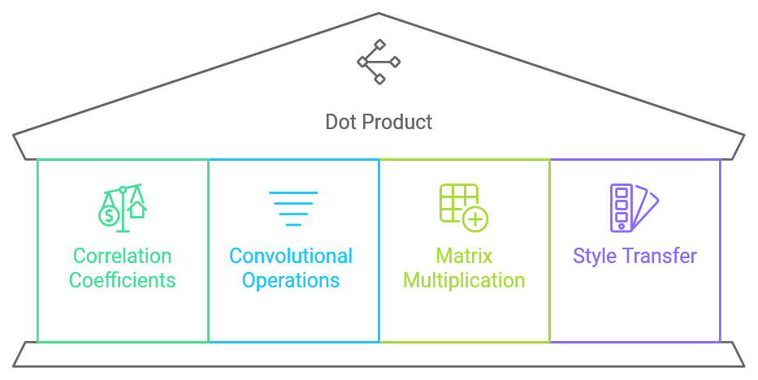

- The dot product reflects the similarity or commonality between two mathematical objects (e.g., vectors, matrices, tensors).
- It's foundational for various computations in statistics and machine learning, including:
  - Correlation coefficients
  - Convolutional operations
  - Matrix multiplication
  - Style transfer (e.g., Gram matrix)

### Implementation

**Note**: For practical implementation and code examples, refer to the "Dot Product section" in the accompanying Jupyter notebook.

# Matrix Multiplication

## Overview

- Matrix multiplication is an extension of the dot product.
- Not all matrices can be multiplied; conditions must be met.

## Matrix Sizes

- A matrix is described as **M rows by N columns** (M x N).

## Validity Rules for Matrix Multiplication

- **Condition for Validity:** The number of columns in the first matrix must equal the number of rows in the second matrix.

- **Outer Dimensions:** The result of the multiplication will be an M x K matrix, where:
  - M = rows of the first matrix
  - K = columns of the second matrix

### Example Validations

| Matrices          | Size   | Valid? | Resulting Size |
|-------------------|--------|--------|----------------|
| A (5x2) and B (2x7) | 5x2 x 2x7 | Yes    | 5x7            |
| B (2x7) and A (5x2) | 2x7 x 5x2 | No     | -              |
| C (7x2) and A (5x2) | 7x2 x 5x2 | No     | -              |
| C^T (7x5) and A (5x2) | 7x5 x 5x2 | Yes    | 7x2            |

## Dot Product and Vectors

- Vectors are treated as column matrices.
- **Matrix Multiplication Validity:** Requires matching inner dimensions.
  - E.g., V (5x1) and W (5x1) → Not valid.
  - Transpose V to get a row vector (1x5), which can then multiply W (5x1).

## Mechanism of Matrix Multiplication

- Each element in the resulting matrix is computed as the dot product of a row from the first matrix and a column from the second matrix.

## Practical Implementation

- **Note**: For practical implementation and code examples, refer to the "Matrix Multiplication" section in the accompanying Jupyter notebook.

# Softmax Function

## Overview of the Natural Exponent

- The natural exponent, denoted as **e**,
is approximately equal to **2.718**. It is an irrational number, similar to π, meaning its decimal representation goes on indefinitely without repeating.
- The function **e^x** grows rapidly as **x** increases and is strictly positive, never reaching zero even for negative inputs. This property is crucial for generating probabilities in the softmax function.

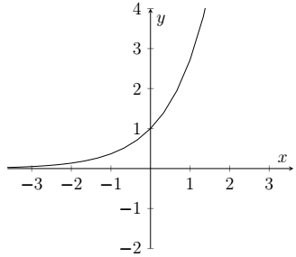

## Definition of the Softmax Function

The softmax function is defined mathematically as follows for a collection of numbers $z$:

$$
\text{softmax}(z_i) = \frac{e^{z_i}}{\sum_{j} e^{z_j}}
$$

Where:
- $z$ is a collection of numbers.
- $z_i$ is the **i-th** element of that collection.

### Key Properties

- The output values are all positive and sum to one, making them interpretable as probabilities.
- For any set of inputs, the softmax transformation guarantees the values lie between 0 and 1.

## Example Calculation

Given a dataset $z = \{1, 2, 3\}$:
1. Compute $e^z$:
   - $e^1 \approx 2.72$
   - $e^2 \approx 7.39$
   - $e^3 \approx 20.09$

2. Sum these values:
   - $2.72 + 7.39 + 20.09 \approx 30.20$

3. Apply the softmax formula:
   - $\text{softmax}(1) \approx \frac{2.72}{30.20} \approx 0.09$
   - $\text{softmax}(2) \approx \frac{7.39}{30.20} \approx 0.24$
   - $\text{softmax}(3) \approx \frac{20.09}{30.20} \approx 0.67$

4. Confirm that the outputs sum to 1:
   - $0.09 + 0.24 + 0.67 = 1.00$

## Interpretation in Deep Learning

- The softmax function is commonly used in the output layer of classification models.
- It transforms the raw outputs (logits) of a model into a probability distribution over multiple classes (e.g., cat, dog, car).
- For example, if a model outputs values indicating the likelihood of categories, the softmax function converts these values into interpretable probabilities, such as:
  - Probability of being a cat: 0.90
  - Probability of being a dog: 0.01
  - Probability of being a car: 0.001

## Non-Linear Characteristics

- The softmax function has strong non-linearity. Larger input values lead to disproportionately larger softmax outputs.

- Negative input values yield smaller outputs, but still positive, illustrating that softmax maintains positivity.

## Graphical Representation

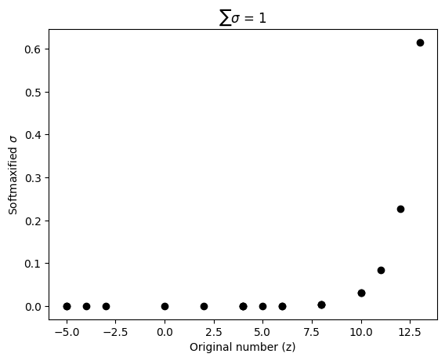

Graphs illustrate the relationship between input values and softmax outputs:

- Inputs that are close to zero result in similar small outputs.
- Larger inputs (positive) yield significantly larger outputs, reflecting the non-linear nature of the softmax function.

## Logarithmic Scaling of Softmax Outputs

In addition to understanding the softmax function in standard terms, it can be insightful to explore how its outputs behave when we change the y-axis scale to a logarithmic scale.

### Logarithmic Scale

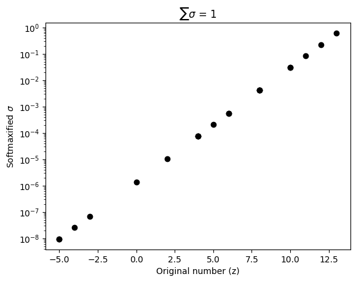

When the y-axis is set to a logarithmic scale, we can observe the output values of the softmax function differently. In this representation:

- **Linear Transformation**: The outputs appear as a linear transformation of the input values. This means that, when visualized in log space, the relationship between input values and their corresponding softmax outputs can be represented as a straight line, this transformation shows the linear nature of the softmax operation when viewed in log space

## Understanding Logarithmic Scaling of the Softmax Function

When we discuss the softmax function and explore its behavior in logarithmic terms, it’s important to provide an intuitive understanding of why this perspective matters.

### Conceptual Importance of Logarithmic Scaling

1. **Simplifying Complex Relationships**:
   - In many real-world situations, the values we work with can vary dramatically. For example, when classifying images, some features might have very high values (like brightness) while others are very low (like edge detection).
   - Logarithmic scaling allows us to compress this range of values into a more manageable format. By transforming the outputs into a logarithmic scale, we can observe how the softmax function relates these varied inputs more clearly, as it becomes easier to compare the relationships between them.

2. **Showing the Relative Differences**:
   - Logarithmic scaling helps highlight the relative differences between input values. For instance, if one category has an input score of 100 and another has a score of 10, the difference is significant. However, if one category has a score of 1,000, the difference might seem less clear without a logarithmic view.
   - In this way, logarithmic scaling allows us to see how much more likely one category is compared to another. It provides a clearer picture of the relationships that softmax captures.

### Intuitive Analogy

Imagine you are hiking in a mountainous region. The elevation of each point represents the score for each category (like our softmax inputs).

- **Linear vs. Logarithmic setup**:
  - In a linear setup, every small change in elevation might not be as noticeable, especially when one mountain (category) towers above the others. You might struggle to see the differences between lower peaks because they all appear quite small compared to the highest mountain.
  - However, if we switch to a logarithmic map, the perspective changes. Now, the relative heights of all the peaks become more apparent, and even the smaller peaks (lower scores) are represented in a way that emphasizes their significance relative to the tallest mountain. This helps you understand that while one peak might be significantly higher, the others still matter in the broader landscape.
  
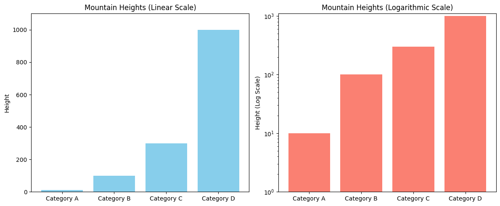

### Implementation

- **Note**: For practical implementation and code examples, refer to the "softmax" section in the accompanying Jupyter notebook.

# Logarithms in Machine Learning and Deep Learning

## Introduction

- The logarithm (log function) is a crucial concept in machine learning and optimization, which are central to deep learning.
- Deep learning primarily involves optimization problems, making the understanding of logarithms essential.

## Natural Exponent and Natural Logarithm

- **Natural Exponent**: The constant $e$ (approximately 2.718).
  - Plot of $e^x$:
    - Always positive.
    - Grows rapidly towards infinity.
  
- **Natural Logarithm**: The inverse of the natural exponent.
  - When plotted, $\log(e^x)$ results in a straight line $y = x$.

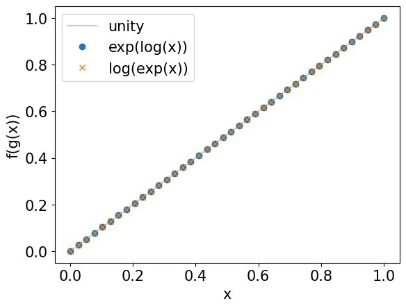

### Key Concepts

- The logarithm function grows but at a slower rate compared to the exponential function.
- **Monotonic Function**: A function that consistently increases or decreases.
  - For logarithms:
    - When $x$ increases, $\log(x)$ increases.
    - When $x$ decreases, $\log(x)$ decreases.
- This monotonic property is significant for optimization:
  - Minimizing $x$ is equivalent to minimizing $\log(x)$ for positive $x$.
  
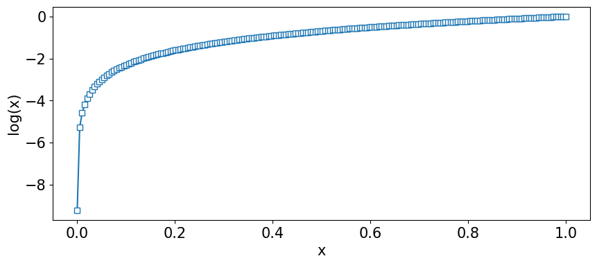

| Property          | Exponential Function $e^x$ | Logarithmic Function $\log(x)$  |
|-------------------|----------------------------------|--------------------------------------|
| Growth Behavior    | Rapidly increases                | Increases slowly                      |
| Defined Domain     | All real numbers                 | $x > 0$ only                     |
| Monotonic          | Yes                              | Yes                                  |

## Importance of Logarithms in Optimization

- Logarithms help in distinguishing small numbers that are closely spaced.
  - For example, as $x$ approaches zero, $\log(x)$ spreads out small values, making them more distinguishable.
  
- **Numerical Precision**:
  - Minimizing very small values (like probabilities close to zero) directly can lead to precision errors.
  - Using the logarithm makes optimization more optimized and easier to compute, as the transformed values are less likely to lead to numerical instability.

## Different Logarithmic Bases

- Various logarithmic bases include:
  - Natural log (base $e$)
  - Log base 2
  - Log base 10
- While different, all logarithmic functions share:
  - Monotonicity.
  - Definition for positive values.
  - Distinction of small numbers.

### Why Natural Log is Commonly Used

- The natural log is preferred due to its mathematical properties and relationship with other functions used in machine learning, such as sigmoid and softmax functions.

## Implementation

- **Note**: For practical implementation and code examples, refer to the "Logarithms" section in the accompanying Jupyter notebook.

# Entropy in Deep Learning

## Overview of Entropy

- **Definition**: Entropy has different interpretations in various scientific fields.
- **Physical Interpretation**:
  - Related to the second law of thermodynamics.
  - Suggests that matter transitions from order to disorder

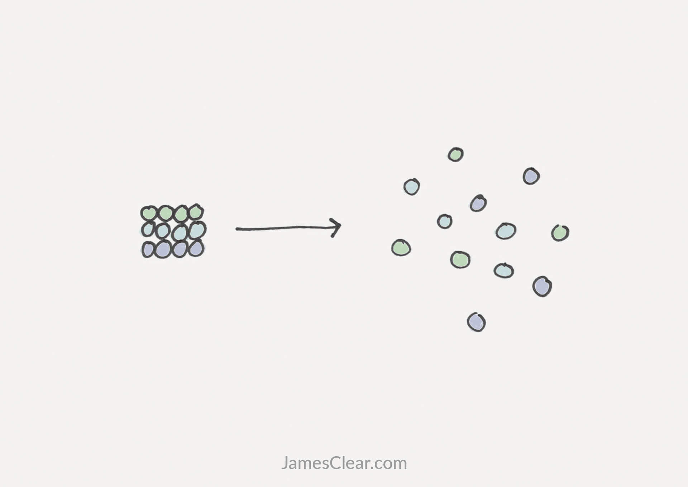

## Shannon Entropy

- **Named After**: Claude Shannon, a pioneer in signal processing and information theory.
- **Concept**: Measures the amount of surprise or uncertainty regarding a specific variable.
- **Characteristics**:
  - **Maximal Entropy**: Occurs at a probability of 0.5 (highest unpredictability).
  - **Low Entropy**: Occurs when probabilities approach 0 or 1 (greater predictability).

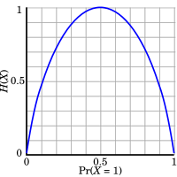

### Key Points

- Surprising events convey more information.
- Surprise in information theory is defined differently from everyday language.

## Formula for Shannon Entropy

- **Mathematical Representation**:
  $$
  H(X) = -\sum P(x) \log(P(x))
  $$
  - **Terms**:
    - $H(X)$: Entropy
    - $P(x)$: Probability of event $x$
    - **Base of Logarithm**:
      - Base 2 yields units called **bits**.
      - Natural log yields units called **nats**.

### Example: Coin Flip

- Outcomes: Heads and Tails
- For a fair coin:
  - $P(\text{Heads}) = 0.5$
  - $P(\text{Tails}) = 0.5$
  - Entropy calculation would include both outcomes.

## Interpretation of Entropy

- **High Entropy**: Indicates a dataset with high variability.
- **Low Entropy**: Indicates redundancy; many repeated values.

## Cross-Entropy

- **Definition**: Measures the difference 
between two probability distributions.
- **Formula**:
  $$
  H(P, Q) = -\sum P(x) \log(Q(x))
  $$
  - **Variables**:
    - $P$: True distribution (ground truth).
    - $Q$: Predicted distribution by the model.

### Application in Deep Learning

- **Context**: Evaluates model performance.

- **Example**:
  - $P$: Probability that an image is a cat.
  - $Q$: Model's predicted probability of the image being a cat.
  - **Model Output**:
    - Initially, $Q$ might be around 0.5 (random guess).
    - After training, $Q$ could improve to 0.99.

## Implementation

- **Note**: For practical implementation and code examples, refer to the "Entropy" section in the accompanying Jupyter notebook.

# Argmin, Argmax, Min, Max Functions

## Minimum and Maximum
- **Definition**:
  - **Minimum**: The smallest value in a set of numbers.
  - **Maximum**: The largest value in a set of numbers.
- **Example**:
  - Given the numbers: `[-1, 0, 2, 3, 4]`
    - **Minimum**: -1
    - **Maximum**: 4

## Arg Min and Arg Max

- **Definitions**:
  - **Arg Min**: Returns the index (or position) of the minimum value.
  - **Arg Max**: Returns the index (or position) of the maximum value.
- **Example**:
  - Using the same list:
    - **Arg Min**: 2 (the position of -1, which is the minimum).
    - **Arg Max**: 5 (the position of 4, which is the maximum).

### Important Considerations

- **Indexing**:
  - In mathematics and human language, counting often starts at 1.
  - In Python, indexing starts at 0.
    - Example:
      - For `[-1, 0, 2, 3, 4]`, 
        - Arg Min (math): 2 (second position).
        - Arg Min (Python): 1 (index 1 for the second position).
        - Arg Max (math): 5 (fifth position).
        - Arg Max (Python): 4 (index 4 for the fifth position).

## Mathematical Notation

- **Arg Max Notation**:
  - Often written as:
    $$
    \text{arg max}_{x} f(x)
    $$
  - Meaning: Finding the positions in $X$ at which the function $f$ is maximized.

## Application in Deep Learning

- **Context**: Using Arg Max with outputs from a neural network.
- **Example**:
  - A convolutional neural network (CNN) trained to recognize stop signs.
  - Given an input image, the model outputs probabilities for different categories via the softmax function.
    - Example Output: `[0, 0, 0.8, 0.2]` (probabilities for different classes).
  - **Use of Arg Max**:
    - To determine the category with the highest probability.
    - Applying `arg max` to the output vector yields the index of the highest probability.
    - If the output vector corresponds to `[0, 0, 0.8, 0.2]`, the result would be 2 (label index for stop sign).

    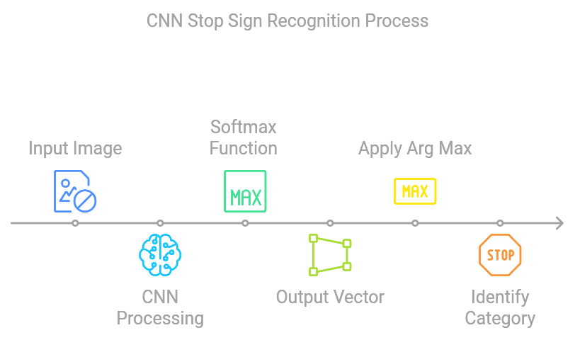

### Implementation

- **Note**: For practical implementation and code examples, refer to the "argmin, argmax" section in the accompanying Jupyter notebook.

# Mean, Variance, and Measures of Variability

## Overview

- **Focus**: Understanding mean and variance, their formulas, and their significance in data analysis and deep learning, leading into concepts like L1 and L2 regularization.

## Mean

- **Definition**: The mean is the most commonly used measure of central tendency, indicating the average value in a dataset.
- **Purpose**: To provide a single value that represents the center of a distribution.
- **Formula**:
  $$
  \text{Mean} (\bar{X}) = \frac{\sum_{i=1}^{n} X_i}{n}
  $$
  - $X_i$: Individual data values.
  - $n$: Total number of data values.
  
- **Representation**:
  - Commonly indicated as $\bar{X}$ (X-bar) or the Greek letter $\mu$ (mu).

### Suitability

- Best for **roughly normally distributed data** (Gaussian distribution).
- **Example**: Given a collection of numbers (e.g., heights, prices), the mean summarizes the central point.

### Limitations

- The mean can be misleading for **non-normally distributed data**:
  - **Bimodal Distributions**: The mean may not represent the central tendency well.

    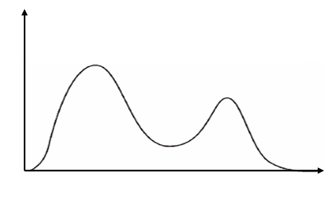

  - **Right-Tailed Distributions**: E.g., income distribution, where a few high values can skew the mean higher than most of the data.

    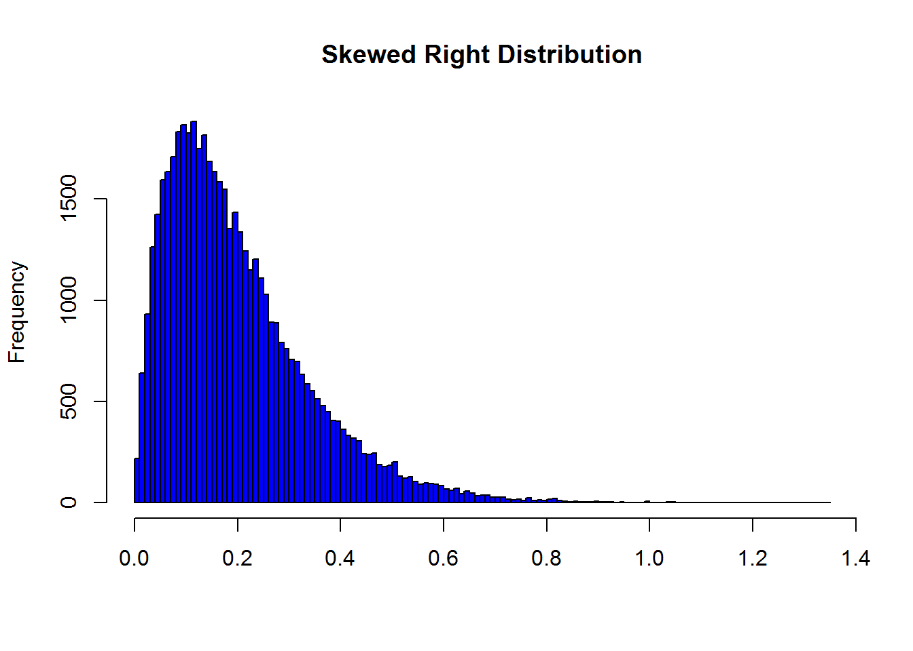

## Variance

- **Definition**: Variance measures the dispersion of data points around the mean.
- **Relation to Standard Deviation**: Variance is the square of the standard deviation.

### Formula

$$
\text{Variance} (\sigma^2) = \frac{\sum_{i=1}^{n} (X_i - \bar{X})^2}{n - 1}
$$

- **Key Components**:
  - Subtract the mean from each data point.
  - Square the result to avoid negative values.
  - Sum all squared differences and divide by $n - 1$ for an unbiased estimate.

### Interpretation

- Variance provides insight into the **spread** of data:
  - Higher variance indicates data points are more spread out from the mean.
  - Lower variance indicates data points are closer to the mean.
  
### Examples

- **Set A**: Wide distribution leads to higher variance.
- **Set B**: Close distribution leads to lower variance.

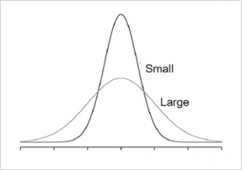

### Comparison with Mean Absolute Difference (MAD)

- **MAD Formula**: 
$$
\text{MAD} = \frac{\sum_{i=1}^{n} |X_i - \bar{X}|}{n}
$$
- **Differences**:
  - Variance emphasizes larger deviations (squared values).
  - MAD is more better in handling outliers.
- **Applications**: 
  - L1 regularization relates to MAD.
  - L2 regularization relates to variance.

## Standard Deviation
- **Definition**: The square root of the variance, providing a measure of dispersion in the same units as the data.
- **Formula**:
$$
\text{Standard Deviation} (\sigma) = \sqrt{\sigma^2}
$$

## Practical Considerations

- **Biased vs. Unbiased Variance**:
  - Using $n$ yields biased variance; using $n - 1$ provides an unbiased estimate, accounting for degrees of freedom.

### Implementation

- **Note**: For practical implementation and code examples, refer to the "Mean, Variance" section in the accompanying Jupyter notebook.

# Sampling Variability in Deep Learning

## Overview

- **Focus**: Understanding why deep learning requires large datasets and the role of sampling variability.

## Importance of Large Samples

- **Key Concept**: Deep learning models often require a substantial amount of data to train effectively. This necessity stems from the principles of random sampling and sampling variability.

### Example Question

- **Scientific Question**: How tall is the average person in a specific country?

- **Approach**: To determine this, we can take a sample by measuring individuals' heights.

    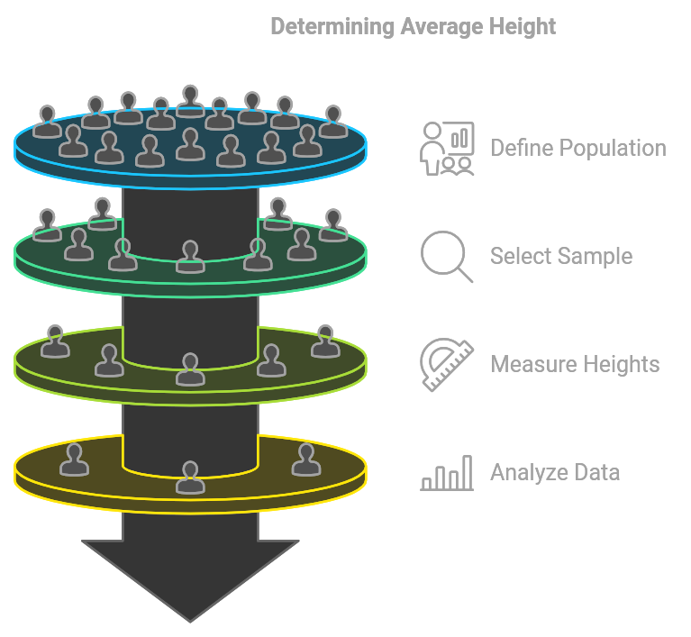

### Sampling Variability

- **Definition**: Sampling variability refers to the phenomenon where different randomly selected samples from the same population yield different values for the same measurement.
- **Implication**: A single measurement may not reliably estimate a population parameter due to variability in the population.

### Real-World Implications

- **Variability in Samples**: For instance, measuring the height of randomly selected individuals will result in varied measurements because of natural differences.

- **Deep Learning Context**: If every instance (e.g., cats) were identical, only one example would suffice for training. However, the diversity in appearances necessitates many examples to account for variability.

## Sources of Sampling Variability

1. **Natural Variation**: Biological and physical traits exhibit inherent variability.
2. **Measurement Noise**: Imperfections in measurement tools (e.g., rulers) introduce variability.
3. **Complex Interactions**: Variables may interact (e.g., age and height), affecting measurements when not controlled.

## Addressing Sampling Variability

- **Solution**: Increase the number of samples to compute an average, improving the reliability of estimates.

- **Law of Large Numbers**: States that as the number of samples increases, the sample mean will converge toward the population mean.

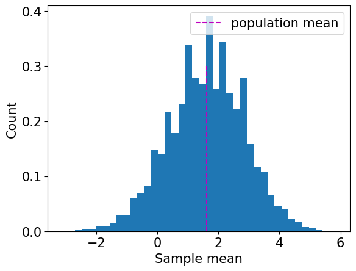

## Practical Application in Deep Learning

- **Learning from Examples**: Deep learning models learn from examples; thus, having a diverse and large dataset is crucial.
- **Risks of Non-Random Sampling**: Biased or non-representative sampling can introduce systematic biases, leading to overfitting and limited generalizability.

## Importance of Random Sampling

- Random sampling is essential to ensure that the data reflects the true characteristics of the population. Non-random samples can skew results and affect model performance.

### Implementation

- **Note**: For practical implementation and code examples, refer to the "Sampling" section in the accompanying Jupyter notebook.

# Randomness and Reproducibility

## Key Concepts

### Randomness in the Real World

- Randomness is inherently unpredictable and uncontrollable.
- Each experiment yields different results, complicating reproducibility.

### Randomness in Computing

- Computers can reproduce the same sequence of random numbers.
- Achieved through a process known as **seeding** random number generators.

### Why Seed Random Number Generators?

- **Initialization**: Random weights are used when creating models to prevent local minima.

- **Reproducibility**: Enables others to replicate results from shared code and models.

## Random Number Generation in Python

### NumPy

1. **Basic Random Generation**:
   - Example: Using `numpy.random.randn()` yields different results on each run.

2. **Seeding Random Number Generators**:
   - **Old Method**: 
     - Use `numpy.random.seed(value)`.
     - Example: Setting `seed` to an arbitrary value (e.g., 17) provides consistent outputs across runs.
   - **New Method**:
     - Use `numpy.random.RandomState(value)`.
     - More flexible as it allows different random states for different variables.

3. **Comparison of Methods**:
   - **Old Method**:
     - Global scope affects all random number generation.
   - **New Method**:
     - Local scope allows separate random states for different operations.

### PyTorch

1. **Random Generation**:
   - Example: Using `torch.randn()` yields distinct results on each run.

2. **Seeding in PyTorch**:
   - Use `torch.manual_seed(value)` for seeding.
   - Seed affects only PyTorch's random number generation, not NumPy's.

### TensorFlow

1. **Random Generation**:
   - Example: Using `tf.random.normal()` yields distinct results on each run.

2. **Seeding in TensorFlow**:
   - Use `tf.random.set_seed(value)` for global seeding.
   - Affects all TensorFlow operations, ensuring consistent results.

## Practical Applications

- Models typically benefit from multiple random initializations to avoid local minima.
- Choosing a seed value for reproducibility allows others to achieve the same results of your model when running it

# T-tests & P-Value

## Key Concepts

### Hypothesis Testing

- **Research Question Example**: Are men taller than women?
- **Hypotheses**:
  - **Null Hypothesis (H₀)**: No difference in average heights (e.g., average height of men = average height of women).
  - **Alternative Hypothesis (H₁)**: There is a significant difference in heights.

### Sampling and Randomness

- Random samples can lead to misleading results due to chance.
- Example: A small sample may reflect unusual height distributions (e.g., selecting shorter women and taller men).

### Statistical Significance

- The t-test is used to determine if the observed differences are statistically significant or could be due to random sampling variability.

---

## The T-Test

### Purpose

- Assess whether the means of two groups are statistically different.
- Commonly used to compare model performances in machine learning.

### Key Terms

- **P-value**: Probability of observing the data (or something more extreme) if the null hypothesis is true.
- **Significance Level (α)**: Commonly set at 0.05 (5%), indicating a 5% risk of concluding that a difference exists when there is none.

### How the T-Test Works

1. **Assumption**: Start by assuming the null hypothesis is true.
2. **Repeat Experiments**: Conceptually repeat the experiment many times to understand how often the observed difference (e.g., height difference) could occur due to random chance.
3. **Calculate the P-value**: Determines the probability of obtaining the observed results under the null hypothesis.

### Interpreting P-values

- **P ≤ 0.05**: Reject the null hypothesis; there is significant evidence that the groups differ.
- **P > 0.05**: Fail to reject the null hypothesis; insufficient evidence to claim a difference.

  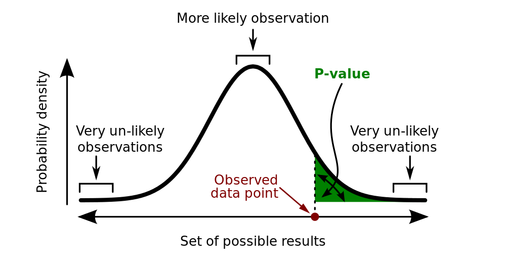

---

## Types of T-Tests

### Unpaired T-Test

- Used when comparing two different groups.
- Example scenarios:
  - Testing a new medication against a placebo group.
  - Comparing heights of men and women.

### Paired T-Test

- Used when comparing the same group under different conditions.
- Example scenarios:
  - Measuring grip strength before and after consuming spinach.
  - Comparing quiz scores of the same students using different note-taking methods.

---

## Summary of Key Points

- **T-Test Framework**:
  - Establish the null and alternative hypotheses.
  - Compute the t-value based on sample means and standard deviations.
  - Compare the t-value to a critical value derived from the t-distribution under the null hypothesis.
  
- **Understanding Results**:
  - A lower p-value indicates stronger evidence against the null hypothesis.
  - Statistical significance is context-dependent; not all scenarios fit the conventional threshold.

- **Practical Application**:
  - Used extensively in model evaluation, helping researchers decide which architectures or parameters yield better performance.
  - Essential for making informed decisions in deep learning and other experimental research fields.

---
### Implementation

- **Note**: For practical implementation and code examples, refer to the "t-test & p-value" section in the accompanying Jupyter notebook.

# Understanding Derivatives for Deep Learning

## Functions and Activation Functions

- **Example Functions**:
  - **ReLU (Rectified Linear Unit)**: flat and then increase (y = 0 when x < 0 && y = x when x >= 0)
  - **Sigmoid Function**: Has an S-shape.

  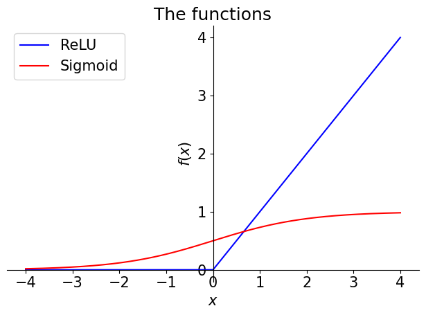

### Understanding Derivatives

- The derivative indicates how a function changes with respect to the X variable (could represent time, space, or an abstract variable).
- **ReLU Function**:
  - Derivative is zero when the function is flat.
  - At $X = 0$, the slope becomes one and remains constant above zero.

- **Sigmoid Function**:
  - Always increasing, meaning its slope (derivative) is positive.
  - The derivative is curvy and changes, indicating how the rate of increase varies.

  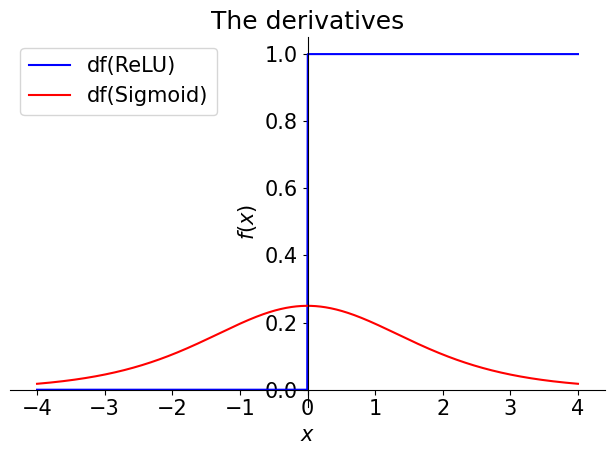

---

## Geometry and Algebra of Derivatives

- The derivative is essentially the slope of the function at each point.
- **Calculating Derivatives**:
  - Different functions require different rules for computation.
  - Focus on polynomials as they're the easiest to differentiate.

### Polynomial Derivatives

- Example of a polynomial: $X^2$.
- Notation for derivative: $\frac{d}{dx}$ or using a prime symbol (e.g., $f'(x)$).
- Derivative Rules:
  - $\frac{d}{dx}(X^n) = nX^{n-1}$.

#### Examples:

- Derivative of $X^2$ is $2X$.
- Derivative of $X^3$ is $3X^2$.

---

## Importance of Derivatives in Deep Learning

- Derivatives indicate the direction and rate of increase or decrease in a function.
- In deep learning, the goal is to minimize an error function to improve model performance.
- The derivative guides how to adjust model parameters to achieve minimal error.

### Gradient Descent

- Gradient descent uses derivatives to update model weights for optimal classification.

- Detailed exploration of this process will follow in the next directory.

---

## Identifying Minima and Maxima

  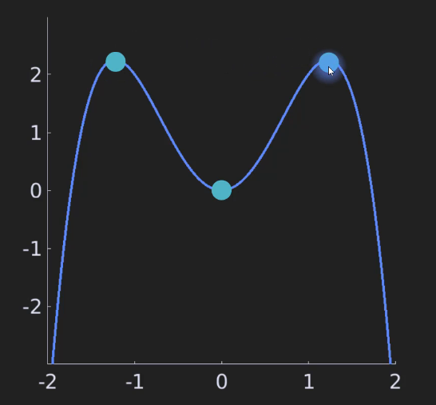

- **Graph Analysis**:
  - We see a function with two local maxima and one local minimum.
  - Some additional minimum points exist at the edges, but we'll ignore those for now.

### Critical Points and Derivatives

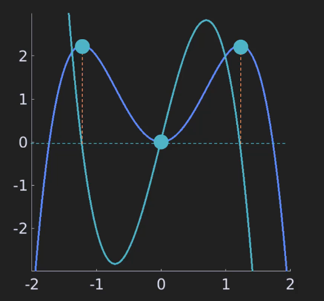

- **Derivative Overview**:
  - The green line represents the derivative of the function.
  - Critical points (minima and maxima) occur where the derivative equals zero.
  
#### Finding Critical Points

- To identify extrema:
  1. Compute the derivative of the function.
  2. Set the derivative equal to zero and solve for $x$.
  
- In the example:
  - This is a third-order polynomial, yielding three solutions.
  - Points of interest: $x = 0$, $x = \pm \sqrt{3}/2$.
  
---

## Distinguishing Minima from Maxima

- Critical points do not inherently indicate whether they are minima or maxima.
- **Determining Nature of Critical Points**:
  - For a **local minimum**:
    - Derivative is negative to the left and positive to the right.
  - For a **local maximum**:
    - Derivative is positive to the left and negative to the right.

## The Vanishing Gradient Problem

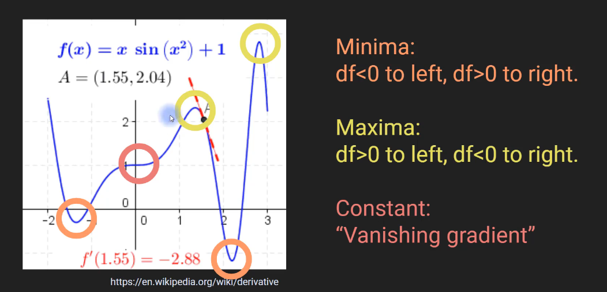

- A situation where the derivative is
zero but neither a minimum nor a maximum can occur.

- This flat area indicates a potential issue in deep learning known as the **vanishing gradient**.
  
### Significance of Vanishing Gradient

- The vanishing gradient problem arises when the model cannot effectively learn because the derivative does not provide useful information.

- Solutions exist to mitigate this problem in deep learning.

---

## Derivative Rules in Calculus

### Key Takeaways

- **Interacting Functions**:
  - Derivatives of functions that interact (through multiplication or embedding) can be unintuitive.
  - While simple functions are easy to differentiate, complex interactions require more practice.
- In deep learning, libraries like PyTorch handle these complexities efficiently, allowing you to focus on conceptual aspects.

---

## Product Rule

- Consider two functions, $f(x)$ and $g(x)$.
- Adding functions: The derivative of the sum equals the sum of the derivatives.
  
### Derivative of a Product

- **Product Rule Formula**:
  $$
  \frac{d}{dx}[f(x)g(x)] = f'(x)g(x) + f(x)g'(x)
  $$
- This means the derivative of two multiplied functions is not simply the product of their derivatives.

---

## Chain Rule

- The Chain Rule applies when one function is embedded inside another.
- **Chain Rule Formula**:
  $$
  \frac{d}{dx}[f(g(x))] = f'(g(x)) \cdot g'(x)
  $$

### Example of Chain Rule

- For the function $f(g(x)) = (x^2 + 4x^3)^5$:
  - **Applying the Chain Rule**:
    - Derivative of the outer function evaluated at the inner function times the derivative of the inner function.
  
### Implementation

- **Note**: For practical implementation and code examples, refer to the "Derivatives" section in the accompanying Jupyter notebook.
