# Gradient Descent

## Table of Contents

1. [Motivation for Gradient Descent](#motivation-for-gradient-descent)
2. [Local Minima in Gradient Descent](#local-minima-in-gradient-descent)
3. [Code Exercise 1](#code-exercise-1)
4. [Gradient Descent in Two Dimensions](#gradient-descent-in-two-dimensions)
5. [Code Exercise 2: Implementing Gradient Ascent](#code-exercise-2-implementing-gradient-ascent)
6. [Exploring Gradient Descent: Goals and Experiments](#exploring-gradient-descent-goals-and-experiments)
7. [Code Exercise 3: Dynamic Learning Rates in Gradient Descent](#code-exercise-3-dynamic-learning-rates-in-gradient-descent)
8. [Understanding Vanishing and Exploding Gradients](#understanding-vanishing-and-exploding-gradients)

# Motivation for Gradient Descent

1. **Initial Guess**: The model begins by making a random guess about the solution.
2. **Compute Error**: It then assesses how far off the guess is by calculating the error.
   - For example, if a model misidentifies a cat as a peanut butter and jelly sandwich, it needs to quantify that error.
3. **Learning from Mistakes**: The real challenge lies in the third step—adjusting the model's parameters based on the computed error to improve future guesses.

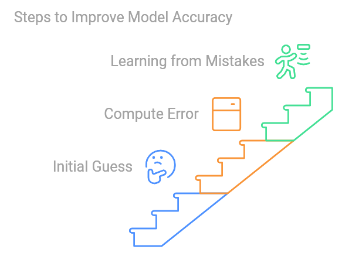

### Need for a Mathematical Framework

- We must translate our intuitive understanding of errors into a mathematical model to minimize them effectively.
- The goal is to create a representation of the error landscape and identify ways to minimize that error.

---

## Role of Calculus and Derivatives

- **Core Idea**: Represent the model's errors as a mathematical function and find its minimum.
- The minimum indicates the fewest mistakes possible, leading to better model accuracy.

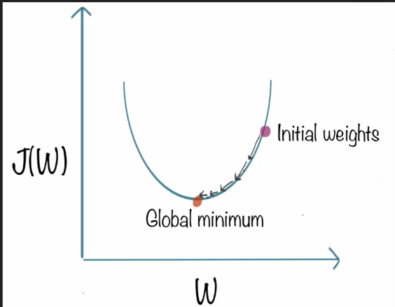

### Error Function

- We often visualize the error function, denoted as $J(W)$, where $W$ represents model parameters (weights).

- The objective is to minimize this function.

### Understanding Gradients

- **Gradient**: In higher dimensions, the term "gradient" is used instead of "derivative."
- Just like derivatives indicate the slope of a function in one dimension, gradients do the same in multiple dimensions.

---

## Visualizing Gradient Descent

- Starting at a random point, the process of gradient descent involves iteratively moving toward the function's minimum.
- In higher dimensions, while visualization becomes complex, the mathematical principles remain consistent.

---

## Numerical Example

- Consider a polynomial function.

    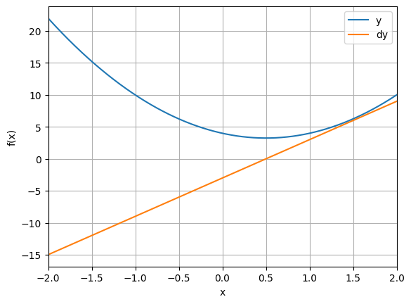

- The blue curve represents our error function, while the orange curve shows its derivative.
- The function's minimum occurs where the derivative equals zero.
---

## Gradient Descent Algorithm Steps

1. **Initialization**: Start with a random guess for the minimum (e.g., $-2$ or $0.6$).
2. **Loop for Iterations**:
   - Compute the derivative at the current guess.
   - Update the guess using the formula:
     $$
     \text{new guess} = \text{current guess} - (\text{derivative} \times \text{learning rate})
     $$

### Learning Rate

- The learning rate, a small constant (e.g., 0.01), controls how much to adjust the guess.
- If the derivative is negative, the guess moves to the right; if positive, it moves to the left.

---

## Example Walkthrough

- Starting with an initial guess, you iteratively compute the derivative and update your guess until approaching the minimum.
- For instance, from a guess of $-0.5$, if the derivative is $-6$, you'd adjust your guess positively to move toward the minimum.

### Final Outcome

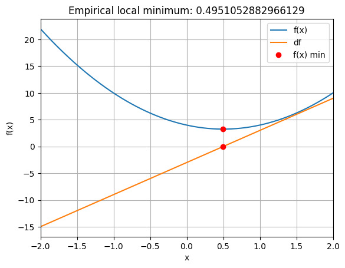

- You might end up with an approximate minimum (e.g., $0.495$), which can be verified against the true minimum (e.g., $0.5$) calculated analytically.

---

## Limitations of Gradient Descent

- **Accuracy Issues**: Gradient descent may not always find the exact solution.
  - Potential pitfalls include poor model parameter choices and getting stuck in local minima.
  - Challenges like vanishing or exploding gradients may also arise.

# Local Minima in Gradient Descent

## Understanding Local Minima

- **Global Minimum**: The lowest point in the error landscape, representing the best solution.
- **Local Minima**: Points where the error is lower than surrounding values but not the lowest overall.
  - **Good Local Minimum**: A relatively low error but not optimal.
  - **Bad Local Minimum**: A much higher error compared to the global minimum.

    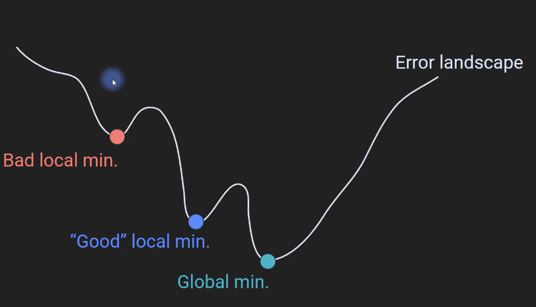

### Why Gradient Descent Gets Stuck

- Gradient descent moves based on the negative derivative. This can lead to situations where the algorithm oscillates around a local minimum without escaping it.

---

## Visualization Challenges in High Dimensions

- In 1D and 2D, we can easily see if a model is stuck in a local minimum.

    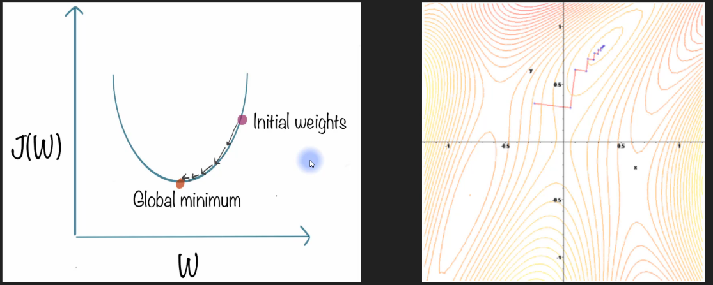

- In high-dimensional spaces, this visualization is impossible, making it hard to assess the model’s performance.

---

## Is Local Minima a Serious Issue?

- Despite the potential for local minima to pose problems, deep learning has shown remarkable success, suggesting this may not be a critical concern.
- The effectiveness of deep learning remains somewhat mysterious, which implies that local minima may not significantly hinder performance.

### Possible Interpretations

1. **Many Good Solutions**: There may be numerous local minima that yield similar performance, allowing models with different parameters to achieve comparable results.

    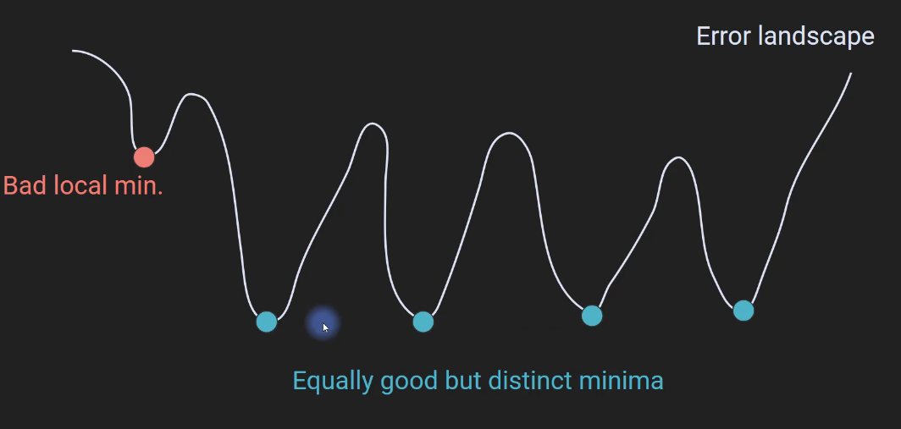

2. **Few Local Minima**: High-dimensional spaces might contain very few true local minima, challenging the assumption that they pose a significant problem.

    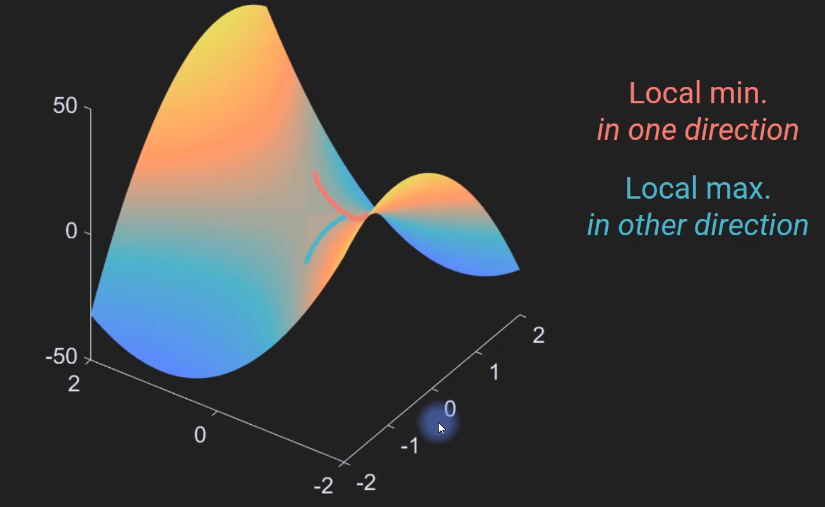

---

## Visualizing Possible Error Landscapes

- **Possibility 1**: The error landscape could feature multiple distinct yet equally good local minima alongside a global minimum. This suggests multiple solutions with similar efficacy.
  
- **Possibility 2**: A high-dimensional error landscape might not have many local minima, as local minima in higher dimensions must meet specific criteria across all dimensions (e.g., be a minimum in every direction).

### Saddle Points

- A saddle point is a location where the function is a minimum in one direction and a maximum in another, complicating the identification of local minima.

---

## Implications for High-Dimensional Spaces

- For models with many parameters, the chance of encountering a local minimum in all dimensions is low.
- Therefore, local minima might not significantly impede gradient descent in deep learning.

---

## Addressing Local Minima

- When model performance is good, it's usually best to not worry about potential local minima.
- If concerned, strategies include:
  - **Multiple Retrainings**: Train the model multiple times with different random initializations and select the best-performing model.
  - **Increase Model Complexity**: Adding parameters can help navigate around local minima more effectively.

### Implementation

**Note:** For practical implementation, refer to the "Gradient descent in 1D" section in the "Gradient_Notes_Code.ipynb" Jupyter Notebook.

# Code Exercise 1

## Challenge Overview

- The aim is to enhance your understanding of gradient descent by tackling a specific problem.

- The solution is in the "Coding_Exercises_Solutions.ipynb" notebook

---

## Recommended Approach

- Rather than starting from scratch, use the previous the "Gradient descent in 1D" section in the "Gradient_Notes_Code.ipynb" notebook

---

## Steps for the Code Exercise

### Step 1: Implement Gradient descent

1. **Change the Function**: Use the function $\cos(2\pi x) + x^2$.
2. **Find the Derivative**: You need to compute the derivative of this function

3. **Evaluate the Function**

4. **Explore Gradient Descent**: Run the modified code to see if gradient descent can find the minimum of this new function.

---

### Step 2: Hard Code Starting Value

- Change the random starting point to $x = 0$.
- Observe the outcome and reflect on why you get this particular result.

---

# Gradient Descent in Two Dimensions

## Key Concepts

- **Terminology**:
  - In one dimension, we compute the **derivative** (the slope of the function at any point).

  - In two dimensions, we compute **partial derivatives** for each axis (e.g., $x$ and $y$).
    - **Partial Derivative with Respect to $x$**: Changes in the function while ignoring $y$.
    - **Partial Derivative with Respect to $y$**: Changes in the function while ignoring $x$.

- The collection of all partial derivatives at a point forms the **gradient**, represented as a vector:
  - $$\text{Gradient} = \nabla = \begin{pmatrix} \frac{\partial f}{\partial x} \\ \frac{\partial f}{\partial y} \end{pmatrix}$$

---

## Notation

- Different notations exist for derivatives and gradients:

  - **Partial Derivative**: Indicated by the curvy $\partial$ symbol.
  - **Gradient**: Indicated by the upside-down triangle symbol (called **nabla** ($\nabla$)).

---

## The Function

- We will work with a complex two-dimensional function $f(x, y)$.

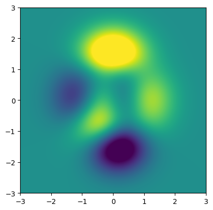

- Visualization:
  - Yellow areas represent peaks, blue areas represent valleys, and green represents a plane approaching zero.
  - The global minimum and local minima will be highlighted.

---

## Gradient Descent Application

1. **Initialization**: Start at a random point in the function.
2. **Gradient Calculation**: Compute the gradient using tools like SymPy.
3. **Iteration**: Use the gradient descent loop, now adapted for two dimensions.
   - The local minimum is represented as a two-element list or tuple (for $x$ and $y$).
4. **Visualization**: Graph the trajectory of the descent, illustrating how the algorithm approaches the minimum.

    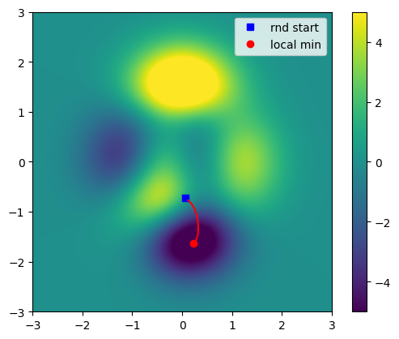

---

## Key Insights

- Starting points significantly affect the outcome of gradient descent.
  - An ideal starting point leads to the global minimum.
  - An unfortunate starting point (like at a peak) may lead to suboptimal solutions, as gradient descent may converge to a local minimum or a flat region.

---

### Implementation

**Note:** For practical implementation, refer to the "Gradient descent in 2D" section in the "Gradient_Notes_Code.ipynb" Jupyter Notebook.

# Code Exercise 2: Implementing Gradient Ascent

- **Goal**: Modify the existing code from the "Gradient descent in 2D" section in the "Gradient_Notes_Code.ipynb" Jupyter Notebook.
to now find the local maximum of a function.

- The solution is in the "Coding_Exercises_Solutions.ipynb" notebook

---

## Instructions

1. **Start with Existing Code**:
   - Start with the existing code from the "Gradient descent in 2D" section in the "Gradient_Notes_Code.ipynb" Jupyter Notebook.

2. **Modify for Gradient Ascent**:
   - Change the algorithm to instead search for the local maximum.

---

# Exploring Gradient Descent: Goals and Experiments

## Objectives

1. **Understand Metaparameters**:
   - Observe the effects of the starting value, learning rate, and number of training iterations on gradient descent.
  
2. **Run Parametric Experiments**:
   - Develop skills to design, execute, and interpret the results of experiments related to gradient descent.

---

## Key Concepts

### Metaparameters

- **Starting Value**: The initial guess for the parameters. Different starting points can lead to different minima (global vs. local).

- **Learning Rate**: A crucial parameter that determines the step size during each iteration. A too-small learning rate can result in slow convergence, while a too-large one can cause overshooting of the minimum.

- **Training Epochs**: The number of complete passes through the dataset during training. More epochs can lead to better convergence but also increase computation time.

---

## Experimental Design

### The Function We will Be Working With

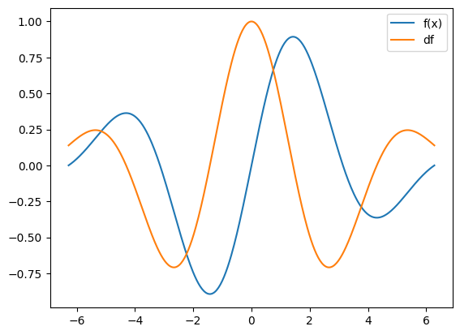

### Experiment 1: Varying Starting Locations

- **Objective**: Investigate how different starting points affect convergence to minima.
- **Method**: Systematically alter the initial guess within a defined range and observe outcomes.

### Experiment 2: Varying Learning Rates

- **Objective**: Understand the impact of different learning rates while keeping other parameters constant.

- **Method**: Test a range of learning rates, analyzing performance with a fixed starting point and epoch count.

### Experiment 3: Interactions Between Learning Rate and Training Epochs

- **Objective**: Explore how varying both the learning rate and number of epochs simultaneously affects the final outcome.
- **Method**: Use a matrix to represent results, providing a comprehensive view of the effects of both parameters.

---

## Insights Gained

- **Starting Values Matter**: The choice of starting point significantly influences the result, demonstrating the sensitivity of gradient descent.

    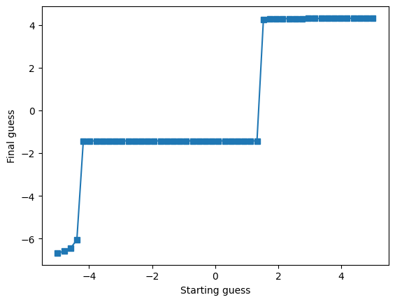

- **Learning Rate Dynamics**: Finding a suitable learning rate is crucial; some ranges facilitate better convergence than others.
  
    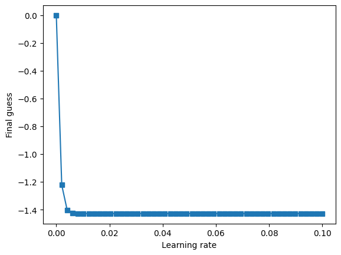

- **Parameter Interactions**: The relationship between learning rates and epochs highlights that increasing one can compensate for a decrease in the other, impacting the effectiveness of the optimization.

    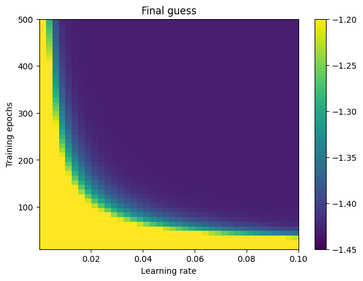

# Code Exercise 3: Dynamic Learning Rates in Gradient Descent

## Fixed Learning Rate Recap

- Previously, gradient descent utilized a constant learning rate, which was varied only across different runs, not within iterations.

## Objective of the Code Exercise

- Modify the learning rate dynamically during gradient descent iterations.

- Copy the code from "Gradient descent in 1D" section in the "Gradient_Notes_Code.ipynb" Jupyter Notebook, and modify it
.

## Proposed Methods

1. **Gradient-Based Learning Rate**:
   - Adjust the learning rate based on the gradient's magnitude. When far from the minimum, the gradient is large, resulting in a larger learning rate. As the algorithm approaches the minimum, the gradient diminishes, leading to a smaller learning rate.

2. **Time-Based Learning Rate**:
   - Decrease the learning rate over time by adjusting it based on the current epoch relative to the total number of epochs. Initially, the learning rate is larger and decreases as training progresses.

## Results and Observations

- The solution is in the "Coding_Exercises_Solutions.ipynb" notebook

## Discussion of Advantages and Disadvantages

- **Time-Based Method**: Useful but not responsive to model performance.
- **Gradient-Based Method**: Adaptive to problem dynamics but requires careful scaling to avoid excessively high learning rates.

# Understanding Vanishing and Exploding Gradients

## Vanishing Gradient Problem

- **Definition**: Occurs when the gradients become very small, causing the model's weights to stop changing significantly.

    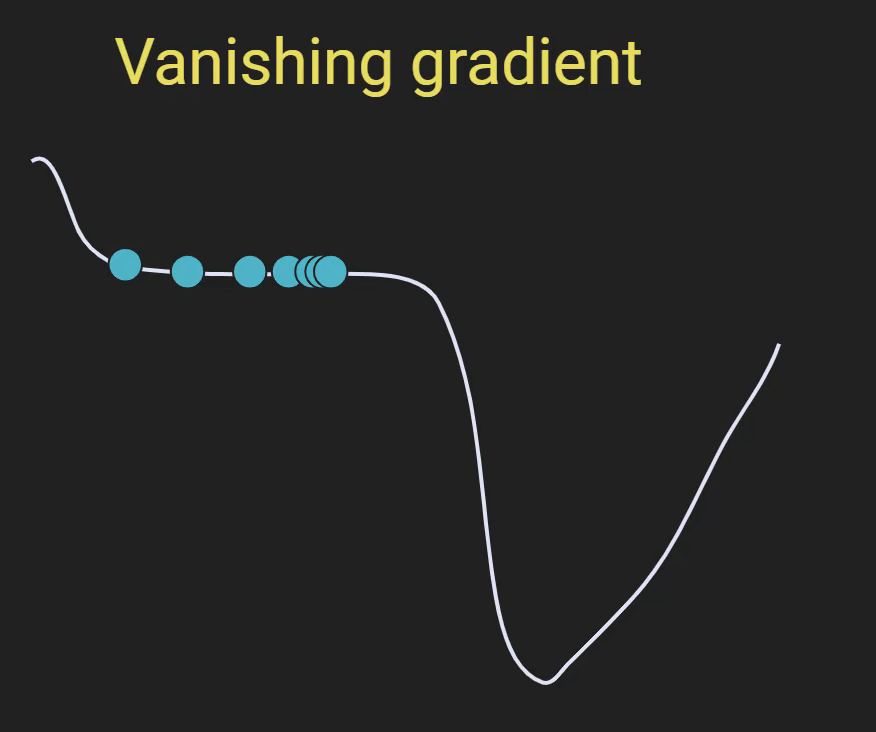

- **Mechanism**:
  - When using gradient descent, if the function is nearly constant over a region, the derivative (gradient) approaches zero.
  - As a result, the steps taken during optimization become tiny.
  - The model may fail to progress beyond this flat region, effectively stopping the learning process.

#### Consequences

- **No Learning**: The model does not improve or learn from the data.
- **Deep Networks**: Particularly problematic due to the high-dimensional error landscapes.

## Exploding Gradient Problem

- **Definition**: Occurs when gradients become excessively large, causing drastic changes in the model’s weights.

    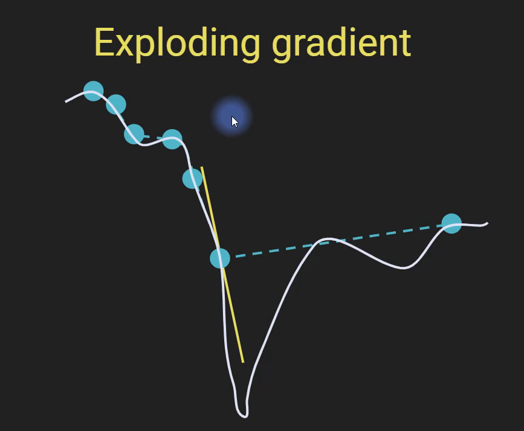

- **Mechanism**:
  - When the derivative is steep, the model takes disproportionately large steps in the optimization process.
  - This can cause the model to overshoot the minimum and jump past it.

#### Consequences

- **Wild Weight Changes**: The model oscillates and never settles into a stable solution.
- **Poor Solutions**: Continuous bouncing around without convergence.

## Summary of Issues

| Problem              | Description                                                                 | Consequence                     |
|---------------------|-----------------------------------------------------------------------------|---------------------------------|
| Vanishing Gradient   | Gradients become too small, leading to negligible updates.                  | No learning occurs.             |
| Exploding Gradient   | Gradients become excessively large, resulting in massive updates.           | Learning is unstable; poor solutions.|

## Strategies to Mitigate Gradient Issues (Will invistigate in the upcomming notes)

1. **Use Fewer Hidden Layers**: Reduces the risk of gradients vanishing in deep networks.
2. **Careful Choice of Activation Functions**: Select functions that do not saturate, which helps maintain gradient flow.
3. **Batch Normalization**: Normalizes inputs to each layer to maintain effective training dynamics.
4. **Regularization Techniques**:
   - **Dropout**: Randomly drops units during training to prevent overfitting.
   - **Weight Decay**: Adds a penalty for large weights to encourage smaller, more generalizable models.
5. **Pre-training with Autoencoders**: Initializes network weights effectively to avoid poor local minima.
6. **Use of Specific Architectures**:
   - **Residual Networks (ResNets)**: Designed to combat the vanishing gradient problem by allowing gradients to flow more easily through the network.
