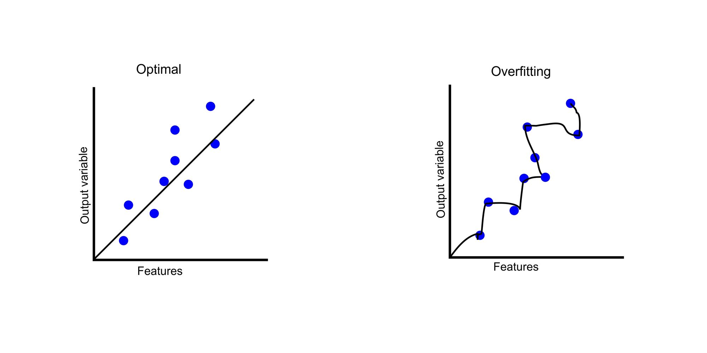
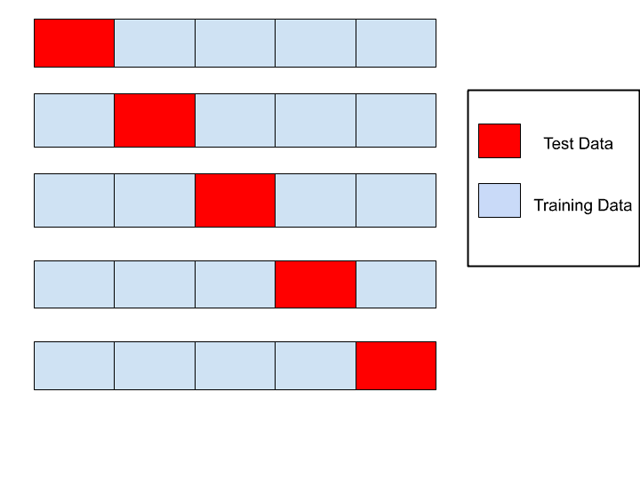
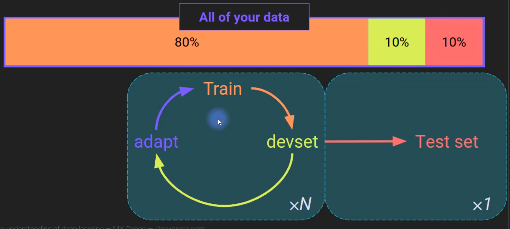
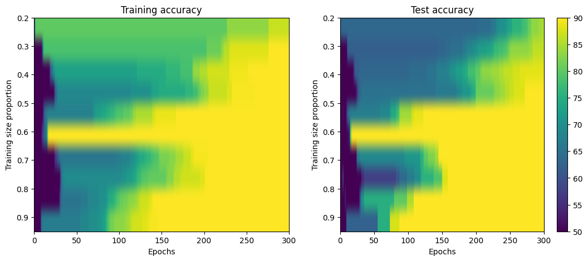
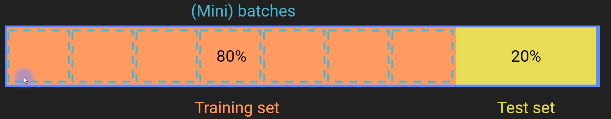
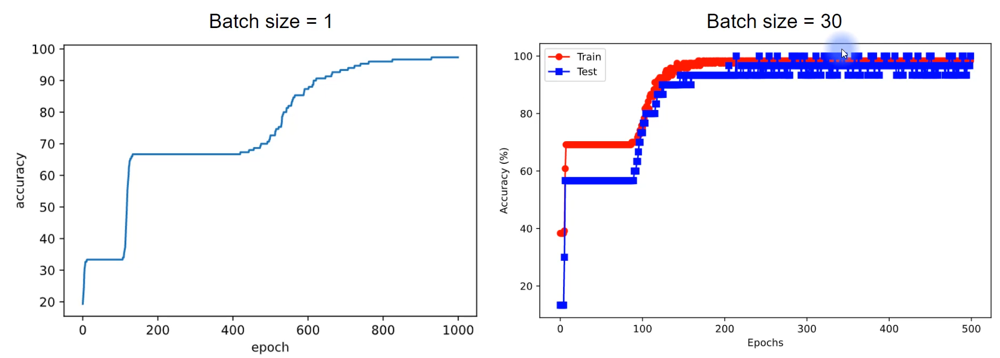

# Overfitting in Deep Learning

## Overview

- This section introduces **overfitting** and discusses strategies to minimize its risk in deep learning models.
- We will also touch upon **underfitting**, the concept of **researcher overfitting**, and general strategies to avoid overfitting in your models.

---

## 1. **What is Overfitting?**

   - **Overfitting** occurs when a model fits the training data too closely, capturing not only the underlying patterns but also the noise in the data.
   - This leads to poor **generalizability**, meaning the model performs well on the training data but fails to predict new, unseen data accurately.

   ### Example:

   

   ### Key Takeaway:
   - **Overfitting** leads to models that are too complex and unable to generalize effectively to new data.

---

## 2. **What is Underfitting?**
   - **Underfitting** happens when a model is too simple and fails to capture the underlying patterns in the data.

  ### Example:

   
   
   ### Key Takeaway:
   - **Underfitting** reduces the model's performance because it is too simplistic, and it misses important data patterns.

---

## 3. **Comparing Overfitting and Underfitting**

| **Issue**            | **Overfitting**                                | **Underfitting**                             |
|----------------------|------------------------------------------------|---------------------------------------------|
| **Sensitivity to Noise** | Highly sensitive to noise, fits noise as if it were a pattern | Less sensitive to noise, more robust |
| **Detection of True Effects** | May detect subtle effects, but at the cost of noise | Less likely to detect true effects, especially if they are small |
| **Generalizability**  | Poor generalization to new data | Poor generalization due to lack of complexity |
| **Model Complexity**  | Over-parameterized, difficult to estimate | Under-parameterized, easy to estimate |

---

## 4. **Choosing the Right Number of Parameters**
   - **Low-Dimensional Data**: When data is low-dimensional (e.g., 1-2 features), visual inspection can help decide the model's complexity.
   - **High-Dimensional Data**: In deep learning, where data and feature spaces are typically high-dimensional, **visualization** becomes impractical, and statistical methods are used to determine the right number of parameters.
   
   ### Key Strategy: **Cross-Validation**
   - **Cross-validation** is commonly used in machine learning and deep learning to evaluate the correct number of parameters for a model.

---

## 5. **Strategies to Avoid Overfitting**

### 1. **Cross-Validation**
   - **Cross-validation** is a technique for evaluating model performance by splitting data into subsets (folds). The model is trained on some folds and tested on the remaining fold to assess generalization ability.
   - Cross-validation helps to avoid overfitting by ensuring that the model is tested on data it hasn't seen before during training.

   

### 2. **Regularization**
   - **Regularization** is a technique used to penalize overly complex models by adding a penalty term to the loss function, which helps prevent overfitting.
   - Common regularization methods include:
     - **L2 Regularization** (Ridge)
     - **L1 Regularization** (Lasso)
     - **Dropout** (specific to neural networks)
   
   Regularization techniques will be discussed in more detail in a separate section.

---

## 6. **Researcher Overfitting (Researcher Degrees of Freedom)**

   - **Researcher Overfitting**: The idea that the researcher (or data analyst) has many choices during data cleaning, model selection, and hyperparameter tuning, which can lead to **overfitting the model** to a specific dataset.
   
   ### Example:
   - **Scenario**: You test three deep learning models (A, B, and C) and clean the data multiple times to improve the model's performance.
   - **Problem**: By repeatedly testing and adjusting models based on the same dataset, you may inadvertently overfit the model to that specific dataset. The model may not perform as well on a new, unseen dataset.
   
   ### Key Takeaway:
   - **Researcher Degrees of Freedom**: Too many choices during model development can limit the generalizability of the model to new data.
   
   ### Strategies to Avoid Researcher Overfitting:
   1. **Predefine Model Architecture**: Choose a model architecture in advance and only make minor adjustments based on testing results.
   2. **Reserve Test Data**: Keep a portion of your data aside as a test set that is never seen during model training. This ensures the model's generalizability to new, unseen data.
      - This is particularly important when working on **novel problems** or datasets that haven't been widely studied.
   
   **Example**: In **Kaggle competitions**, test data is reserved until after model development, preventing overfitting to the training data.

---

# Cross-Validation and Overfitting

## Overview

we will explore the concept of **cross-validation**, its mechanism, and how it helps in minimizing the risk of **overfitting**. We will also examine the assumptions behind cross-validation, and the relationship between **overfitting** and **generalizability**.

---

## 1. What is Cross-Validation?

Cross-validation is a technique used in machine learning to assess the performance of a model and ensure that it generalizes well to unseen data.

- **Training Set**: The data used to train the model.
- **Hold-Out Set (DevSet)**: A development set used to tune model parameters and test its performance.
- **Test Set**: A set of data used only to evaluate the final model after training.

---

### Cross-Validation Cycle

1. **Split the Data**:
    - **80%** for training.
    - **10%** for hold-out (development) set.
    - **10%** for testing.
  
    
   
2. **Training Phase**:
    - Train the model only using the **training set** (no information from the hold-out or test set).
    
3. **Evaluation Phase**:
    - After training, the model is tested on the **hold-out set**.
    - The model’s weights are frozen (no backpropagation here), and only **forward propagation** is used to compute accuracy and loss.
   
4. **Model Tuning**:
    - Based on the results from the devset, adjust the model (e.g., change the number of hidden layers, regularization, optimizer, etc.).
   
5. **Repeat the Cycle**:
    - The model goes through several cycles of training, evaluation, and tuning until performance stabilizes.

6. **Final Testing**:
    - Once satisfied with the model's performance on the development set, the model is tested on the **test set** (no further modifications at this stage).
    - This final evaluation gives an unbiased estimate of the model's performance on new, unseen data.

---

## 2. Types of Overfitting in Cross-Validation

Overfitting occurs when a model becomes too tailored to the training data, limiting its ability to generalize to new data.

### 2.1 Overfitting to the Training Set

- During training, the model adapts too much to the **training data**.
- This can lead to high performance on the training set but poor performance on unseen data.

### 2.2 Researcher Overfitting

- This occurs when the model is repeatedly adjusted based on the performance on the **hold-out set**.
- **Adapting the model** to the devset continuously (based on devset results) can lead to overfitting, as the devset influences the model.
- The model may perform well on the training and devsets but poorly on the test set (if the test set is not independent).

### 2.3 Avoiding Overfitting

- The **test set** should not be used during model tuning or training.
- To avoid overfitting, once the model is adjusted using the devset, **freeze the model** and test it only on the test set at the end.

---

## 3. K-Fold Cross-Validation

K-Fold cross-validation is commonly used in machine learning but is not as prevalent in deep learning. In K-fold cross-validation:

- **Split data** into K subsets (folds).
- Each fold is used as a test set while the remaining K-1 folds are used for training.
- This process is repeated K times, each time with a different fold used as the test set.

Example:


---

## 4. Key Assumptions for Cross-Validation

For cross-validation to work effectively, certain assumptions must hold true:

### 4.1 Independence Assumption

- The **hold-out (devset) and test sets** must be **independent** and **uncorrelated** with the training data.
- **Violation of this assumption** can lead to poor generalization and biased performance metrics.

#### Example of Valid Independence:
- **Pet Picture Classification**: If the test set consists of pictures from different people than those used in the training set, the assumption holds true, and overfitting is minimized.

#### Example of Assumption Violation:
- **Predicting Age from Face Pictures**: If the test set consists of siblings of the people in the training set, the images may be too similar, violating the independence assumption.
- **Predicting House Prices**: If the test set consists of neighboring houses (in the same area or street), the model may perform poorly on new, unseen locations.

---

## 5. Overfitting in Practice: City Example

Consider training a model for **predicting home prices** in three different cities (City A, City B, City C):

- **Scenario 1 (No Overfitting)**: 
  - The model is trained on data from all three cities and achieves **80% accuracy** across all cities.
  - This model generalizes well across cities.

- **Scenario 2 (Overfitting to City A)**:
  - The model is trained on data only from City A, leading to **95% accuracy** in City A.
  - However, performance drops in Cities B and C, showing that the model overfits to City A.

In the second case, the overfitting is beneficial if the goal is to **maximize accuracy in City A** (e.g., if hired by the mayor of City A). However, it limits generalization, which is a problem if the model needs to work across multiple cities.

---

# Generalization and Generalization Boundaries

## Overview
- **Generalization** is a core concept in deep learning and machine learning.
- It refers to how well a model performs on **new, unseen data**—data that was not part of the model's training process.
- we explore **generalization boundaries**, a critical aspect in understanding where a model can generalize and how that affects performance.

---

## Key Concepts

### What is Generalization?
- **Generalization**: The ability of a model to perform well on new, previously unseen data.
- The model should not just memorize the training data but learn patterns that can be applied to new, unseen data.

### Generalization Boundaries
- **Generalization boundaries** define the *scope* of data on which the model should work well.
- These boundaries limit the population or data characteristics that the model should be designed to handle.
  
### Example 1: Predicting Weight Based on Height and Calories
- Imagine a model trained to predict **weight** based on **height** and **calories consumed**.
- The model could be limited to **adult humans**, excluding:
  - **Children** (since their metabolism differs from adults).
  - **Non-human animals** (e.g., rodents have much faster metabolism than humans).
  
#### Generalization Boundaries for this Model:
- **Population**: Adult humans (both sexes, from various countries).
- **Excluded Data**:
  - Children: Their relationship between height, calories, and weight differs from adults.
  - Non-human animals: Their metabolism and physiology are significantly different from humans.

### Example 2: Predicting House Prices in Different Cities
- Suppose you're hired by the mayor of **City A** to develop a model predicting house prices.
  
#### Generalization Boundaries:
- **City A**: The model should perform well for homes in **City A**.
- **Other cities (B and C)**: Performance on cities B and C is irrelevant, and overfitting to City A is acceptable if the goal is to serve City A specifically.

### Generalization vs. Accuracy Tradeoff
- **Larger Generalization Boundaries** often lead to **lower accuracy**.
  - **Why?** The more varied or noisy the data (across different cities, regions, or populations), the harder it is for a model to generalize.
  - Expanding generalization boundaries to encompass a broader range of data typically results in a **slight loss in accuracy**.
- **Smaller Generalization Boundaries** (e.g., focusing on City A) can achieve **higher accuracy** but limit the model's applicability to other populations.

---

## Practical Implications of Generalization Boundaries

### Designing the Model and Data Sets

- **Generalization Boundaries** should guide the design of:
  1. **Training set**: Data from the population or sample within the desired generalization boundary.
  2. **Development (dev) set**: Data used for model evaluation during training, selected from the same boundary.
  3. **Test set**: Data that should be part of the generalization boundary but not used for training. It evaluates the final performance of the model on unseen data.

- **Example**:
  - If you're building a model for **adult humans**, you must ensure:
    - The **training set** contains data from various adult humans (different ages, sexes, etc.).
    - The **dev set** should also reflect this population.
    - The **test set** should not contain data from children or animals.

### Iterative Process of Adjusting Boundaries

- When designing the model and deciding on the generalization boundaries, **constant reflection** is essential:
  - Should the model focus on one population, or should it generalize to multiple?
  - The balance between **accuracy** and **applicability** should drive your decision on generalization boundaries.

---

## Conclusion: Importance of Defining Generalization Boundaries

- **Generalization boundaries** are critical for deciding how much variability or diversity you want the model to handle.
- The broader the boundary, the more you risk reduced accuracy due to increased complexity.
- Defining clear generalization boundaries ensures the model:
  - Works effectively for the intended population.
  - Avoids unnecessary overfitting to irrelevant data.
  
- The process of setting boundaries becomes more intuitive as you gain experience in working with data and models.

---

### Next Steps:

- Now that we understand generalization, we'll transition to the practical implementation of cross-validation and other methods to help improve the generalizability of deep learning models.

# Generalization and Generalization Boundaries

## Overview
- **Generalization** is a core concept in deep learning and machine learning.
- It refers to how well a model performs on **new, unseen data**—data that was not part of the model's training process.
- we explore **generalization boundaries**, a critical aspect in understanding where a model can generalize and how that affects performance.

---

## Key Concepts

### What is Generalization?
- **Generalization**: The ability of a model to perform well on new, previously unseen data.
- The model should not just memorize the training data but learn patterns that can be applied to new, unseen data.

### Generalization Boundaries
- **Generalization boundaries** define the *scope* of data on which the model should work well.
- These boundaries limit the population or data characteristics that the model should be designed to handle.
  
### Example 1: Predicting Weight Based on Height and Calories
- Imagine a model trained to predict **weight** based on **height** and **calories consumed**.
- The model could be limited to **adult humans**, excluding:
  - **Children** (since their metabolism differs from adults).
  - **Non-human animals** (e.g., rodents have much faster metabolism than humans).
  
#### Generalization Boundaries for this Model:
- **Population**: Adult humans (both sexes, from various countries).
- **Excluded Data**:
  - Children: Their relationship between height, calories, and weight differs from adults.
  - Non-human animals: Their metabolism and physiology are significantly different from humans.

### Example 2: Predicting House Prices in Different Cities
- Suppose you're hired by the mayor of **City A** to develop a model predicting house prices.
  
#### Generalization Boundaries:
- **City A**: The model should perform well for homes in **City A**.
- **Other cities (B and C)**: Performance on cities B and C is irrelevant, and overfitting to City A is acceptable if the goal is to serve City A specifically.

### Generalization vs. Accuracy Tradeoff
- **Larger Generalization Boundaries** often lead to **lower accuracy**.
  - **Why?** The more varied or noisy the data (across different cities, regions, or populations), the harder it is for a model to generalize.
  - Expanding generalization boundaries to encompass a broader range of data typically results in a **slight loss in accuracy**.
- **Smaller Generalization Boundaries** (e.g., focusing on City A) can achieve **higher accuracy** but limit the model's applicability to other populations.

---

## Practical Implications of Generalization Boundaries

### Designing the Model and Data Sets
- **Generalization Boundaries** should guide the design of:
  1. **Training set**: Data from the population or sample within the desired generalization boundary.
  2. **Development (dev) set**: Data used for model evaluation during training, selected from the same boundary.
  3. **Test set**: Data that should be part of the generalization boundary but not used for training. It evaluates the final performance of the model on unseen data.

- **Example**:
  - If you're building a model for **adult humans**, you must ensure:
    - The **training set** contains data from various adult humans (different ages, sexes, etc.).
    - The **dev set** should also reflect this population.
    - The **test set** should not contain data from children or animals.

### Iterative Process of Adjusting Boundaries
- When designing the model and deciding on the generalization boundaries, **constant reflection** is essential:
  - Should the model focus on one population, or should it generalize to multiple?
  - The balance between **accuracy** and **applicability** should drive your decision on generalization boundaries.

---

## Conclusion: Importance of Defining Generalization Boundaries
- **Generalization boundaries** are critical for deciding how much variability or diversity you want the model to handle.
- The broader the boundary, the more you risk reduced accuracy due to increased complexity.
- Defining clear generalization boundaries ensures the model:
  - Works effectively for the intended population.
  - Avoids unnecessary overfitting to irrelevant data.
  
- The process of setting boundaries becomes more intuitive as you gain experience in working with data and models.


# Manual Cross-Validation in Python

## Overview

In this lesson, we will learn how to implement cross-validation manually in Python, using **NumPy** for data partitioning. We'll explore how to split data into **training** and **test** sets, how to handle data imbalances, and how to implement these techniques for a **flower (iris) dataset**. This will serve as a practical example for understanding cross-validation and how it is implemented.

Note: For the full code implementation, refer to the associated Jupyter notebook.

## Key Concepts

### Cross-Validation Recap

Cross-validation is a method for assessing how well a model generalizes to an unseen dataset. The primary goal is to partition the data into training and test sets to evaluate model performance.

- **Training Set**: The data used to train the model.
- **Test Set**: The data used to evaluate the model's performance after training.

### Why Split the Data?
- The split ratio typically favors the training set (e.g., 80-20 or 70-30).
- The test set should remain unseen by the model during training to avoid **overfitting**.
- The proportion (e.g., 80%) is not special; it’s about providing enough data for training while leaving a small portion for validation.

### Hold-Out Set vs. Test Set
- **Hold-Out Set**: Used when you continuously refine your model or run systematic experiments.
- **Test Set**: If you're only testing one model configuration, you don't need a separate dev set. A single test set is enough.

### Data Balance

For datasets with multiple classes, it's important to ensure that the **train** and **test** sets have a **balanced representation** of each class. This helps the model generalize better and prevents bias toward certain classes.

### Steps in the Manual Cross-Validation Process

1. **Data Partitioning**: Split data into training and test sets manually using NumPy.
2. **Randomization**: Ensure that the data is randomly shuffled to avoid any biases due to ordering.
3. **Train and Evaluate**: Train the model using the training set and evaluate it using the test set.

## Data Partitioning with NumPy

### Creating Train/Test Split

- You can partition your dataset into **train** and **test** sets using a simple **Boolean vector**.
  - `True` values indicate data points in the training set.
  - `False` values indicate data points in the test set.

#### Example:

```python
# Define the proportion for the training set
train_size = 0.8
train_test_bool = np.zeros(len(data), dtype=bool)

# Set the first 80% of the data to be in the training set (True)
train_test_bool[:int(train_size * len(data))] = True
```
- **Shuffling** the dataset is essential to avoid biases. Ensure that data from all classes is distributed randomly across both sets.

```python
# Shuffle the data
np.random.shuffle(train_test_bool)
```

### Ensuring Data Balance

- The dataset should ideally have equal representation of all classes in both training and test sets.
- You can check the balance by calculating the average of the class labels in both training and test datasets.

| Data Set        | Average of Class Labels |
|-----------------|-------------------------|
| Full Dataset    | 1 (balanced)            |
| Training Set    | Should be close to 1     |
| Test Set        | Should be close to 1     |


## Training and Testing the Model

1. **Training**:
   - Train the model using only the data from the **training set**.
   - Do not expose the test data to the model during training to prevent **overfitting**.

```python
# Example: Selecting training data
train_data = data[train_test_bool]
train_labels = labels[train_test_bool]
```
   - Evaluate the model using the **test set**.
1. **Testing**:
   - Use the negation of the **Boolean vector** to select the test set data.

```python
# Example: Selecting test data
test_data = data[~train_test_bool]
test_labels = labels[~train_test_bool]
```
3. **Model Evaluation**:
   - Calculate **accuracy** on both the training and test datasets.
   - The training accuracy can be higher due to overfitting, especially with small datasets.

```python
# Example: Reporting accuracy
train_accuracy = calculate_accuracy(train_data, train_labels)
test_accuracy = calculate_accuracy(test_data, test_labels)
```
## Key Takeaways

- **Data Partitioning**: Ensure a proper **train/test split** and randomize the data to avoid biases.
- **Balance**: Check that both training and test sets have a representative sample of all classes.
- **Testing**: Use the **test set** to evaluate performance after training, without exposing the model to this data during training.

Note: For implementation details and code, refer to the associated Jupyter notebook.

# Cross-Validation with Scikit-learn

## Introduction

We will cover:
1. **Cross-validation** using **Scikit-learn**.
2. A deeper understanding of how to partition data into **training**, **validation**, and **test** sets.

## Experiment Overview

We will experiment with different proportions of training and testing data and observe how the partitioning influences model performance. We'll test multiple splits (from 10% to 95% for training) and track the **training** and **test accuracy**.

---

## Using Scikit-learn’s `train_test_split` Function

Scikit-learn provides a function called `train_test_split` that automates the splitting of data. Here’s a quick breakdown of how it works:

- **Inputs**:
  - Data: The numerical features.
  - Labels: The target values.
  - Test size: The proportion of data to allocate to the test set.

- **Outputs**:
  - Training data and labels.
  - Test data and labels.

#### Example of Using `train_test_split`:

```python
from sklearn.model_selection import train_test_split
import numpy as np

# Create a fake dataset
X = np.array([[1, 2, 3, 4], [5, 6, 7, 8], [9, 10, 11, 12], [13, 14, 15, 16], [17, 18, 19, 20]])
y = np.array([1, 1, 2, 2, 1])

# Split the data: 80% for training, 20% for testing
X_train, X_test, y_train, y_test = train_test_split(X, y, test_size=0.2)

print("Training data:", X_train)
print("Test data:", X_test)
```

- You can control the **test size** or **train size** by adjusting the respective parameters.
- `train_test_split` randomizes the data for you by default, but you can control this behavior with the `shuffle` parameter.

---

## Experimenting with Data Split Proportions

Now, let's explore how different proportions of training and test data affect model performance. We'll split the IRIS dataset in various proportions and evaluate how the model behaves.

### Training with Different Proportions

In this experiment, we will:
1. Use Scikit-learn to create different training/test splits (from 10% to 95% for training).
2. Track the **training** and **test** accuracies for each configuration.

```python
# Example: Create training/test splits for various training sizes
training_sizes = [0.1, 0.2, 0.5, 0.7, 0.8, 0.9, 0.95]

for size in training_sizes:
    X_train, X_test, y_train, y_test = train_test_split(X, y, train_size=size)
    print(f"Training size: {size * 100}%")
    print(f"Training data: {X_train.shape}, Test data: {X_test.shape}")
```

### Training and Test Accuracy

We'll track how the model’s **accuracy** changes over the epochs and as we adjust the proportion of training data. The training set accuracy typically increases faster because the model is exposed to more data during training. The test set accuracy, however, might lag behind because it represents unseen data.


---

## Experimental Results

By systematically changing the proportion of training data, we can observe the impact on accuracy.

  

- **Yellow color** indicates higher accuracy.
- **Blue color** indicates lower accuracy.

### Key Observations:

- **Larger training data** generally leads to better performance.
- Small datasets may lead to inconsistencies due to random initialization and limited data.


# DataLoaders, Mini-Batch Training, and Model Training with PyTorch

## 1. **Introduction to DataLoader**
DataLoader is a utility in PyTorch used to handle data during model training. It simplifies working with data by making it iterable. You will typically use it to feed data into your model during training and testing.

- **What is a DataLoader?**
  - A DataLoader is an iterable object in PyTorch.
  - It can be used to load batches of data during training or testing.
  - It helps automate shuffling, batching, and loading data in an efficient manner.

- **Key Points**:
  - **Shuffling**: Data can be shuffled to avoid bias in training.
  - **Batch Size**: You can set the batch size, i.e., the number of samples per iteration.
  - **TensorDataset**: Combines data and labels into a convenient dataset format for use with DataLoader.

## 2. **Batch Training**
Batch (or Mini-batch) training partitions the training data into smaller batches, which are used to train the model in iterations. This is more efficient than using a single data point at a time or the entire dataset.

  

- **Benefits of Mini-Batch Training**:
  - **Faster Training**: Reduces the time needed to train the model compared to training with a batch size of one.
  - **Improved Accuracy**: Can lead to better model performance by balancing computational efficiency and model accuracy.

### Example: Comparison of Batch Sizes in Training

                |

**Observation**: Larger batch sizes can significantly reduce the number of epochs needed to achieve high accuracy.

## 3. **Creating and Using DataLoader in PyTorch**
### Steps:
1. **Data Preparation**: Use `scikit-learn` to split data into training and test sets.
2. **TensorDataset**: Bundle the data and labels into a `TensorDataset`.
3. **DataLoader**: Create a `DataLoader` by passing the dataset (not raw data) into it.
4. **Shuffle**: DataLoader supports shuffling of data for randomization.

### Code Example:
```python

from torch.utils.data import DataLoader, TensorDataset
from sklearn.model_selection import train_test_split

# Create TensorDataset (data, labels)
dataset = TensorDataset(data, labels)

# Create DataLoader
train_loader = DataLoader(dataset, batch_size=4, shuffle=True)
test_loader = DataLoader(test_dataset, batch_size=1, shuffle=False)
```
### Iterating Through DataLoader
- You cannot directly print a DataLoader object.
- You need to iterate through it (e.g., using a `for` loop) to access its contents.

```python

for data, labels in train_loader:
    print(data, labels)
```

### Important Considerations:
- **Batch Size**: Control the number of data points in each batch.
- **Shuffle**: Shuffling ensures randomization of data, avoiding model bias.
- **TensorDataset**: Combines data and labels for easier handling.

## 4. **Training the Model Using Mini-Batches**
### Key Training Process:
- **Epoch Loop**: For each epoch, loop through mini-batches in the training data.
- **Batch Loop**: For each mini-batch, perform the following:
  1. **Forward Pass**: Pass the data from the mini-batch through the model.
  2. **Loss Calculation**: Compute loss based on the mini-batch.
  3. **Backpropagation**: Apply backpropagation based on the mini-batch.
- **End of Epoch**: Once all batches are processed, compute training accuracy for the epoch.

### Code Example for Training Loop:
```python

for epoch in range(epochs):
    for batch_data, batch_labels in train_loader:
        # Forward pass
        output = model(batch_data)
        loss = compute_loss(output, batch_labels)
        
        # Backpropagation
        optimizer.zero_grad()
        loss.backward()
        optimizer.step()
        
    # Compute accuracy for the epoch
    epoch_accuracy = compute_accuracy(output, batch_labels)
```
### Double Loop:
- **Outer Loop**: Loops through the number of epochs.
- **Inner Loop**: Loops through mini-batches of the data.

## 5. **DataLoader Example with Real Data (Iris Dataset)**

### Workflow:
1. **Split Data**: Use `train_test_split` to divide the data into training and testing sets.
2. **Convert to TensorDataset**: Convert the split data and labels into `TensorDataset`.
3. **Create DataLoader**: Generate the `train_loader` and `test_loader` using DataLoader.

### Example:
```python
from sklearn.datasets import load_iris
from sklearn.model_selection import train_test_split
import torch
from torch.utils.data import DataLoader, TensorDataset

# Load iris data
X = torch.tensor(iris.data, dtype=torch.float32)
iris = load_iris()
y = torch.tensor(iris.target, dtype=torch.long)

# Split data
X_train, X_test, y_train, y_test = train_test_split(X, y, test_size=0.2)

# Convert to TensorDataset
train_dataset = TensorDataset(X_train, y_train)
test_dataset = TensorDataset(X_test, y_test)

# Create DataLoader objects
train_loader = DataLoader(train_dataset, batch_size=12, shuffle=True)
test_loader = DataLoader(test_dataset, batch_size=len(test_dataset), shuffle=False)
```

## 6. **Training with Mini-Batches and DataLoader**

- **Batch Training**: Use mini-batches for faster convergence and better accuracy.
- **Test Set Evaluation**: After training, test the model on the entire test set (batch size = total number of test samples).

### Example:

```python

for data, labels in train_loader:
    # Forward pass and backprop
    pass

# After all epochs, evaluate on the test set
for data, labels in test_loader:
    # Forward pass on test data
    pass
```

### Insights:

- Mini-batch training significantly speeds up the training process.
- It reduces the number of epochs needed to reach high accuracy.

## 7. **Final Thoughts**
- The use of **DataLoader** and **mini-batch training** is essential for efficiently training deep learning models.
- PyTorch’s utilities make it easier to handle large datasets and complex training routines.
- Continue practicing with various datasets to solidify your understanding of DataLoader and mini-batch training.

---

**Note**: The implementation of these concepts can be found in the attached Jupyter notebook.
