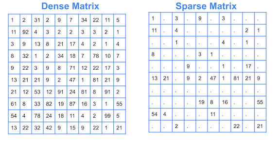
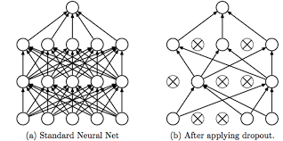
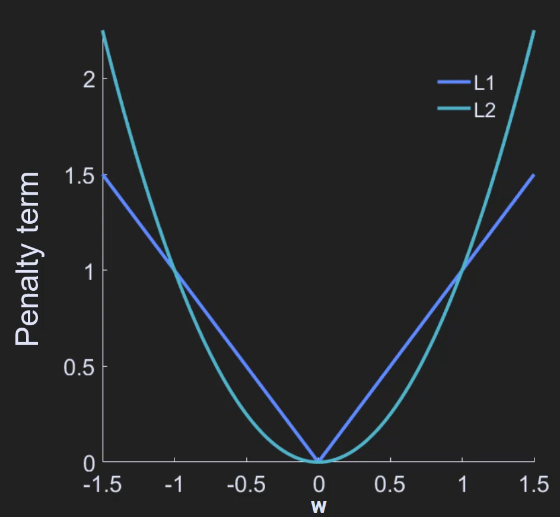
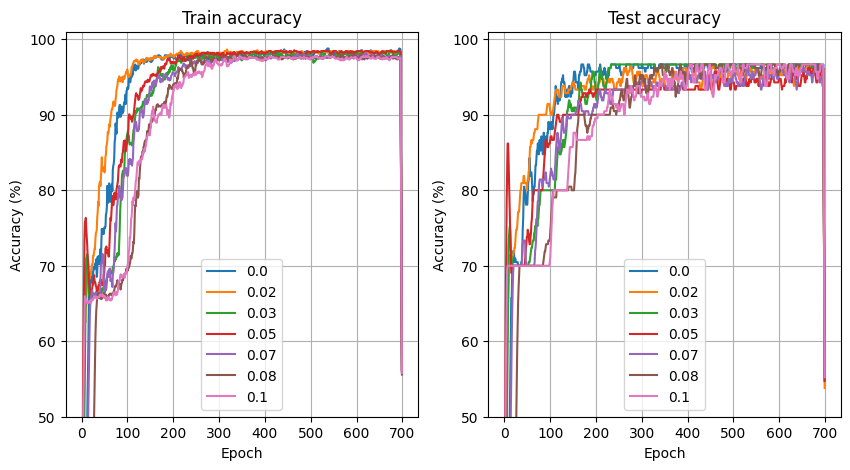
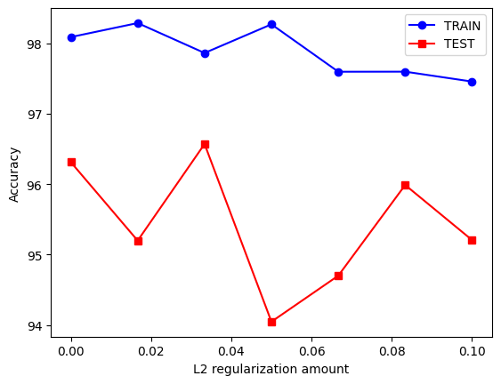
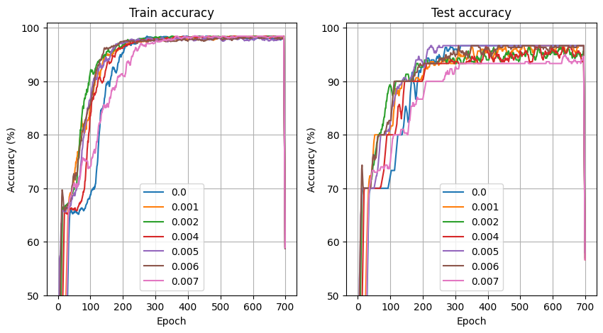
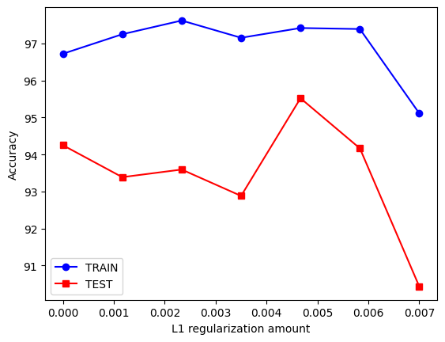
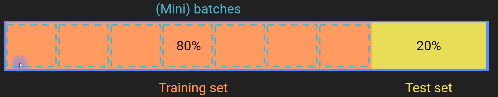
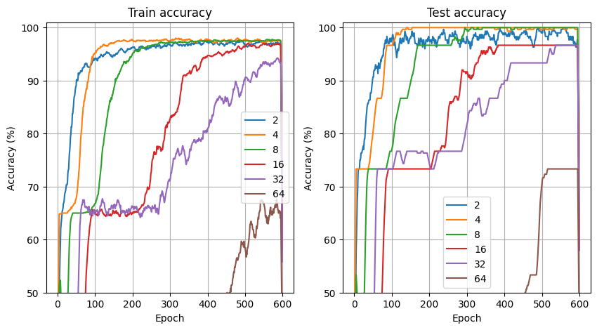

# Introduction to Regularization in Deep Learning

## What is Regularization?

- **Definition**: Regularization is a method used in machine learning and deep learning to prevent a model from memorizing specific examples (i.e., overfitting) and encourages the model to generalize better to new, unseen data.
  
- **Key Purpose**:
  - Prevents memorization of training data (overfitting).
  - Helps the model generalize well to new data.
  - Alters the representations within the model, potentially making them **more sparse** (relying on fewer features) or **more distributed** (spread across many features).

       

- **Why is it Important?**
  - Without regularization, models may only solve simple problems with simple architectures.
  - It is crucial for developing sophisticated and deeper models in deep learning.

## Effects of Regularization

- **Training Time**: Regularization can either **increase** or **decrease** training time, depending on the regularization method used.
  
- **Training vs. Test Accuracy**:
  - Regularization generally **lowers training accuracy** (because it penalizes the model for overfitting).
  - **Test accuracy** (or validation accuracy) **usually increases** with regularization as the model generalizes better.

- **Larger Models and Datasets**:
  - Regularization tends to be more effective with **larger models** (more layers and parameters) and **larger datasets**.
  - It is not always necessary for simple models, and may even **decrease performance** in such cases.

## Types of Regularization Methods

### 1. **Model Regularization**

   - **Dropout**:
     - Randomly **removes nodes** in the network during training (i.e., forces the output of some units to be zero).
     - Dropout forces the model to not rely on specific nodes, improving generalization.
     - While it works well in practice, **the exact reason why dropout works is not fully understood**.
         
         

### 2. **Loss Regularization**

   - **Idea**: Modify the loss function by adding a penalty term that discourages overly large weights.
   - **Methods**:
     - **L1 regularization**: Adds a penalty proportional to the **absolute value of the weights**.
     - **L2 regularization**: Adds a penalty proportional to the **square of the weights** (often referred to as **weight decay**).
   - These regularizers help in **preventing the model from assigning too much importance to any individual feature**.
        
      

### 3. **Data Regularization**

   - **Data Augmentation**:
     - **Expands** the dataset by creating modified versions of the training data.
     - Commonly used in image data by applying transformations like:
       - **Color changes**
       - **Horizontal flips**
       - **Zooming and cropping**
     - The goal is to **increase data diversity** and avoid the model overfitting to specific data points.
     - Data augmentation is especially important in **Convolutional Neural Networks (CNNs)** for image-related tasks.

   - **Batch Training**:
     - Helps to **train the model on smaller, randomly selected batches** of data rather than the entire dataset at once, improving efficiency and reducing overfitting.

## Visualizing the Effect of Regularization

- **Overfitting without Regularization**:
  - Imagine a model fit that is **too tight** to the training data, capturing unnecessary details and noise.

- **Effect of Regularization**:
  - Adding regularization leads to a **smoother model fit** that captures the general trends in the data without focusing too much on individual data points.
  - The model becomes **less complex** and **more general**.

## Choosing a Regularization Method

- **Which Regularizer to Use?**
  - There’s **no one-size-fits-all answer**. The best regularization method depends on your problem and model.
  - **Empirical Approach**:
    - Test different regularizers and see what works best for your model and data.
    - **Literature Review**: Check which methods have worked for similar problems.

- **Performance Comparison**:
  - Research suggests that **any form of regularization is usually better than no regularization** at all.
  - Some methods might not differ significantly in terms of performance, but adding regularization will usually improve results compared to no regularization.

---

# Dropout Regularization

Dropout regularization is an effective method to improve the performance and generalizability of deep learning models.

**Key Takeaways:**

- Dropout is a simple but powerful concept used during training in deep learning models.
- It helps prevent overfitting by randomly "dropping" units (neurons) from the network during each training epoch.
- This process forces the model to not rely too much on individual units, making it overall better.

---

## 1. **What is Dropout?**

- Dropout regularization involves randomly "dropping out" units from the network during each training epoch.
- The probability of dropping out a unit is typically set to 0.5, meaning there’s a 50% chance a unit will be ignored during that particular epoch.
- When a unit is dropped, its output (activation) is set to zero, so it doesn't contribute to the model’s forward pass.

   

---

## 2. **Training vs Testing**

- **Training Phase:**
  - During training, the model randomly drops out units with probability P (e.g., 0.5).
  - Each epoch has a different set of units being dropped, ensuring that the model doesn't overly rely on any specific unit.
  
- **Testing Phase:**
  - No units are dropped out during testing. All weights are used to ensure the model can evaluate on full capacity.
  - However, the challenge here is that the number of active units differs between training and testing, potentially causing inconsistency in the input to each unit.
  
---

## 3. **How to Fix the Testing Phase Scaling Issue?**

To solve the issue of different activations during training vs testing, there are two possible solutions:

- **Solution 1: Scale Down Weights During Testing:**
  - During evaluation, each weight is scaled by a factor of (1 - P) to account for the dropped units during training.
  - This ensures the overall magnitude of the inputs remains consistent between training and testing.

- **Solution 2: Scale Up Weights During Training:**
  - During training, we scale the weights of the active units by (1 / P) or Q (where Q is the inverse of P). This increases the strength of active units to compensate for the missing inactive ones.
  - PyTorch uses this method, where it scales the weights during training and leaves them unchanged during testing.

---

## 4. **Why Does Dropout Work?**

The exact reasons why dropout works remain somewhat mysterious, but several explanations have been proposed:

- **Prevents Overfitting:** Dropout helps prevent the model from overfitting by making the model stronger and not overly reliant on specific neurons.
- **Distributed Representation:** By forcing the model to rely on multiple nodes across the network, it encourages distributed representations rather than focusing too much on one or a few nodes.
- **Improves Stability:** The model becomes less sensitive to the fluctuations or noise of specific neurons, leading to a more stable model.

---

## 5. **Effect on Training:**

- **Longer Training Times:** Dropout generally requires more training epochs, as the model’s capacity to learn is reduced in each epoch by the random dropping of nodes.
- **Faster Per-Epoch Computation:** Each training epoch computes faster because fewer computations are required due to fewer active units.
- **Possible Accuracy Trade-off:** Dropout may slightly decrease the training accuracy but improve the test accuracy due to its regularization effect. In some cases, dropout can increase both training and test accuracy.
- **Works Better for Deep Networks:** Dropout works best for deep networks, particularly in convolutional neural networks (CNNs) and other complex architectures. It may not improve performance in smaller, shallow networks.

---

## 6. **Considerations:**

- **Data Size:** Dropout regularization doesn't perform well with small datasets. With limited data, you might not see the expected benefits because more epochs are required, and training can become inefficient.
- **Model Type:** Dropout regularization is most effective in large, deep models, particularly CNNs used for image recognition tasks.
- **Convolution Layers in CNNs:** There’s some debate about the best way to apply dropout in convolutional layers, but this will be addressed later in the CNN notes.

---

# PyTorch: Switching Between Training and Evaluation Modes

Before viewing how dropout is implemented in PyTorch, we should first review the concepts of training mode vs Evaluation mode.

## Why Switch Between Training and Evaluation Modes?

- **Gradients & Backpropagation**:
  - Gradients are computed during training to optimize the model.
  - During evaluation (testing with dev/test sets), gradients **should not** be computed.
  
- **Regularization Methods**:
  - Two specific regularizations—**dropout** and **batch normalization**—should only be applied during **training**, not evaluation.
  
### The Problem:

- When evaluating a model, we don’t want backpropagation (which uses gradients) and regularization methods (like dropout) to be active.
  
Thus, we need a way to **deactivate gradients** and **turn off regularization** during evaluation.

## PyTorch Methods for Switching Between Modes

1. **`net.train()`**:
   - Puts the model into **training mode**.
   - Regularization (like dropout) is **active**.

2. **`net.eval()`**:
   - Puts the model into **evaluation mode**.
   - Regularization (like dropout) is **turned off**.

3. **`torch.no_grad()`**:
   - Disables **gradient computation** (used only during evaluation).
   - Helps speed up evaluations by reducing unnecessary computations.

### How These Methods Work Together:

- **Training Mode (`net.train()`)**: 
   - This is **the default mode**.
   - It’s active during training, ensuring backpropagation and regularization like dropout are functioning.

- **Evaluation Mode (`net.eval()`)**: 
   - Used when evaluating the model.
   - **Deactivates regularization** (dropout and batch normalization).
   - Important for **testing** the model's actual performance on unseen data.

- **No Gradient (`torch.no_grad()`)**: 
   - Typically used in the **evaluation phase** to turn off the gradient computations.
   - Important for **reducing computation overhead** during testing.

## When to Use These Functions:
### 1. **Training Loop**:
   - At the beginning of each training epoch, you should explicitly set the model to **training mode**:
     ``` python
     net.train()
     ```  
   - You don’t need to manually turn on training mode because it’s the **default**.
   
### 2. **Evaluation Loop**:
   - After the training phase, you can switch to **evaluation mode**:
     ``` python
     net.eval()
     ```  
   - **`torch.no_grad()`** is used within the evaluation loop to disable gradient tracking:
     ``` python
     with torch.no_grad():
         # evaluation code here
     ```  
   - This saves computational resources and speeds up evaluation.
   
### 3. **Switching Back**:
   - After you’ve finished the evaluation, remember to switch the model **back to training mode**:
     ``` python
     net.train()
     ```  

## Example Code Flow:
``` python
# Training Loop
for epoch in range(num_epochs):
    net.train()  # Ensure model is in training mode
    # Training process for each mini-batch...

# Evaluation Loop
net.eval()  # Switch model to evaluation mode
with torch.no_grad():  # Disable gradient computation
    # Evaluation process for test set...
```

### Notes:
- **`net.train()`** is necessary if you’re using methods like **dropout** or **batch normalization**.
- **`torch.no_grad()`** is not essential but can **improve performance** during evaluation, especially for large models.

### When Is `torch.no_grad()` Helpful?
- For smaller models, the performance difference may not be noticeable.
- For larger, more complex models (more layers, units, etc.), **using `torch.no_grad()` will make a big difference** in computation time.

## **Dropout Code Implementation in PyTorch:**

To implement dropout in PyTorch, you can use the `torch.nn.Dropout` module. Here's how it works:

### **Training Mode (Applying Dropout):**
In PyTorch, dropout is applied during the training phase. We create an instance of the dropout class with a specified probability (P) and apply it to the model. Here’s an example:

``` python
import torch
import torch.nn as nn

# Set dropout probability (50%)
dropout = nn.Dropout(0.5)

# Example vector of ones
X = torch.ones(10)

# Apply dropout to the vector
Y = dropout(X)
print(Y)
# Output: Some values will be zeroed out, others scaled up (depending on P)
```
- The `Dropout` class randomly zeroes out elements of the input tensor with the specified probability (0.5 in this case).
- The output will contain some zeros (where the dropout was applied), and the non-zero values will be scaled up to compensate for the dropped units.

---

### **Evaluation Mode (No Dropout):**
When switching to evaluation mode, dropout is no longer applied. Here’s how to switch to evaluation mode:

``` python
dropout.eval()

# Apply dropout in evaluation mode (no dropout)
Y_eval = dropout(X)
print(Y_eval)
# Output: No zeros, full input is passed through without modification.
```

- The `eval()` method ensures no units are dropped during evaluation. This is important during testing to ensure the full model is used.

---

### **Alternative Method: Using `F.dropout`:**

The `F.dropout` function is another way to apply dropout in PyTorch. However, it's a little different from `nn.Dropout`:

``` python
import torch.nn.functional as F

# Apply dropout with probability of 0.5 using F.dropout
Y_f = F.dropout(X, p=0.5, training=True)
print(Y_f)
# Output: Randomly dropped out values based on the dropout probability.
```
- `F.dropout` doesn't automatically disable during evaluation mode.
- You need to manually set `training=False` to prevent dropout during evaluation.

---

## 9. **Important Notes for Using Dropout:**
- **Training Mode vs Evaluation Mode:** Always ensure that dropout is disabled during testing/evaluation (i.e., `dropout.eval()`) to get consistent results. Forgetting to switch back to training mode can lead to errors or incorrect behavior.
- **Manual Toggle for `F.dropout`:** When using `F.dropout`, remember to manually control whether dropout is applied using the `training` parameter.

---

# Parametric Experiment For Exploring Dropout Rates

## Overview
This lesson focuses on **dropout regularization** in a deep learning model. The key topics include:
- How dropout regularization works in practice.
- Exploring the effects of different dropout rates on model accuracy.
- Testing dropout regularization and its impact on a model's performance.

---

## For Implementation Details:

- View the attached Jupyter notebook (Regularization.ipynb) for the full code.

---

## Experiment Setup
- **Data**: Using The iris Dataset.

- **Model**: A **deep neural network** with:
  - **Input Layer**: 4 inputs.
  - **Hidden Layer**: 32 neurons.
  - **Output Layer**: 3 neurons
  - Dropout rate is introduced in the hidden layer to explore its effects on performance.

### Why Use Dropout?
- **Dropout** is particularly useful when a model shows signs of **overfitting**, where it performs very well on the training data but poorly on the test data.
- However, **dropout doesn't always work** – the dropout rate needs to be adjusted properly for optimal results.
---

## Workflow

### 1. **Data Preparation**:
     - Data is split into **training (80%)** and **test (20%)** sets using `train_test_split`.

   - **PyTorch DataLoader**: 
     - Data is then converted into **`TensorDataset`** and **`DataLoader`** for easier iteration during model training.
     - Batch size for training is set to **16** to improve efficiency during training.

### 2. **Model Definition**:
   - **Architecture**: The model consists of an input layer (4 inputs), one hidden layer (32 neurons), and an output layer (3 neuron).
   - Dropout rate is a key **hyperparameter** that can be tuned for better regularization.
   - Dropout is applied during training but **not during evaluation/testing**, ensuring that the model performance during testing isn't influenced by random dropping of units.

   - **Forward Pass**:
     - Activation function used: **ReLU**.
     - **Dropout** is applied after the hidden layer with the probability defined by the dropout rate.
     - The model switches between **train mode** and **eval mode** for proper dropout application.

### 3. **Training the Model**:
   - **Training Loop**: The model is trained using standard **Stochastic Gradient Descent (SGD)**.
   - **Loss Function**: cross-entropy (`CrossEntropyLoss`) is used for classification.
   - **Accuracy Calculation**: After each epoch, the model computes both training and testing accuracies, ensuring dropout is off during evaluation.

### 4. **Dropout Rate Experimentation**:
   - The experiment varies the dropout rates (from 0 to 1) and computes the model's accuracy for each.
   - Results show that:
     - **Dropout is not always beneficial**. The best accuracy is achieved with **0% dropout**.
     - As dropout rate increases, both training and testing accuracies decrease, suggesting **dropout regularization might not always help**.
      
      

        
### 5. **Generalization Error**:
   - **Generalization error** is calculated as the difference between training and test accuracies:
     - Smaller differences indicate better generalization (no overfitting).
     - Larger differences suggest the model is overfitting, i.e., it performs well on training data but poorly on unseen test data.
    
---
## Key Takeaways

- **Dropout**: It's a **powerful regularization technique** in deep learning but isn't always the right solution.
  - It works best in cases where the model is overfitting but can hinder performance when overused.
  - Proper tuning of the **dropout rate** is crucial for optimal performance.
  
- **Model Behavior**:
  - Overfitting can be controlled by adjusting the dropout rate.
  - However, **no dropout** might actually yield the best performance for some models and datasets.

---

# Weight Regularization: L1 and L2 Regularization

## Overview:
- **Weight Regularization** is a technique to prevent overfitting in deep learning models.
- Common methods of weight regularization include **L1 Regularization** and **L2 Regularization**.
- These techniques are used across various fields, such as machine learning, statistics, robotics, and control engineering.
  
## Regularization Goal:
- The goal of training is to **find the set of weights (W)** that minimize the cost function.
  - The cost function is the **average of the losses** from a set of data points (e.g., mean squared error for regression, binary cross-entropy for classification).
  - The loss measures the discrepancy between the model's predicted output (**ŷ**) and the actual observed output (**y**).

## Weight Regularization:
- **Weight Regularization** involves adding a penalty term to the cost function to encourage smaller weights and prevent overfitting.

## Formula for Regularization:
- The **cost function** with regularization becomes:
  $$
  J(W) = \text{Loss}(ŷ, y) + \lambda \times \text{Regularization Term}
  $$
  Where:
  - $J(W)$ is the regularized cost.
  - $\lambda$ is the **regularization parameter** (typically small, e.g., 0.01).
  
### Regularization Types:
1. **L2 Regularization (Ridge Regression)**:
   - **Formula**: 

     $$
     \lambda \sum_{i=1}^{n} w_i^2
     $$

     Where $w_i$ are the weights.
   - This shrinks all weights, but larger weights are penalized more than smaller ones due to squaring the terms.
   - **Effect**: Encourages weights to be small, but not necessarily zero.
   - **Other Names**: Ridge Regression (in linear regression), Weight Decay (in deep learning).
   
2. **L1 Regularization (Lasso Regression)**:
   - **Formula**:
     $$
     \lambda \sum_{i=1}^{n} |w_i|
     $$
   - This **promotes sparsity**, driving some weights to zero, which simplifies the model.
   - **Effect**: Many weights will become zero, promoting **sparsity**.
   - **Other Names**: Lasso Regression (in linear regression).

## Geometric Intuition Behind L1 and L2:

   

### L2 Regularization:
- **Effect**: L2 regularization shrinks larger weights significantly more than smaller weights.
- The cost decreases faster for larger weights than for smaller weights.
  - Example: A change from weight = 1.5 to 1.4 reduces the cost by about 0.3.
  - A change from weight = 0.2 to 0.1 reduces the cost by only 0.03.
- **Intuition**: Larger weights contribute more to the regularization cost, so they are more heavily penalized.

### L1 Regularization:
- **Effect**: L1 regularization applies a constant penalty for both large and small weights.
- The cost decrease is **the same** regardless of the weight magnitude.
  - Example: A change from weight = 1.5 to 1.4 reduces the cost by 0.1.
  - A change from weight = 0.1 to 0.2 also reduces the cost by 0.1.
- **Intuition**: This leads to sparsity, setting many weights to zero.

## Comparison: L1 vs. L2 Regularization
| Feature               | **L1 Regularization (Lasso)**      | **L2 Regularization (Ridge)**     |
|-----------------------|------------------------------------|-----------------------------------|
| **Effect on Weights**  | Promotes sparsity (many zeros)     | Shrinks weights, but rarely zero  |
| **Penalty**            | Linear (absolute values)           | Quadratic (squared values)        |
| **Outcome**            | Sparse model (many zero weights)   | Shrinking of weights but not zero |
| **Use Case**           | Feature selection, sparsity        | Distributed representations       |
| **Geometric Shape**    | Diamond-shaped contours            | Circular contours                 |

## Regularization Parameter ($\lambda$):
- The **regularization parameter** ($\lambda$) determines the strength of the penalty term.
- Typically, $\lambda$ is small, e.g., 0.01.
  - A large $\lambda$ would overly penalize the weights, making them too small.
  - A small $\lambda$ may not reduce overfitting effectively.
- **Tuning $\lambda$**:
  - Cross-validation: Test the model with different values of $\lambda$ and select the one that minimizes validation error.
  - Empirical values: Common starting points include $\lambda = 0.01$, but this may vary by task.

## Combination of L1 and L2 Regularization:
- **Elastic Net Regression**: A mix of L1 and L2 regularization.
- Useful when you want to combine the benefits of both L1 (sparsity) and L2 (shrinkage).

## When Does Weight Regularization Work?
- **When to Use**:
  - For **large, complex models** to avoid overfitting.
  - If **training accuracy** is much higher than **validation accuracy**, indicating overfitting.
  
- **When Not to Use**:
  - For **simple models**, regularization might degrade performance.

## Why Does Weight Regularization Work?
- Regularization **discourages complex and overly specific** representations, helping the model generalize better.
- It also **improves numerical stability** by preventing excessively large weights, which can cause instability, especially in deep networks with many layers.

# L2 Regularization in PyTorch

- PyTorch has **built-in support** for L2 regularization through the `weight_decay` parameter in the optimizer.
- L2 regularization is **not specified in the model architecture** but in the **optimizer** function.

## Parametric Experiment on L2 Regularization in PyTorch
- **Model Architecture**:
  - Input layer → Hidden layer → Output layer.
  - `nn.Sequential` is used to create a simple model without needing a custom class.

- **Optimizer**:
  - The optimizer function used is `torch.optim.SGD`, which stands for Stochastic Gradient Descent.
  - Standard input to `SGD`: `model.parameters()` (model weights) and the learning rate.
  - To apply L2 regularization, an optional input `weight_decay` is added:
    - `weight_decay` specifies the amount of L2 regularization applied during training.
    - Example: `weight_decay=0.01` applies 1% regularization.

  **Note**: The `weight_decay` parameter **defaults to 0**, meaning no regularization is applied unless specified.

### The Experiment
- **Dataset**: Iris flower dataset.
- **Objective**: Evaluate how the level of L2 regularization affects categorization accuracy.
- **Process**:
  - Train the model 7 times, each time with a different level of L2 regularization (ranging from 0 to 0.1).
  - Track training and test accuracy across epochs.

### Results





## Insights from the Experiment
- **Effect of Regularization**:
  - There is **no clear trend** indicating that L2 regularization always improves model performance.
  - In fact, excessive L2 regularization can result in decreased performance due to overly constrained weights.
  
- **Interpretation of Results**:
  - For this experiment, L2 regularization values above 0.01 (e.g., 0.1) may be **too aggressive**, leading to a decrease in accuracy.
  - **Smaller regularization values** tend to offer better performance without too much penalization on the weights.

- **Variability**:
  - Due to the **random initialization** of weights, running the experiment multiple times may yield **slightly different results**.

## Practical Takeaways
- **L2 Regularization Application**:
  - Regularization should be tuned based on the model complexity and the dataset.
  - Start with a small value (e.g., `0.01`), and gradually increase if overfitting is observed.
  
- **Model Evaluation**:
  - Always evaluate performance using both **training accuracy** and **test accuracy**.
  - Regularization can help balance bias and variance, but it’s important to avoid over-regularizing, which can harm the model.

### For Implementation Details:
- View the attached Jupyter notebook (Regularization.ipynb) for the full code on how to implement L2 regularization, run the experiment, and plot the results.

# L1 Regularization in PyTorch

- **Manual Implementation**: Unlike some other frameworks, in PyTorch, L1 regularization isn't as straightforward. Instead of specifying a parameter in the optimizer, we manually compute the L1 penalty term and add it to the loss.

- **L1 Regularization Formula**:  
  $$
  L1 \text{ penalty} = \lambda \sum_i |w_i|
  $$
  Where:
  - $\lambda$ is the regularization strength (L1 lambda).
  - $w_i$ are the weights of the model.

## Approach:
### 1. **Accessing Weights**:
   - **Iterating Over Parameters**: 
     - In PyTorch, you can access the weights and biases of a model using `model.named_parameters()`. This returns the name, size, and number of elements of the model's parameters (weights and biases).
     - Example output:
       - `0.weight`: 32x4 matrix (32 nodes, 4 input features).
       - `0.bias`: 32 units, corresponding to the biases for each node.

   - **Exclusion of Bias Terms**:
     - Only weights (not biases) are used in L1 regularization. The bias terms do not contribute to the penalty.

### 2. **Creating the L1 Regularization Term**:
   - **Manual Calculation**:
     - The L1 regularization term is calculated as the sum of the absolute values of the weights.
     - Formula used:  
       $$
       L1_{\text{term}} = \lambda \times \frac{1}{\text{num\_weights}} \sum_i |w_i|
       $$
     - `num_weights`: Total number of weights in the model (excluding biases).

   - **Effect of Regularization**:
     - The penalty is scaled by the regularization parameter $\lambda$ to prevent it from dominating the model's main loss (e.g., accuracy loss).
     - If $\lambda = 0$, no regularization is applied.


### 3. **Training the Model**:
   - **Training Loop**:
     - As with standard training, after adding the L1 term to the loss, proceed with backpropagation and parameter updates.
     - Track accuracy and loss values for both training and testing datasets.
   
### 4. **Experimentation with Regularization Strength**:
   - **Testing Different $\lambda$ Values**:
     - Run experiments using various values for $\lambda$ to observe the effect on model performance.
     - Higher values of $\lambda$ increase regularization, making the model more sparse.
     - Plot results to visualize how regularization impacts training accuracy and loss.

  - **Empirical Results**:
     - **Initial Regularization**: In early stages of training, higher regularization might help the model learn faster by preventing overfitting.
     - **Final Performance**: In simpler models or smaller datasets, regularization may not significantly improve performance. However, in complex models or large datasets, its effect is more pronounced.
     - Repeating the experiment multiple times is important for confirming results.

   
   
   

### Note:
- **Implementation Details**: For the implementation of the code and more details, please refer to the attached Jupyter notebook (Regularization.ipynb), which demonstrates the actual code for L1 regularization in PyTorch.

# Mini-Batches in Deep Learning

## What is a Mini-Batch?
- **Batch**: Often refers to the entire dataset used for training. (Note: terminology can vary—some people use "batch" to mean a mini-batch.)
- **Mini-Batch**: A smaller subset of the dataset used to update the model's weights during training.
- **Batch Size (K)**: The number of samples contained in each mini-batch.
  - **K = 1**: This scenario is known as pure Stochastic Gradient Descent (SGD). (However, note that PyTorch’s `SGD` optimizer can be used with any batch size, so "SGD" does not always imply a batch size of 1.)
  - **K = N** (where N is the total number of samples): This is referred to as Batch Gradient Descent.
- **Common Practice**: Mini-batch sizes are typically chosen as powers of two (e.g., 16, 32, 64) for computational efficiency, especially when using GPUs.



## How Mini-Batches Impact Computation
- **Small Batch Sizes (e.g., 4):**
  - **Frequent Updates:** Weight updates occur more often, which can accelerate early learning.
  - **Noisy Gradients:** Fewer samples per batch lead to higher variance in the gradient estimates. This noise can help the model escape local minima but may also result in less stable convergence.
  - **Generalization:** The inherent noise can act as a regularizer, potentially improving generalization on diverse datasets.
- **Moderate Batch Sizes (e.g., 16 or 32):**
  - **Balanced Trade-off:** Strike a balance between frequent updates and the stability of gradient estimates.
  - **Stable Training:** Commonly used in practice because they typically offer smooth and reliable training dynamics.
- **Large Batch Sizes (e.g., 54 or more):**
  - **Accurate Gradients:** More samples per batch yield more reliable gradient estimates, reducing noise.
  - **Less Frequent Updates:** Fewer updates per epoch may slow down convergence if learning rate adjustments are not made.
  - **Generalization Risks:** With reduced gradient noise, the model might overfit if not properly regularized or if the learning rate isn’t tuned accordingly.
- **Additional Note:** The optimal batch size depends on the specific dataset, model architecture, and task. Experimentation is key to finding the best balance.


## Analogy: Exam Grading
- **Pure SGD (K=1)**: Teacher gives detailed feedback on each answer (very informative but slow).
- **Batch Training (K=N)**: Teacher gives one final score without feedback (fast but not helpful for learning).
- **Mini-Batching (1<K<N)**: Teacher gives scores on blocks of 10 questions (balance between speed and learning).

# Mini-Batches in PyTorch

## Handling Uneven Batch Sizes
- If the dataset size is not perfectly divisible by the batch size, the last mini-batch may contain fewer samples.
- This can cause inconsistencies in training.
- Solution: Use `drop_last=True` in `DataLoader` to discard the last incomplete batch.
  - **Pros:** Keeps batch sizes uniform, avoiding computational issues.
  - **Cons:** Results in some data loss, which may be problematic for small datasets.
  - **Alternative:** Choose a batch size that minimizes data loss.

## Importance of Equal Batch Sizes

### Importance of Consistent Batch Sizes
- **Uniformity Matters:** For reliable metric computations (like accuracy), it’s crucial that the batches used during both training and evaluation are of consistent size.
- **Impact on Metrics:** Inconsistencies—especially when using very small batches during evaluation—can lead to misleading or unstable metric results.

### Potential Problems with Inconsistent Batch Sizes
- **Uneven Batch Sizes:** When one or more batches (particularly the last batch) are significantly smaller than the others, the computed metrics for those batches may be less precise.
  - For example, metrics computed on a very small batch might only yield a limited set of possible outcomes, which can distort the overall evaluation when averaged with metrics from larger batches.
- **Metric Sensitivity:** Evaluation metrics (e.g., accuracy) calculated on very few samples can be biased. For instance, an accuracy of 100% computed from a batch of 2 samples is not as reliable as an accuracy of 100% computed from a batch of 32 samples.

### Mitigating the Problem
- **Ensure Equal Batch Sizes:** Design your data loading process so that all batches during evaluation contain the same number of samples.
  - You might adjust the batch size or use options (such as dropping the last incomplete batch) to maintain consistency.
- **Alternative Approach:** If feasible, compute evaluation metrics on the entire test set at once to avoid the variability introduced by small batch sizes.

---

# Exploring the Effects of Mini-Batch Size on Model Performance

## Experiment Setup

 - **Step 1**: Modify the code to explore different mini-batch sizes, from `2^1` to `2^6`.
 - **Step 2**: Set learning rate to **0.001**.
 - **Step 3**: Record **training accuracy** and **testing accuracy** for each mini-batch size over epochs.
 - **Step 4**: Plot the results to analyze the effect of mini-batch size on learning speed and accuracy.


## Observations from Results

   

| Mini-Batch Size | Early Training Speed | Final Accuracy | Observations                              |
|-----------------|----------------------|---------------|-------------------------------------------|
| **2**           | Very Fast           | High          | Quick convergence; high noise in updates. |
| **4**           | Fast                | High          | Rapid learning; slightly more stable than size 2. |
| **8**           | Moderate            | High          | Balanced approach between speed and stability. |
| **16**          | Slower              | High          | Slower start, but still reaches high accuracy. |
| **32**          | Slow                | High          | Requires more epochs|
| **64**          | Slowest             | High          | Initially lags; can catch up given enough epochs.|

**Note:** Implementation details (including code and exact parameters) are provided in the attached Jupyter Notebook.

