# Artificial Neural Networks (ANNs)

## Table of Content

# Introduction to Artificial Neural Networks (ANNs) and the Perceptron


## 1. Overview of the Section
- **Goal**: Introduce deep learning architectures, starting with **Artificial Neural Networks (ANNs)**.
- Focus on the **perceptron**, the basic unit in ANNs.
- **Progression**: From simple perceptrons to more sophisticated deep learning models.

---

## 2. The Perceptron: Basic Architecture

  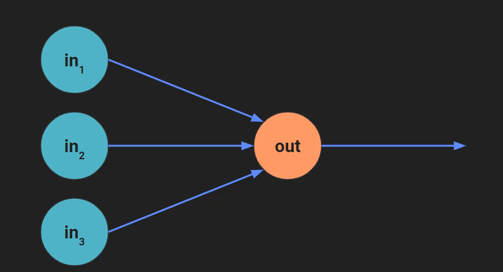

- A **perceptron** is a simple, early model of neural networks.
- The basic perceptron has:
  - **Inputs** (X): A set of values fed into the model.
  - **Weights** (W): Assigned to each input to modify its contribution to the output.
  - **Computation**: A weighted sum of inputs.
  - **Output**: A single value resulting from the computation.

### Example of a Perceptron.
  
  **Example (Averaging Perceptron)**:
  - Inputs: $x_1 = 8, x_2 = 5, x_3 = -4$
  - Weights: $w_1 = w_2 = w_3 = \frac{1}{3}$
  - Computation:  
   $$
    \text{Output} = \left(8 \times \frac{1}{3}\right) + \left(5 \times \frac{1}{3}\right) + \left(-4 \times \frac{1}{3}\right) = 3
   $$

- **Weighted Sum**: The perceptron computes a **weighted sum**, which can be expressed mathematically as:
 $$
  Y = x_1 w_1 + x_2 w_2 + x_3 w_3
 $$
  This can be written as a **dot product**:
 $$
  Y = \mathbf{X} \cdot \mathbf{W} = X_1W_1 + X_2W_2 + X_3W_3
 $$
  where **X** is the vector of inputs and **W** is the vector of weights.

---

## 3. Linear vs. Non-Linear Operations

- **Linear Operations**: Involve only **addition** and **scalar multiplication**.
  - The result of a linear operation can be represented as a straight line on a graph.
  - **Example**: Weighted sum of inputs, as in the perceptron model.
- **Non-Linear Operations**: Involve functions that cannot be represented by a straight line.
  - **Example**: Activation functions like the **signum** function.

### Key Idea:

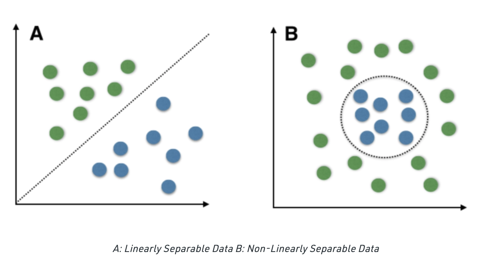

- **Linear Models** can only solve **linearly separable problems** (i.e., problems where data can be separated by a straight line).
- **Non-Linear Models** are needed for more complex problems (i.e., non-linearly separable).

---

## 4. The Signum Function (SGN)

- The **signum function** is a simple non-linear function.
  - **Output**: $1$ for positive inputs,$-1$ for negative inputs.


  **Graph**: The output of the signum function is not continuous and cannotbe represented by a straight line—this makes it **non-linear**.

  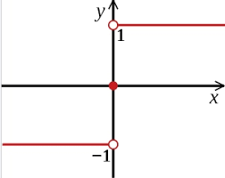

---

## 5. Activation Function

- The **activation function** introduces non-linearity into the perceptron model.
  - It can be any non-linear function, such as the **sigmoid** or **ReLU** (Rectified Linear Unit).
  - It transforms the output of the linear combination of inputs and weights.

**Perceptron Model with Activation**:
$$
Y = f(\mathbf{X} \cdot \mathbf{W})
$$
where $f$ is a non-linear activation function.

---

## 6. Bias Term

- **Bias** (or **intercept**) is an additional term that allows the model to adjust the output independently of the input values.
- **Without bias**: The decision boundary (separation line) must pass through the origin, which limits the model's ability to fit data well.
- **With bias**: The decision boundary can be shifted, improving model flexibility.

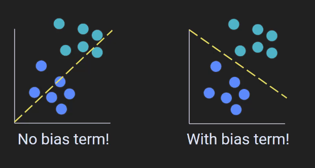

---

## 7. Mathematical Representation of Perceptron

- **Model with bias**:
 $$
  Y = \mathbf{X} \cdot \mathbf{W} + b
 $$
  where **b** is the bias term.

  - In this case, **m** is the slope and **b** is the intercept (bias).
  - For **X = 0**, **Y = b** (shift of the line along the Y-axis).

---

## 8. Training the Perceptron

- The perceptron learns by adjusting the weights and bias to minimize errors between predicted and actual outputs.
- **Training Process**:
  - The model receives inputs, computes a weighted sum, applies an activation function, and produces an output.
  - The error is computed, and weights are updated during training (using techniques like gradient descent).
  
  In practice, libraries like **PyTorch** handle the process of training models, including bias terms.

---
# Geometric Perspective on Artificial Neural Networks (ANNs)

---

## 1. Overview

- Focus on:
  - **Basic architecture** of ANNs.
  - **Geometric perspective** of ANNs and 
  deep learning.
  - Key terms: **feature space**, **separating hyperplanes**, **visualizing predictions**.

---
## 2. Basic Model and Architecture

### Model Structure:
- **Inputs**: $X_1$ and$X_2$.
- **Weights**: $W_1$ and $W_2$ correspond to each input.
- **Computation**: Weighted sum of inputs.
- **Activation Function**: Applied to the weighted sum (non-linear transformation).
- **Output**: The prediction, $\hat{Y}$ (denoted as **Y hat**), based on inputs.
- **Bias Term**: Implicitly included and set to 1.

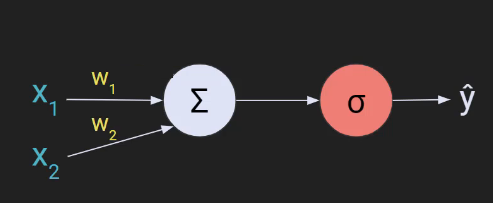


### Model Output:
- **Goal**: Find the weights $W_1$ and $W_2$ so that the model's prediction $\hat{Y}$ matches the actual exam result$Y$.

---

## 3. Geometric Representation: Feature Space

### Feature Space

- **Definition**: A geometric representation of the data where each feature is an axis.
- **Example**:
  - X-axis: Hours studied ($X_1$).
  - Y-axis: Hours slept ($X_2$).
  - Each student is represented as a **dot** (coordinate) on the graph.

  | X1 (Hours Studied) | X2 (Hours Slept) | Y (Result) |
  |---------------------|------------------|------------|
  | 2                   | 4                | Success    |
  | 6                   | 5.5              | Fail       |
  | 8.5                 | 7.2              | Success    |

### Plotting the Data

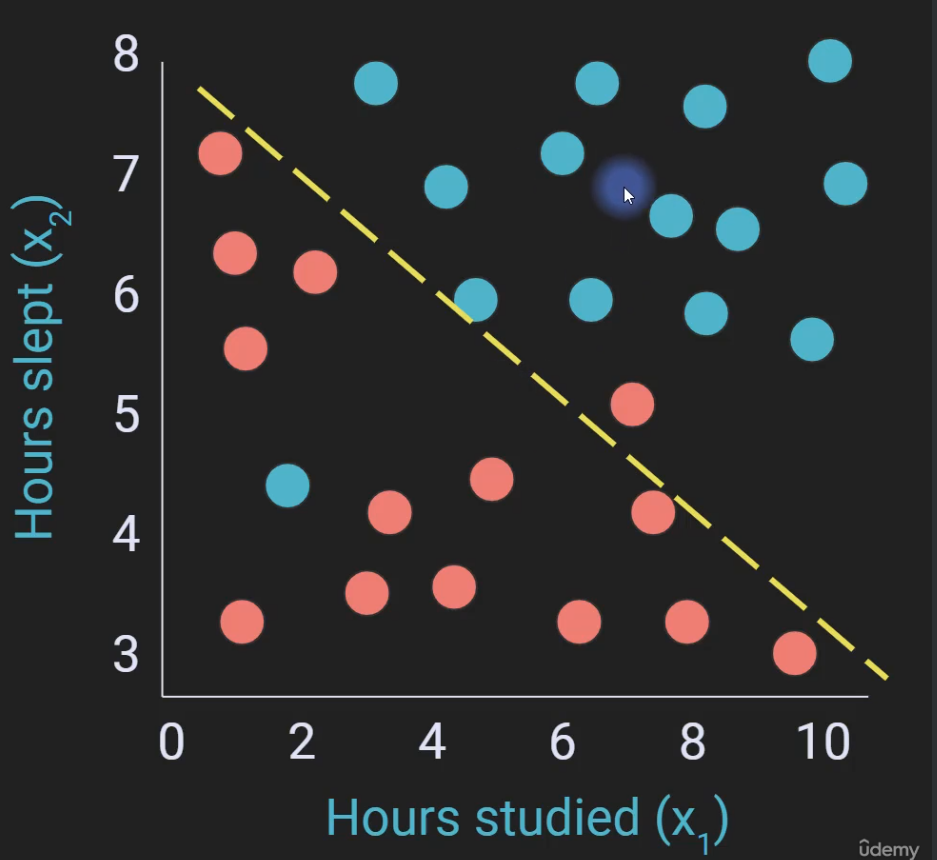

- **Green dots**: Students who passed the exam.
- **Red dots**: Students who failed the exam.

This entire plot is referred to as the **feature space**.

### High-Dimensional Feature Spaces:

- For more complex models, input data may exist in higher dimensions (hundreds or thousands of features).
- **Dimensionality reduction** can be applied using techniques like **autoencoders**.

---

## 4. Separating Hyperplanes

### Decision Boundary

- We need to find a **line** (or **hyperplane**) that separates students who passed the exam from those who failed (The yellow line in the figure above).
- **Separating Hyperplane**:
  - In **2D**, it’s a **line**.
  - In **3D**, it’s a **plane**.
  - In higher dimensions, it’s referred to as a **hyperplane**.

### Geometric Interpretation

- The **separating hyperplane** divides the feature space into two regions:
  - **Above the line**: Model predicts **pass**.
  - **Below the line**: Model predicts **fail**.
  
This line is a decision boundary that **binarizes** the feature space.

---

## 5. Binary vs. Continuous Predictions

### Binary (Categorical) Predictions

- **Example**: Pass or fail (discrete).
- **Geometric Representation**: The separating hyperplane (line) divides the data into two categories.

### Continuous Predictions

- **Example**: Predicting an actual exam score (e.g., 50%).
- **Problem Setup**:
  - We need an additional axis to represent the **exam score** in the 3D 
  space.
  - The **exam score** becomes the third dimension (Z-axis), alongside hours studied (X1) and hours slept (X2).
  
  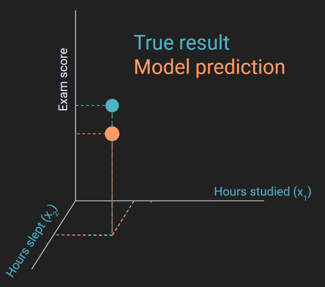

### Geometric Representation of Continuous Predictions

- **Z-axis**: Represents the pr
edicted exam score.
- **Model Output**: The model outputs a continuous value, such as a percentage (e.g., 50%).
- **Activation Function**: Chosen to allow continuous output, instead of binary.

---

## 6. Discrete vs. Continuous Outputs

### Discrete Outputs:
- **Categorical outputs** (e.g., pass/fail).
- **Geometric Representation**: Binarizes the feature space with a separating hyperplane.

### Continuous Outputs:
- **Numeric outputs** (e.g., exam score).
- **Geometric Representation**: Involves higher-dimensional space (e.g., 3D) with the exam score as an additional axis.

---
# Understanding Forward Propagation in Deep Learning

## Key Concepts Covered

- **Perceptron Model**: The fundamental building block of deep learning. It consists of:
  - **Inputs (X)**: Features from the real world (e.g., hours of sleep and study time).
  - **Weights (W)**: Learnable parameters that adjust the importance of each input.
  - **Bias (B)**: A constant term that helps shift the output.
  - **Activation Function (σ)**: A non-linear function applied to the output of the linear computation.

---

## Forward Propagation: Step-by-Step Breakdown

### 1. **Linear Combination of Inputs and Weights**
   - Each input $X_i$ is multiplied by its corresponding weight $W_i$.
   - The sum of these products is computed, and the bias term is added:
  $$
    \hat{Y} = \sum_{i=1}^{n} X_i W_i + B
  $$
   - The result is a linear combination of the inputs and weights.

### 2. **Activation Function**

   - The linear output $\hat{Y}$ passes through a **non-linear activation function**.
   - Common activation functions include:
     - **Sigmoid**: Used for proability outputs.
     - **Hyperbolic Tangent (tanh)**: Maps outputs between -1 and 1.
     - **ReLU**: Rectified Linear Unit, used in intermediate layers.
   - The activation function maps the linear output to the final output.


---

## Mathematical Notation & Computation

### 3. **Dot Product and Bias**

   - The computation can be simplified by incorporating the bias term into the weight vector.
  $$
    X_0 = 1, \quad W_0 = B
  $$
  Hence, the final expression becomes:
  $$
    \hat{Y} = \sigma(W^T X)
  $$
   - This simplification removes the need to explicitly handle the bias term in the computation.

---

## Decision Boundary
  - The model classifies data into two
  categories based on the decision boundary.

   - The decision boundary is determined by the equation:
  $$
    \sum_{i=1}^{n} X_i W_i + B = 0
  $$
   - This defines a **hyperplane** that separates the feature space into two parts:
     - **Class 1**: Data points on one side of the boundary.
     - **Class 2**: Data points on the other side.
  
  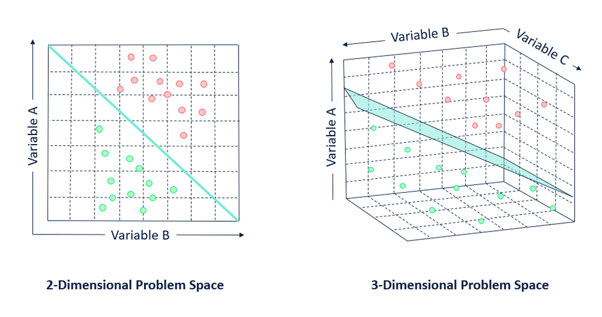

---

## Activation Functions: Impact on Model

### 7. **Common Activation Functions**
   - **Sigmoid Function**:
     - Maps output to the range [0, 1].
     - Used in binary classification problems, especially for the output layer.
   - **Tanh (Hyperbolic Tangent)**:
     - Maps output to the range [-1, 1].
   - **ReLU (Rectified Linear Unit)**:
     - Maps all negative values to 0 and keeps positive values unchanged.
     - Common in hidden layers of neural networks.

#### Visualizing Activation Functions

| Function   | Output Range  | Typical Use Case               |
|------------|---------------|--------------------------------|
| Sigmoid    | [0, 1]        | Output layer (probabilities)   |
| Tanh       | [-1, 1]       | Intermediate layers (hidden)  |
| ReLU       | [0, ∞)        | Hidden layers (deep models)   |

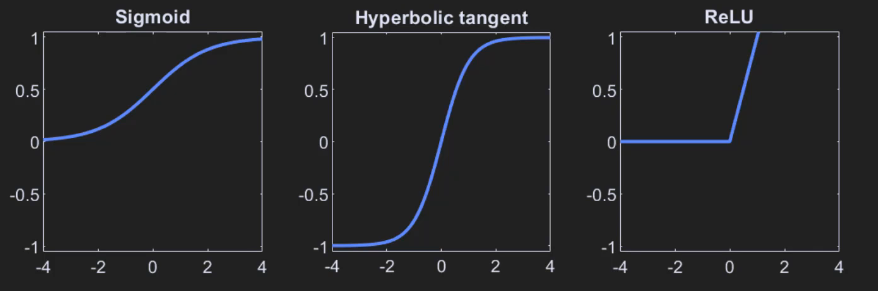

---

## Probabilities and Decision Making

### 8. **Interpreting Outputs as Probabilities**
   
   - When using **sigmoid** or other non-linear activations, the output ${\hat{Y}}$represents the **probability** of a data point belonging to a certain class.
   - Example:
     - $X_1 = 2$, $X_2 = 5$ → Output: 0.999 (99.9% chance of class 1).
     - $X_1 = -3$, $X_2 = 1$ → Output: 0.003 (0.3% chance of class 1).
   - Near the decision boundary, the output is close to 0.5, indicating uncertainty.
  
  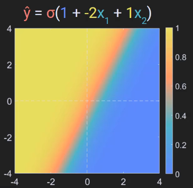
---

## Learning the Best Weights: Backpropagation

### 9. **Training the Model**
   - The model learns by adjusting weights $W$ through **backpropagation**.
     - **Backpropagation** is the process of computing gradients and using them to update weights via **gradient descent**.

     - **Gradient Descent**: Optimization technique to minimize the loss function and find the best set ofweights.

   - The goal is to find a set of weights that minimizes the error (loss) on the training data.

---

## Key Takeaways:
- The perceptron model is the fundamental unit of deep learning.
- The **linear part** computes a weighted sum of inputs, while the **activation function** introduces non-linearity.
- **Decision boundaries** separate classes in feature space, and the activation function affects the interpretation of these boundaries.
- The process of learning the best model involves adjusting weights and biases via **backpropagation** and **gradient descent**.

# Errors, Loss Functions, and Cost Functions in Deep Learning

## Key Concepts

- **Error:** The difference between the model’s prediction and the true value.
- **Loss Function:** A function that quantifies the error for each individual sample.
- **Cost Function:** The average of the losses across all samples; used as the optimization criterion during model training.

---

## 1. **Error Calculation**

- The model's prediction is denoted as **y_hat**.
- The true value or target is denoted as **y** (also called the "target variable").
- **Error** is calculated as:  
 $$
  \text{Error} = y - \hat{y}
 $$
  
### Table: Example of Error Calculation for Student Exam Prediction

<table>
  <thead>
    <tr>
      <th>Sample</th>
      <th>y_hat</th>
      <th>y</th>
      <th>y - y_hat</th>
      <th>Binarized Error (|Error| > 0.5)</th>
    </tr>
  </thead>
  <tbody>
    <tr>
      <td>1</td>
      <td>0.98</td>
      <td>1 (Pass)</td>
      <td>0.02</td>
      <td>0 (No error)</td>
    </tr>
    <tr>
      <td>2</td>
      <td>0.03</td>
      <td>0 (Fail)</td>
      <td>0.03</td>
      <td>0 (No error)</td>
    </tr>
    <tr>
      <td>3</td>
      <td>0.90</td>
      <td>0 (Fail)</td>
      <td>0.90</td>
      <td>1 (Error)</td>
    </tr>
  </tbody>
</table>

- **Continuous Errors:** Reflect the magnitude of the difference between predictions and reality.
  - More sensitive to large or small errors.
- **Binarized Errors:** Simplified to 0 or 1 based on a threshold (e.g., 0.5), easier to interpret but less sensitive.

---

## 2. **Loss Functions**

Loss functions calculate how well the model's predictions match the true values. Two main types of loss functions are used in deep learning:

### a. **Mean Squared Error (MSE) Loss**

- **Used for:** Continuous data (e.g., predicting prices, height, temperature).
- **Formula:**  
 $$
  \text{MSE Loss} = \frac{1}{2}(\hat{y} - y)^2
 $$
  - Where $\hat{y}$ is the model's prediction for sample i, and $y$ is the true value.
  - **Squaring** the error ensures that all errors are positive and gives more weight to larger errors.
  - The **factor of 1/2** is a convenience for derivatives in optimization.

- **Example Use Cases:**
  - Predicting sale prices of houses.
  - Estimating height, weight, or any other continuous numerical variable.

---

### b. **Cross-Entropy Loss (Logistic Loss)**

- **Used for:** Categorical data (e.g., classification tasks such as disease detection, image classification).
- **Formula:**  
 $$
  \text{Cross-Entropy Loss} = -\left( y \log(\hat{y}) + (1 - y) \log(1 - \hat{y}) \right)
 $$
  - **y_hat** is the model's predicted probability for the positive class (0 or 1).
  - **y** is the true class label (either 0 or 1).
  - The **minus sign** ensures the loss is positive.
  - **Example Use Cases:**
    - Predicting whether a patient has a disease (binary classification).
    - Identifying if an image contains a cat, human, etc.

---

## 3. **Cost Function**
- **Cost Function**: The **average of losses** across multiple samples (data points).
  - If we have$n$samples, the cost function is:
   $$
    \text{Cost Function} = \frac{1}{n} \sum_{i=1}^{n} \text{Loss}_i
   $$
- The **cost** is used as an optimization criterion during training.
- **Notation**: The cost function is commonly denoted by$J$.
- **Loss vs. Cost**:
  - **Loss** is computed for each individual sample.
  - **Cost** is the average loss across all samples.

---

## 4. **Optimization Objective in Training**
- The main goal of deep learning is to **minimize the cost function** during model training.
- **Objective**: Find the optimal set of weights ($W$) that minimizes the **cost function**.
  
 $$
  \text{Objective:} \quad \arg\min_{W} \, J(W)
 $$

- This involves adjusting the weights so that the model's predictions (y_hat) get closer to the true values (y).

---

## 5. **Training with Batches**
- Instead of computing the cost function over the entire dataset (which can be computationally expensive), **mini-batch training** is often used.
  - **Mini-batches** involve computing the average loss over a smaller subset of samples (e.g., 20 or 30 samples).
  - **Why not use the full dataset?**:
    - **Efficiency**: Reduces the computational cost of training.
    - **Overfitting Prevention**: Using individual losses can lead to overfitting, while averaging over batches helps generalize the model.
    - **Increased Sensitivity**: Mini-batches help with variability and can be more sensitive to small changes during training.

---

## 6. **Summary of Key Functions**

| **Function**            | **Type**                  | **Used For**                               | **Formula**                                    |
|-------------------------|---------------------------|--------------------------------------------|------------------------------------------------|
| **Mean Squared Error (MSE)** | Loss (Continuous)         | Numerical predictions (e.g., price, height) |$\text{MSE Loss} = \frac{1}{2} (\hat{y} - y)^2$|
| **Cross-Entropy Loss**  | Loss (Categorical)        | Classification tasks (e.g., disease, image) |$\text{CE Loss} = - \left( y \log(\hat{y})) + (1 - y) \log(1 -\hat{y}) \right)$|
| **Cost Function**       | Aggregated Loss           | Training optimization                     |$J(W) = \frac{1}{n} \sum \text{Loss}_i$   |


---
# From Perceptron to Deep Network and Backpropagation

## Key Concepts

- **Perceptron**: A single computational unit (node) that performs weighted sum followed by a non-linear activation.
- **Deep Network**: A network consisting of multiple layers of perceptrons (nodes), where each node's output feeds into the next layer.
- **Gradient Descent**: Optimization method used for adjusting weights to minimize a cost or loss function.
- **Backpropagation**: An application of gradient descent for training deep neural networks, involving the calculation of gradients using the chain rule.

---

## 1. **Simplification of Neural Network Diagram**
- Instead of drawing detailed calculations, we simplify the diagram using a single circle to represent each perceptron.
  - **Perceptron**: Each unit computes a weighted sum of inputs, passes it through a non-linearity, and sends the output to the next layer.

    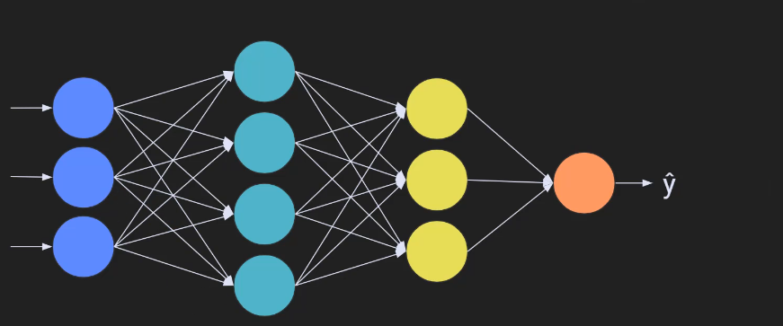
  
- **Terminology**:
  - Nodes (or units) are used instead of "artificial neurons" to avoid confusion with biological neurons.
  - Nodes perform the same computation independently.

---

## 2. **Network Structure**
- **Input Layer**: The first set of nodes receives input directly from the data (e.g., student hours studied, image pixels).
- **Hidden Layers**: Intermediate layers that process the data through weighted sums and non-linear activations.
- **Output Layer**: The final set of nodes that produce the model's prediction.

### Example Network:
- **Input layer**: Receives data (e.g., student study hours, clinical measures).
- **Hidden layer(s)**: Processes the input and propagates through activation functions.
- **Output layer**: Produces the final prediction (e.g., pass/fail, probability of disease).

---

## 3. **Independence of Nodes**
- **Key Idea**: Each node operates independently.
  - Each unit in the network computes its own output based on its inputs, but does not "know" or interact with other nodes in the network.
  - Nodes do not share state or information with others (they think they are the only unit).
- **Importance for Training**:
  - Each node must independently adjust its weights based on the error signal, using **backpropagation**.

---

## 4. **Backpropagation and Gradient Descent**
- **Backpropagation** is a specific form of **gradient descent** used for training deep networks.
  - The goal is to minimize the loss or cost function by adjusting the model's weights.
- **How it works**:
  - **Gradient Descent**:
    - Update weights based on the gradient (derivative) of the loss with respect to the weights.
    - The update rule:  
     $$
      W_{\text{new}} = W_{\text{old}} - \eta \cdot \frac{\partial L}{\partial W}
     $$
      Where:
      - $W$= Weights
      - $\eta$= Learning rate (a small constant)
      - $L$= Loss function

- **Backpropagation** is an application of this rule across all layers of the network, from the output layer back to the input layer.

---

## 5. **Computing Gradients with the Chain Rule**
- **Gradient Calculation**:
  - To update weights, we need to compute the gradient of the loss with respect to each weight.
  - **Chain Rule**: When the loss function involves a composition of functions (e.g., activation functions and the output), we use the chain rule to differentiate.
   $$ 
    \frac{\partial L}{\partial W} = \frac{\partial L}{\partial \hat{y}} \cdot \frac{\partial \hat{y}}{\partial W}
   $$

    - Where:
      - $L$ is the loss function.
      - $\hat{y}$ is the predicted output.
      - $W$ are the weights.
  - **Derivative of Loss**:
    - In practice, the derivative of the loss is calculated layer by layer, starting from the output layer and working backwards.

---

## 6. **Example: Derivative of MSE Loss**
- **Mean Squared Error (MSE)**:  
 $$
  L = \frac{1}{2} (\hat{y} - y)^2
 $$
  - To compute the gradient of MSE with respect to the weights$W$, we need to apply the chain rule, considering the embedded functions inside the activation function.

- **Step-by-Step Gradient Calculation**:
  1. Compute the partial derivative of the loss function with respect to the predicted output ( $\hat{y}$).
  2. Use the chain rule to break down the derivatives step by step through each layer, considering the weights and activations.
  3. The gradient at each layer is used to update the weights, starting from the output and moving backward through the network.

---

## 7. **Backpropagation in Practice**
- **Calculation of Gradients**:
  - **Forward Propagation**: Pass inputs through the network to compute the output.
  - **Backward Propagation**: Compute the gradients of the loss function with respect to each weight using the chain rule, and update weights accordingly.
- The process is repeated for multiple iterations (epochs) until the network converges to a minimum loss.

- **Notational Variations**:
  - Loss function can be substituted with cost function, especially when using batches of data.
  - The core principle of backpropagation remains unchanged: optimize the weights using the gradient of the cost function.

---

## 8. **Challenges in Backpropagation**
- **Numerical Stability**: Backpropagation requires careful handling of numerical issues, such as exploding or vanishing gradients.
- **Computational Efficiency**: Implementing the calculus directly can be slow; hence, deep learning frameworks like PyTorch use optimizations to speed up the process.
- **Practical Implementation**: While the mathematics is important, real-world implementations use tricks to stabilize and optimize the procedure for large networks.

---

## 9. **Summary of Backpropagation Steps**
1. **Forward Propagation**:
   - Inputs are passed through the network.
   - Each node computes a weighted sum and applies a non-linearity (activation function).
   - Output of the final layer is the model's prediction.
   
2. **Compute Loss**:
   - Calculate the loss function (e.g., MSE or cross-entropy) based on the model's output and the true values.

3. **Backward Propagation**:
   - Compute the gradient of the loss with respect to each weight using the chain rule.
   - Update the weights using the gradient descent update rule:
    $$
     W_{\text{new}} = W_{\text{old}} - \eta \cdot \frac{\partial L}{\partial W}
    $$

4. **Repeat**:
   - This process is repeated for each batch of data until the model converges and the loss is minimized.

---

Artificial Neural Networks (ANNs) for Regression

## 1. **Introduction to Regression and ANNs**
   - **Regression** is a statistical procedure used for predicting data values. 
   - **Goal**: Predict a continuous variable (y) based on another variable (x).
   - In this context, we explore how Artificial Neural Networks (ANNs) can be applied to regression problems.

## 2. **Simple Linear Regression Formula**
   - The general formula for **simple linear regression**:
$$
  y = mx + b
$$
  Where:
  - $y$ is the predicted value (dependent variable).
  - $x$ is the independent variable.
  - $m$ is the slope (coefficient).
  - $b$ is the intercept (bias term).
  - **Error term** $\epsilon$ is added to account for noise or unexplained variance:
$$
y = mx + b + \epsilon
$$
  - **Regression goal**: Predict $y$ as a function of $x$, assuming some error is present.
   
## 3. **Regression and Perceptron Model Comparison**
   - **Perceptron Model** and **Linear Regression** have similarities:
     - Both predict $y$ based on inputs and weights.
     - The equation of a perceptron:
      $$
       y = \text{bias} + \sum ( \text{weight} \times \text{input} )
      $$
     - **In regression**:
       - $y$ is predicted using a linear weighted sum of inputs.
       - The **intercept (bias)** in the perceptron is equivalent to the **bias (b)** in regression.
       - The **weights** in perceptrons are analogous to **coefficients** in regression.
   
   - **Key Difference**: 
     - Regression is **linear** (no activation function).
     - Perceptrons typically use **non-linear activation functions** (e.g., ReLU, Sigmoid).
     - **In regression**, there is no non-linearity unless using models like polynomial regression.

## 4. **Regression Loss Function**
   - **Loss function** in regression: 
     - **Mean Squared Error (MSE)**:
      $$
       \text{MSE} = \frac{1}{2} (\hat{y} - y)^2
      $$
     - $y$ = actual values, $\hat{y}$= predicted values.
     - **Goal**: Minimize the difference between predicted and actual values.
   
## 5. **Introducing Non-Linearity**
   - In traditional regression, predictions are a straight line.
   - In a **neural network** with a non-linear activation function:
     - Predictions can **deviate from a straight line**, allowing the model to capture more complex patterns.
     - Example: A perceptron with a non-linear activation (e.g., **ReLU**) can predict values that do not fall strictly on a line.

## 6. **Overfitting in Regression**
   - **Overfitting**: Occurs when a model learns not only the underlying patterns but also the noise in the data.
     - Leads to poor generalization to new data.
     - **Goal**: Find a balance where the model captures the important features but does not memorize every noise in the data.

## 8. **Implementation in PyTorch**
- Check the "ANNs For Regression" Section in "ANN_Code_Notes.ipynb"

## 9. **Key PyTorch Concepts**
   - **Linear Layers**:
     -$\text{nn.Linear}(in\_features, out\_features)$
     - Represents a fully connected layer with weights and biases.
   
   - **Activation Functions**:
     - **ReLU**: Rectified Linear Unit; non-linear function.
   
   - **Loss Function**:
     - **MSELoss**: Mean Squared Error, used for regression tasks.
   
   - **Optimizer**:
     - **SGD**: Stochastic Gradient Descent, used for weight optimization.

## 10. **Visualizing Model Performance**
   - After training the model:
     - Plot both **actual data** and **predicted data**.
     - Compare **predictions** with the original data to visualize the model's accuracy.
   - **Correlation**: Measure the performance using the correlation coefficient between predicted and actual values.

  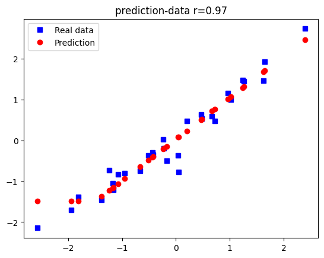

## 11. **Why Use Traditional Statistical Models?**

   - **Deep Learning vs Traditional Models**:
     - **Deep Learning**: More powerful for complex, large datasets, but may not always provide an optimal solution and can be harder to interpret.
     - **Traditional Models**: Still widely used in many practical applications, especially for small or simpler datasets.
   - **Advantages of Traditional Models** (e.g., linear regression):
     - **Simplicity**: Easier to understand and interpret.
     - **Smaller Datasets**: Often more effective on smaller datasets where linear relationships hold.
     - **Guaranteed Solutions**: Regression models offer **optimal solutions** mathematically.
     - **Interpretability**: Regression coefficients are easily interpreted.


# Coding Exercise: Exploring the Relationship Between Regression Slope and Deep Learning Model Performance

## Overview
This exercise explores the relationship between the regression slope and the ability of a deep learning model (perceptron) to learn that relationship between the input variable $x$ and the target variable $y$. The challenge involves conducting a parametric experiment where the regression slope is manipulated, and we analyze how well a deep learning model can predict the output.


## Experiment Setup

### 1. **Model and Data Functions**
- **Function 1**: Build and train the model.
  - Inputs:$x$ and $y$ (data).
  - Outputs: Final predictions and losses after training.
- **Function 2**: Create the data.
  - Inputs: Slope $m$.
  - Outputs:$x$ and $y$ based on the formula $y = m \cdot x + b$.

### 2. **Parametric Experiment Execution**
- **Vary $m$**: From -2 to +2, in 21 steps.
- **Repeat the experiment 50 times**: To account for random variations in the model’s performance.
- **Metrics to Track**:
  - **Loss** (MSE): Average loss over 50 runs for each slope.
  - **Accuracy**: Correlation coefficient between the predicted and true$y$.

### 3. **Challenges and Best Practices**
- **Debugging**: Test the model with small data before running long experiments.
- **Randomness in Results**: Deep learning models can get stuck in local minima; repeating the experiment helps average out these effects.
- **Local Minima**: In some cases, the model can produce poor predictions if it gets stuck in a local minimum, leading to a suboptimal performance.
- **Handling NaN values**: If the model encounters issues such as dividing by zero during the computation of correlation, handle NaN values appropriately.

---
## Solution

- Check The "Exploring the Relationship Between Regression Slope and Deep Learning Model Performance' section in "ANN_Code_Exercises.ipynb"

## Results Interpretation

### 1. **Loss vs. Slope**
- **Trend**:
  - As the slope magnitude increases (either negative or positive), the loss increases.
  - The smallest loss is observed when the slope is near zero.
  
- **Reason**:
  - Larger slopes lead to greater variance in $y$, which increases the numerical value of the loss (mean squared error).
  - The losses are not normalized, so larger values of $y$ (due to larger slopes) naturally result in larger loss values.

### 2. **Accuracy vs. Slope**
- **Trend**:
  - Model accuracy is higher when the slope is further from zero.
  - Accuracy drops as the slope approaches zero.
  
- **Reason**:
  - When the slope is near zero,$x$ becomes less informative about $y$, making it harder for the model to learn the relationship.
  - The model performs better when $x$ provides more information about $y$, i.e., when the slope is larger (positive or negative).

### 3. **Unexpected Results**: Loss and Accuracy Inconsistencies

- **Counterintuitive Observation**: 
  - In regions where the model has lower loss (near $m = 0$), the model’s performance (accuracy) is worse.
  - Where the loss is higher (large magnitudes of $m$), the model performance improves.

- **Explanation**:
  - **Loss** is based on the scale of the data, so larger slopes lead to larger loss values.
  - **Accuracy** is a measure of the model's ability to capture the relationship between $x$ and $y$, which is more apparent when the slope is large.
  
- **Key Takeaway**:
  - Loss is influenced by the data's scale and variance, while accuracy reflects the model's ability to learn the relationship between variables. These metrics may not always align perfectly, especially when comparing datasets with different ranges of values.

---

## Discussion Points

### 1. **Loss and Model Performance**
- **Loss and accuracy tradeoff**:
  - Why do we see higher losses with larger slopes even though the model's performance is better?
  - How can the loss be interpreted in different contexts, especially when comparing across datasets with different scales?

### 2. **Slope Approaching Zero**
- **Why does model performance degrade near a slope of zero?**
  - As the slope gets closer to zero, the relationship between $x$ and $y$ becomes weaker, leading to less information for the model to learn.
  
### 3. **Deep Learning Models and Relationship Learning**
- **Key Point**: 
  - Deep learning models learn the relationship between variables, not just the data values themselves.
  - As the complexity of the model increases, the relationships the model learns also become more complex and abstract.
  
---

# Building Artificial Neural Networks (ANNs) for Binary Classification

## Overview

- **Objective**: Transition from regression to **binary classification** using ANNs. Instead of predicting a continuous numerical value, we predict categories (e.g., Category 1 or Category 2).
- **Problem**: Classify data points into two categories based on two features (2 dimensions).
- **Key Concepts**:
  - **Binary Classification**: The goal is to categorize data into two classes (e.g., 0 or 1).
  - **Loss Function**: Use **binary cross-entropy** instead of mean squared error (MSE).
  - **Model Architecture**: Simple modifications from regression models (input features, loss function, activation function).

---

## Key Concepts

### Binary Classification
- **Binary classification** involves classifying data into two categories.
- **Loss Function**: Unlike regression (which uses MSE), **binary classification** uses **binary cross-entropy loss**.

### Model Architecture
- **Input Layer**: 
  - Two inputs 
  - Each input corresponds to a feature of the data
- **Hidden Layer**: 
  - **ReLU (Rectified Linear Unit)** activation function.
  - Linear weighted sum followed by ReLU activation.
- **Output Layer**:
  - **Sigmoid activation function** for binary classification.
  - Sigmoid function maps outputs to a range between 0 and 1.

### Activation Functions
- **ReLU (Rectified Linear Unit)**:
  - Typically used in hidden layers.
  - Outputs the input directly if positive; otherwise, outputs zero.
  - Helps introduce non-linearity into the model.
- **Sigmoid**:
  - Used in the output layer for binary classification.
  - Maps the output to a probability between 0 and 1.
  - Thresholded at 0.5: outputs > 0.5 are classified as Category 1, and outputs < 0.5 are classified as Category 0.

---

## Model Design for Binary Classification

### Architecture Overview
| Layer        | Type                     | Activation Function | Description                                           |
|--------------|--------------------------|---------------------|-------------------------------------------------------|
| **Input Layer** | 2 input features | -                   | Two inputs due to 2D data                           |
| **Hidden Layer** | Linear weighted sum + ReLU | ReLU                | First hidden layer; applies ReLU activation          |
| **Output Layer** | Linear weighted sum + Sigmoid | Sigmoid             | Output layer for binary classification               |

- **Linear Weighted Sum**: Computes the weighted sum of the input data, typically followed by a non-linear activation function like ReLU in hidden layers and Sigmoid in the output layer.

### Why Use Sigmoid in the Output Layer?
- The **Sigmoid function** maps outputs between 0 and 1.
- **Thresholding**:
  - Output values > 0.5 are categorized as **Category 1**.
  - Output values < 0.5 are categorized as **Category 0**.
- **Numerical Stability**:
  - Sigmoid helps prevent large outputs, improving stability by normalizing values.
  - In more complex models, using a Sigmoid function can help in multi-class classification by interpreting outputs as probabilities.

---

## Training the Model

### Loss Function for Binary Classification
- **Binary Cross-Entropy Loss (BCELoss)**: Measures the difference between predicted probabilities and actual labels.
  - **BCEWithLogitsLoss**: A more numerically stable version of binary cross-entropy, which internally applies the sigmoid function.

- **Alternative**: Some simpler models might use raw outputs (sign of the prediction) without sigmoid, but this could cause issues as models become more complex.

---

## Model Implementation Steps

1. **Data Generation**:
   - Create two data clouds, each representing a category (e.g., Category 0 and Category 1).
   - Add noise to create a more realistic dataset.
   - Data is generated with two features (X and Y coordinates).

2. **Model Architecture**:
   - Use a neural network similar to the regression model, but modify the architecture to:
     - Have two input features (Classification problem dimension 1 and 2).
     - Use a **Sigmoid** function in the output layer for binary classification.

3. **Training**:
   - The model is trained using **Stochastic Gradient Descent (SGD)** as the optimizer.
   - The **learning rate** is set to 0.01.
   - **Loss function**: Use **BCELoss** for binary classification.

4. **Model Evaluation**:
   - Evaluate the model using the accuracy of predictions (comparing predicted labels with actual labels).
   - Check for **overfitting**: The model may perform differently on new data depending on how it generalizes from the training set.

---

## Implementation in PyTorch

Check The "Classifying Problem" section in "ANN_Code_Notes.ipynb"

## Implementation explanation

### Data Generation Process

- **Data Centering**:
  - Data A is centered at (1, 1).
  - Data B is centered at (5, 1).
- **Noise Addition**:
  - Noise is added to each data point, making it more realistic.
  - This noise introduces variance, making the problem non-trivial.

### Model Predictions

- After training, **predictions** are made by passing the data through the trained model.
- The output of the **Sigmoid function** is then thresholded at 0.5 to predict the category:
  - **Predicted Category 1** if the sigmoid output > 0.5.
  - **Predicted Category 0** if the sigmoid output < 0.5.

### Model Accuracy

- Accuracy is calculated by comparing the predicted labels with the actual category labels.
- **Possible Results**:
  - The model may not perfectly separate the data (e.g., a decision line that does not perfectly split the two categories).
  - Depending on the **initialization** and **randomness** of the training process, the accuracy can vary (e.g., 76%, 90%, 94%).

---

#  Exploring Learning Rate Effects on ANN Performance

1. **Introduction to the Experiment**

- **Objective**: To explore the effect of different learning rates on the performance of a simple Artificial Neural Network (ANN) for binary classification.
- **Focus**: Running parametric experiments with varying learning rates, analyzing the 
results, and understanding the underlying model behavior.

2. **Learning Rate Overview**
- **Learning Rate in Gradient Descent**: A crucial hyperparameter in training neural networks.
  - **Purpose**: Controls the size of the steps the model takes when adjusting weights during training.
  - **Balance**: Too large → misses the optimal solution. Too small → slow convergence.
  
### **Error Landscape Visualization**
- **Goal**: Minimize the loss (error) function, i.e., find optimal model weights.
- **Gradient Descent Process**:
  - **Gradient**: The derivative of the loss function w.r.t. weights.
  - **Step Size**: Product of gradient magnitude and learning rate.
  
- **Ideal Learning Rate Behavior**:
  - **Far from Minimum**: Larger learning rate speeds up convergence.
  - **Near Minimum**: Smaller learning rate to avoid overshooting and instability.

### 2.2. **Consequences of a Poor Learning Rate**
- **Too Large**: Risk of overshooting the minimum, causing instability.
- **Too Small**: Training becomes inefficient, taking many steps to converge or never reaching the minimum.

##  **Experimental Setup**
- *Binary Classification Task**: Categorize points as either blue squares or black circles.
- **Training Procedure**:
  - Two functions are used:
    1. **Model Creation**: Defines the architecture and the components (e.g., loss function, optimizer).
    2. **Model Training**: Implements the training loop, involving forward propagation, loss calculation, and backpropagation.

- **Learning Rate Range**: From small values like 0.001 to larger values like 0.1, tested over 50 linearly spaced values.

### Implementation
Check "Run Experiment" Subsection under the "Classifying Problem" Section in the "ANN_Code_Notes.ipynb" Notebook

### **Code Structure**
- **Model Creation Function**:
  - Defines the model architecture (e.g., layers, activation functions).
  - Specifies the loss function (`BCEWithLogitsLoss` for binary classification).
  - Uses **Stochastic Gradient Descent (SGD)** as the optimizer.
  
- **Training Function**:
  - Performs training for a fixed number of epochs.
  - Each epoch includes:
    1. Forward pass (prediction).
    2. Loss computation (based on prediction vs. true labels).
    3. Backpropagation (gradient calculation and weight update).
  - **Accuracy Calculation**: After training, calculates final accuracy by comparing predicted labels to actual labels.

## 4. **Experimental Results**

- **Visualizing Accuracy vs. Learning Rate**:
  - **Initial Expectations**: A range of learning rates should result in a high accuracy plateau, with drop-offs for very small or large values.
  - **Results**:
    - **High Accuracy**: For larger learning rates (close to 1), the model might perform well.
    - **Low Accuracy**: For very small learning rates, the model may not converge properly, showing poor results.
  
    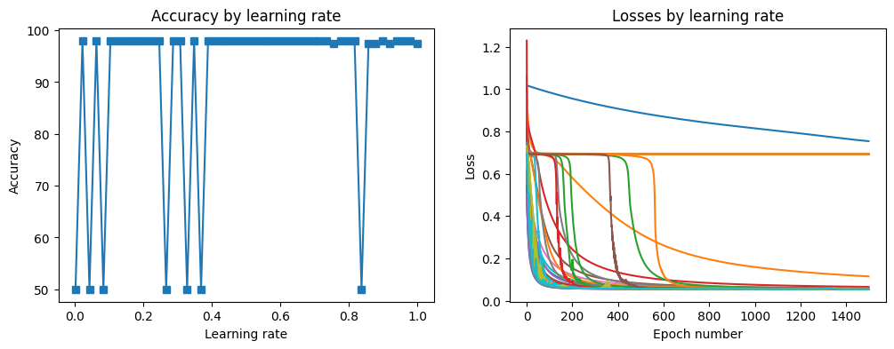

### **Loss During Training**
- **Observation**: Loss decreases inconsistently across different learning rates. 
  - Some learning rates result in loss approaching zero, indicating successful learning.
  - Others show stagnation, where the model struggles to improve, even after many epochs.

###  **Model Variability**
- **Unstable Results**:
  - Models may sometimes perform close to rndom guessing (50% accuracy), especially for lower learning rates.
  - The performance can be bimodal—either very successful (close to 100% accuracy) or very poor (close to 50%).
  - **Interpretation**: This variability may be due to the randomness in initial weight values and the interaction with the learning rate.

### **Meta-Experiment: Repetition for Consistency**
- **Meta-Experiment Setup**: To account for variability, the experiment is repeated 50 times, and the average performance is computed.
- **Findings**:
  - Small learning rates generally underperform.
  - Larger learning rates lead to more consistent, successful learning, achieving higher average accuracy.

  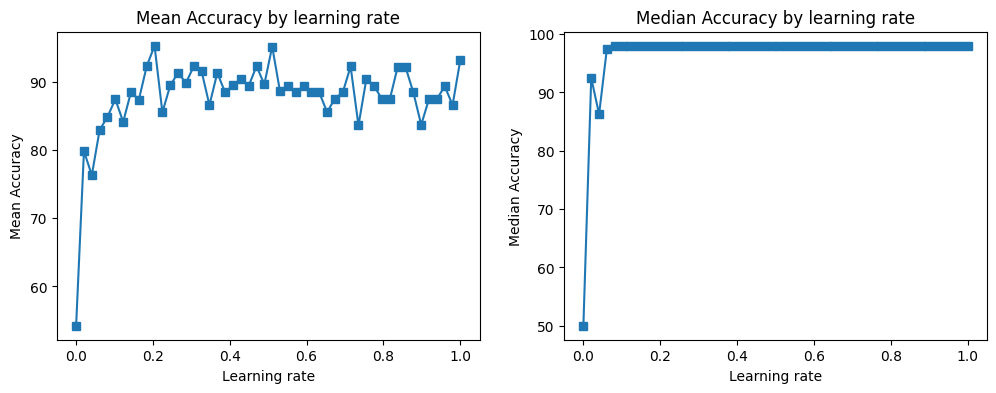

  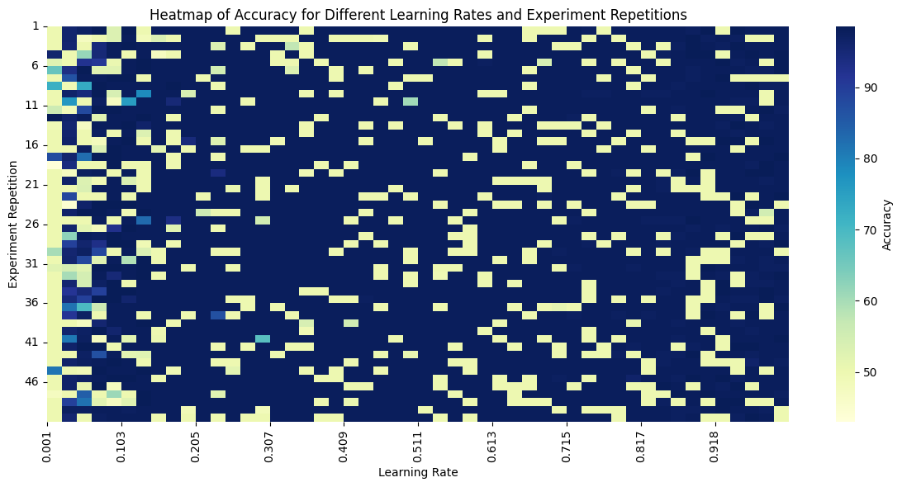

## 5. **Possible Explanations for the Results**
- **Error Landscape**: The model’s error landscape likely contains multiple minima.
  - Some local minima are shallow and easy to reach, while others are deep and hard to escape from.
  - Learning rates that are too low may cause the model to get stuck in poor local minima, leading to inconsistent results.
  
- **Multiple Learning Rate Runs**:
  - Since the ANN model has many parameters, its error surface is high-dimensional (e.g., five-dimensional for this model).
  - Visualizing or fully understanding the error surface is difficult, but understanding it conceptually helps explain the variability in results.

## **Practical Considerations**

- **Learning Rate Tuning**: Fine-tuning the learning rate is a key task in training neural networks to ensure good generalization.
  - **Large Learning Rates**: May lead to faster training but with a risk of overshooting.
  - **Small Learning Rates**: Safe but slow, with potential for stuck solutions.
  
- **Model Instability**: If a model's performance is highly variable (i.e., it sometimes learns well and other times poorly), it's often due to the error landscape and random initialization of weights.

## **Conclusions**
- **Key Insights**:
  1. **Learning Rate Sensitivity**: The choice of learning rate has a significant impact on the model’s performance and training stability.
  2. **Effect of Randomization**: Random initial weights can cause variability in the results. Repeated experiments are crucial for understanding model performance.
  3. **Averaging Results**: Running the experiment multiple times and averaging results can help mitigate the impact of random fluctuations, providing a clearer picture of the relationship between learning rate and model performance.

---

### **Important Notes**
- **Learning Rate and Model Behavior**:
  - The model's performance can vary dramatically depending on the chosen learning rate.
  - It’s essential to experiment with different learning rates to understand their impact.
- **Repetition for Accuracy**:
  - Running multiple trials and averaging results can provide more reliable insights into model behavior.
- **Error Landscape**:
  - Understanding the error landscape helps explain why some learning rates may be more successful than others.

---

# Multi-Layer Artificial Neural Networks (ANNs) for Classification

## Overview

we build on the simple Perceptron model introduced in previous videos by adding more complexity through **multi-layer neural networks**. The goal is to improve the model's performance by adding hidden layers, and we'll also learn important terminology related to deep learning along the way.

### Key Points

- **Problem in Previous Model**:
  - The Perceptron model performed poorly on the Classification problem dataset.
  - Performance varied: the model either performed well (above 90% accuracy) or very poorly (around chance level).
  
- **Approach in This section**:
  - Build a **multi-layer artificial neural network** (MLP).
  - Add **hidden layers** to improve model complexity.
  - Explore the effect of **learning rates** on performance.

---


## Building the Multi-Layer Perceptron

### Model Architecture

- **Input Layer**: 
  - 2 input units (for 2-dimensional feature data).
  
- **Hidden Layer**:
  - 16 units (can be adjusted, but the number of input features must match the number of output features of the previous layer).
  
- **Output Layer**:
  - 1 output unit (predicts the probability of the input belonging to category 1 or category 0).

### Key Considerations

- **Linear vs. Non-linear**: Each layer alternates between a linear transformation (weighted sum) and a non-linear activation function (e.g., ReLU).
- **Output Layer**: For binary classification, the output layer uses the **Sigmoid** activation function to map the final output to a probability.

### Implementation

You will find the implementation in the "Trying Multi-layer model" subsection under the "Classifying problem" section in the "ANN_Code_Notes.ipynb"

### Code Structure Overview

- **Linear Layer**: Each layer performs a weighted sum of its inputs.
- **Non-linear Activation Function**: Applied after each linear layer (e.g., ReLU for hidden layers, Sigmoid for the output layer).

---

## Training the Model

### Model Creation

- **Libraries**: We use **PyTorch** for defining and training the model.
- **Data Generation**: Data points are generated from two centroids to create a 2D classification task. The centroids may be placed in different configurations (e.g., horizontally or vertically separable).
  
### Important Parameters:

- **Learning Rate**: Varies from 0.001 to 0.1 in experiments to observe its impact on model accuracy and loss.

---

## Model Evaluation

### Performance Metrics

- **Accuracy**: The proportion of correct predictions.
  - In binary classification, the decision threshold is set to 0.5 when the output is passed through a **Sigmoid** function.
  
- **Loss Function**: Measures how well the model's predictions match the true labels.
  - For binary classification, loss is often computed using **Binary Cross-Entropy Loss** (BCE).
  
### Evaluation Workflow:

1. **Model Predictions**: 
   - Output the probability that each data point belongs to category 1 (after applying Sigmoid).
   
2. **Decision Boundary**:
   - If the model's output probability is greater than 0.5, the model predicts category 1.
   - Otherwise, category 0 is predicted.
   
3. **Accuracy Calculation**:
   - Compare the model's predictions to the actual labels.
   - Convert the Boolean results (True/False) to numeric (1/0) and calculate the mean.

---

## Visualizing and Interpreting Results

### Learning Rate Experimentation:
- **Effect on Performance**:
  - With varying learning rates, the model either
    - Performs well (high accuracy).
    - Performs poorly (around 50% accuracy, guessing randomly).

  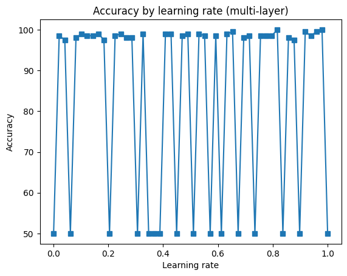
---
### Observations

The accuracy varies a lot and is non-predictable, sometimes it's approximetly perfect, and other times, the model is just guessing.

# Solving the Classification Problem with Linear Models

## Key Concept: Simple Solutions for Simple Problems

we explore how a seemingly simple change to the model can lead to dramatic improvements in performance. This change addresses a key question: **When is a linear model sufficient, and when should you use more complex nonlinear models?**

### Objectives of the Section:

- Understand why a **linear model** can work perfectly for a simple classification problem (the **Classification Problem dataset we have**).
- Learn about the **trade-offs** between linear and nonlinear models.
- Discuss the general principle: **Simple problems benefit from simple solutions**.
  
### The Experiment: Removing Nonlinearities

1. **Starting Point**: The model previously used nonlinear activation functions (ReLU) in the hidden layers.
   - The task was to modify the model by **removing these nonlinearities** and only keeping the nonlinearity in the final output layer (sigmoid).
   - The question posed: **How does the performance of the linear model compare to the nonlinear model in classifying the qwerties dataset?**

2. **Modifying the Model**:
   - **What to change**: Comment out the lines with **ReLU activation functions** in the hidden layers.
   - **What remains**: A linear model with no nonlinearities in the hidden layers, and a **sigmoid function** at the output layer.

3. **Running the Modified Model**:
   - Upon running the modified model, the results were striking:
     - The model achieved **99.5% accuracy** on the qwerties classification problem.
     - One model achieved **100% accuracy** with **zero errors**.
     - **100% of the models** achieved **greater than 70% accuracy**, indicating consistent and high performance.

4. **Discussion Point**: 
   - Why did the linear model perform so well, whereas the nonlinear models were inconsistent (sometimes performing well, sometimes poorly)?
   - **Key takeaway**: The qwerties dataset is **linearly separable** — a straight line in feature space can separate the two classes (blue squares vs. black circles).
   - Adding nonlinearities forced the model to search for unnecessarily complex solutions that weren't required for this simple problem.

---
## Implementation

Check the "Fixing The Incosistincy Problem By Using Linear Solution" subsection under the "Classifying Problem" Section in the "ANN_Code_Notes.ipynb"

## Key Lessons & Insights

### 1. **Linear vs. Nonlinear Models**

- **Linear Problems**: 
  - **Definition**: Problems where a linear boundary (e.g., a straight line) can separate classes effectively.
  - **Appropriate Model**: **Linear models** (e.g., logistic regression, k-means clustering).
  - **Why linear models work well**: A **simple linear decision boundary** suffices to solve these problems.

- **Nonlinear Problems**:
  - **Definition**: Problems where classes cannot be separated by a straight line or hyperplane. 
  - **Appropriate Model**: **Nonlinear models** (e.g., deep neural networks, decision trees).
  - **Why nonlinear models are needed**: These problems require **complex decision boundaries** that can't be captured by linear models.

### 2. **The Role of Nonlinearities in Deep Learning**

- **Nonlinear activation functions** (e.g., ReLU) are useful in **complex problems** where you need to model intricate patterns.
- In simpler problems, adding **nonlinearities** can actually **hurt performance** because they complicate the model's search space, causing it to **overfit** or **struggle** with finding the optimal solution.

---

# Why Nonlinearities Are Essential in Deep Learning

## Overview of the Key Concept:
In this section, we explore the concept that a **multi-layer linear model** is mathematically equivalent to a **single-layer linear model** if there are **no nonlinear activation functions** between layers. This is an important concept, as it highlights the necessity of using **nonlinear transformations** in deep learning models. Without nonlinearities, the multiple layers will effectively collapse into one, limiting the model's capacity to learn complex patterns.

### Core Idea: Nonlinearities Are Required Between Layers

- Without non-linear activation functions, a multi-layer network behaves just like a **single-layer model**.
- Nonlinearity in deep learning is crucial for enabling the model to **learn complex, hierarchical representations** of data.
- **Key takeaway**: You must introduce some nonlinearity (e.g., ReLU, Sigmoid, Tanh) between layers to maintain the power of deep learning models.

---

## Breakdown of the Reasoning

### 1. **Understanding the Perceptron Model** (Without Nonlinearity Between Layers)
- **Layer 1**: The output of the first layer is the **dot product** of the input `X` and the weights `W1`, followed by a **nonlinear activation** (e.g., ReLU, Tanh).
  - Mathematically, this is:  
   $\text{Output}_1 = f(X \cdot W1)$ 
    where $f$ is the non-linear activation function.

- **Layer 2**: The output of the second layer is the dot product of the output from Layer 1 and a different set of weights `W2`, followed by another **nonlinear activation**.
  - Mathematically, this is:  
   $\text{Output}_2 = f(\text{Output}_1 \cdot W2)$
  
  - This setup allows the model to learn more complex, nonlinear relationships due to the **nonlinear transformations** between the layers.

### 2. **What Happens If We Remove Nonlinearities?**
- If we **remove the nonlinear activation function** (i.e., use a **linear activation function** like the identity function), the output of each layer becomes a **linear combination** of the inputs and weights:
  - **Layer 1 (Linear)**:  
   $\text{Output}_1 = X \cdot W1$
  - **Layer 2 (Linear)**:  
   $\text{Output}_2 = \text{Output}_1 \cdot W2 = X \cdot (W1 \cdot W2)$

- Here, we see that the second layer's output is simply the **product of two sets of weights**, effectively collapsing the entire multi-layer model into a **single-layer linear model**.

---

## Implications of Linear Models

### Key Point:
- **Without non-linear activations**, no matter how many layers are stacked, the model will just perform a sequence of **linear transformations**, which is mathematically equivalent to a single-layer linear model.
- This collapse happens because **linear transformations** are **composable**, meaning that multiple layers of linear transformations can be combined into one.

### Why is this a problem?
- **Linear models** can only capture **linear relationships** in the data.
- For complex data with **nonlinear relationships** (e.g., image classification, speech recognition), a linear model will be **insufficient** to learn the underlying patterns.
- **Nonlinearities** enable the model to approximate **complex decision boundaries** and hierarchical data representations.

---

## Numerical Example: Linear vs. Nonlinear Functions

### Example 1: Linear Function
- **Operation**:$A \cdot 5 + 5$
- Using the distributive property of linear functions:
  -$A \cdot 5 + A \cdot 5 = A \cdot 10$

### Example 2: Nonlinear Function (Logarithm)
- **Operation**:$\log(5 + 5)$
  - First, you compute:  
   $\log(5 + 5) = \log(10) = 1$
  - If you try to break this down using the distributive property:  
   $\log(5) + \log(5) \neq \log(10)$,  
    it results in a different value.
  
  - This demonstrates that **nonlinear functions do not obey the same properties** as linear functions (such as distributivity).

---

# Multi-Class Classification with Deep Learning (Iris Dataset)

## Key Concepts and Topics

### 1. **The Iris Dataset**

   - **Purpose**: Used to predict the species of iris flowers based on measurements of their physical features.
   - **Features**:
     - **Sepal Length**
     - **Sepal Width**
     - **Petal Length**
     - **Petal Width**
   - **Target (Output)**: Species of the flower, which can be one of three categories:
     - Setosa
     - Versicolor
     - Virginica
   - **Dataset History**: The iris dataset is nearly 100 years old and has been widely used for teaching and exploring multivariate classification problems.

### 2. **Problem Type: Multi-Class Classification**
   - **Goal**: Classify the flower into one of the three species based on the four feature measurements.
   - **Challenges**: This is a multi-class classification problem, where there are more than two classes to choose from.
  
---

### 3. **Neural Network Architecture**
   - **Inputs**: 4 features (sepal_length, sepal_width, petal_length, petal_width)
   - **Output**: 3 outputs, corresponding to the three species of iris flowers.
   
   #### Layers of the Model:
   - **Input Layer**: 4 inputs (sepal and petal measurements)
   - **Hidden Layer**: 64 units
   - **Output Layer**: 3 units (for each flower species: Setosa, Versicolor, Virginica)
   
   #### Visual Representation:

   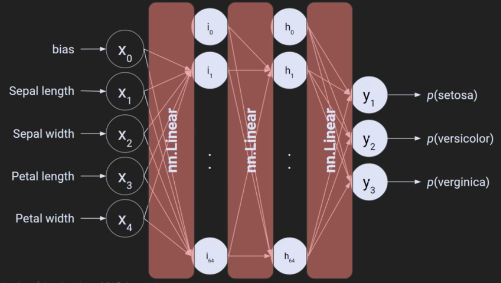
  
   - **Fully Connected Network**:
     - **Input Layer**: Connects to the hidden layer (4 -> 64).
     - **Hidden Layer**: Connects to the output layer (64 -> 3).
     - **Weight Matrices**: The network uses weight matrices for each layer (e.g., 4x64 for input to hidden layer transformation).
     - **Biases**: Every layer has a bias, which is set to 1. These biases do not take input but are part of the learnable parameters.
     - **Activation Functions**: ReLU (Rectified Linear Unit) is used between layers to introduce non-linearity.

### 4. **Key Terminology**
   - **Fully Connected (Feedforward) Network**: Each node in a layer connects to every node in the subsequent layer.

---

### 5. **Multi-Class Output Layer**
   - **Output Layer**: 3 units corresponding to the 3 iris species. Each output unit represents the probability of a flower belonging to that species.
   - **Activation Function**: **Softmax** is applied to the output layer to convert raw outputs into probabilities.
     - **Why Softmax?**: Ensures the sum of all output probabilities equals 1, forming a valid probability distribution.
     - **Difference from Sigmoid**: In binary classification, a sigmoid is used for two categories, where the probabilities are complementary. In multi-class classification, Softmax is used to ensure independent probabilities for each category.

---
### 7. **Loss Function: Cross-Entropy Loss**

   - **Role**: Measures the performance of the model by comparing the predicted probabilities with the true labels.
   - **Combination of LogSoftmax and NLLLoss**: The Cross-Entropy loss combines the log of the predicted probabilities (LogSoftmax) and the Negative Log-Likelihood Loss (NLLLoss) into a single loss function. This ensures that the final output probabilities are scaled properly.
   - **Why LogSoftmax?**: Taking the log of probabilities can stabilize training by reducing the impact of small probability values.

---
### 8. **Implementation**

Check the "Multi-output ANN (iris dataset) in the "ANN_Code_Notes.ipynb" notebook

## 9. **Training the Model**
   - **Procedure**:
     - **Forward Pass**: Compute the output of the model given the inputs.
     - **Loss Calculation**: Compare the predicted outputs with the actual labels.
     - **Backpropagation**: Adjust weights and biases based on the loss.
   - **Accuracy Tracking**: Accuracy is tracked at each epoch to evaluate the model's performance during training.

---


### 10. **Training Insights**
   - **Initial Accuracy**: The model begins with random weights, resulting in accuracy similar to random guessing (around 66% for three categories).
   - **Fluctuations in Accuracy**: During training, the model may not show smooth progress in accuracy as it refines its weights. However, with further training, the accuracy increases significantly.
   - **Final Accuracy**: After training, the model reaches a high accuracy (around 98%).

---

### 11. **Visualization**
   - **Loss & Accuracy Over Time**: Loss typically decreases over time, but accuracy may fluctuate until the model "learns" the correct patterns.

    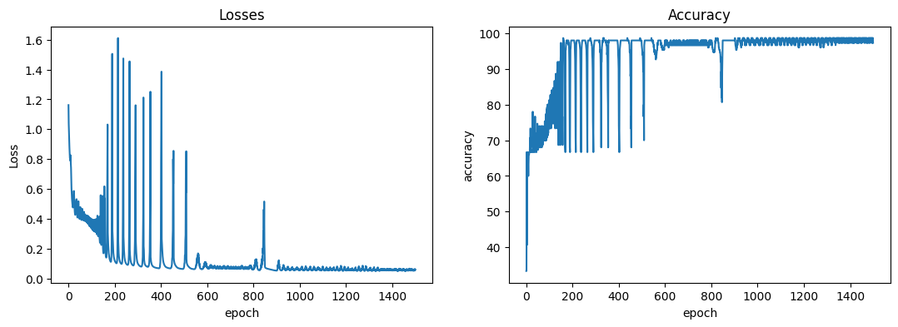
  
   - **Softmax Visualization**: The output probabilities for each class (Setosa, Versicolor, Virginica) are plotted to show how confident the model is for each flower.
     - **Setosa**: The model is highly confident, with the probability for Setosa close to 1.
     - **Versicolor & Virginica**: The model is less confident, showing more variation between the probabilities of the different classes.

    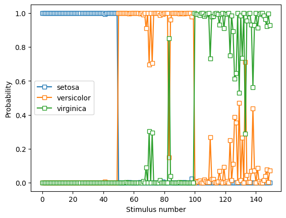
---

### 13. **Conclusion**

   - **Model Performance**: After training, the deep learning model can classify flowers with high accuracy based on the iris dataset, showing the power of neural networks for multi-class classification tasks.

---
# Code Challenge - Multi-Output Classification for Three Categories

## Overview

This is a hands-on code challenge designed to strengthen your deep learning, coding, and implementation skills. The main objective is to combine and modify code from two previous sections to generate and classify data into three categories instead of two. You'll work with data that has three groups of outputs (e.g., blue squares, black circles, red triangles) and implement a neural network that classifies them into three categories.

### Key Concepts:

- Merging code from multiple sources
- Classification with three categories
- Using Softmax for multi-class classification
- Neural network architecture and training

---

## Task Objective

- Modify existing code to classify data into three categories: blue squares, black circles, and red triangles.
- Use two previous Implementation: **Classifying Problem** and **Multi-output ANN (iris dataset)** From "ANN_Code_Notes.ipynb".
- Create a neural network that processes three groups of qwerties and outputs three classifications.

---

## Steps to Solve the Challenge


### 1. **Data Generation with Three Categories**

- **Data Creation**:
  - Add a third group of data points (e.g., red triangles).
  - Ensure the three groups are sufficiently separable, with centers far enough apart.
  
- **Example Code**:
  - Previous code created two groups, now add one more group (center C).
  - Make sure the clusters (A, B, and C) are not overlapping too much.

- **Trivial Steps**:
  - Copy-paste code to generate the third group.
  - Adjust variable names accordingly.

### 2. **Neural Network Architecture**

- **Input Layer**:
  - 2 input features: x and y coordinates.
  
- **Hidden Layer**:
  - A hidden layer with "n" units (this is flexible; you can experiment with different architectures).

- **Output Layer**:
  - 3 units for 3 categories (blue squares, black circles, and red triangles).

- **Softmax**:
  - Softmax is included in the model for multi-class classification.
  - **Note**: PyTorch's cross-entropy loss function already includes a log Softmax function, but explicitly adding Softmax can be helpful for exploration.

---

## Solution:

Check "3-Classification Problem" section in the "ANN_Code_Exercises.ipynb"

# Exploring Model Complexity and Number of Units in Hidden Layer

## Goal:

In this section, we aim to explore how the number of units in a model's hidden layer affects the classification accuracy. Specifically, we will experiment with the **Iris dataset** and observe the model's performance as we change the number of hidden units from **1 to 128**.

## Experiment Overview:

- **Dataset:** Iris dataset (flower classification).
- **Model Architecture:** 
  - One hidden layer with varying number of hidden units.
  - Input layer with 4 features (from the Iris dataset).
  - Output layer with 3 units (corresponding to the 3 flower categories).
- **Objective:**
  - Parametrically change the number of hidden units and observe the impact on model accuracy.
  - Plot accuracy as a function of the number of hidden units.

## Key Concepts:

### 1. **Model Complexity and Hidden Units**
   - **Too few units:** When the model has very few units in the hidden layer, it may be too simple to capture the complexity of the dataset.
   - **Too many units:** Increasing the number of units could introduce overfitting and unnecessary complexity.
   - The goal is to find a balance where the model has enough complexity to learn the task, but not too much that it overfits.

### 2. **Hypothesis**
   - Before running the experiment, you should make a prediction about the model's performance:
     - Will the accuracy be high throughout the range of units?
     - Could there be a Parabolic shape (low accuracy for too few or too many units)?

### 3. **Building the Model**
   - **Input Layer:** 4 features (x1, x2, x3, x4).
   - **Hidden Layer:** Varying number of hidden units (1 to 128).
   - **Output Layer:** 3 units (for the 3 flower categories).

### Implementation:
Check the "Comparing The Number Of Hidden Units" Section in the "ANN_Code_Notes.ipynb"

### 4. **Steps in the Experiment**
   - **Data Transformation:** Convert data from pandas DataFrame to PyTorch tensors.
   - **Model Creation:** A Python function creates the model, where the number of units in the hidden layer is parameterized.
   - **Training Function:** 
     - Loop through **epochs**.
     - Perform **forward pass**.
     - Compute **loss** and **backpropagation**.
     - Return final accuracy after all training.
   - **Hyperparameters:**
     - **Training Epochs:** Set to 500 for the experiment.
     - **Range of Hidden Units:** From 1 to 128 (exclusive).

### 5. **Plotting Results**
   - **X-axis:** Number of hidden units in the hidden layer.
   - **Y-axis:** Model accuracy after all training.
   - **Horizontal Lines:**
     - **33% accuracy:** Chance level (random guessing).
     - **67% accuracy:** Correct classification of 2 categories out of 3.
     - **95% accuracy:** High performance, with near-perfect classification.

  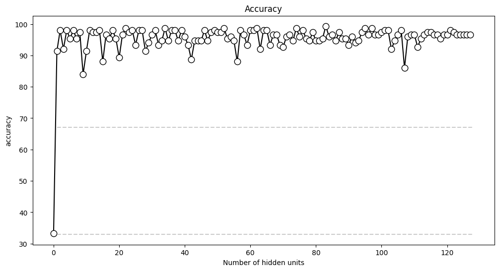

## Observations from the Experiment:
- **Model Performance:**
   - **Underfitting (Low number of units):** The model struggles to learn the data properly.
   - **Overfitting (High number of units):** The model could potentially overfit, but for the given dataset, adding too many units didn't degrade performance.

   - The final accuracy stabilizes around 95% as the model complexity reaches an appropriate level.

## Conclusion:
- **Too few units**: Insufficient model complexity leads to poor performance.
- **Too many units**: Adding complexity beyond a certain point doesn't necessarily improve performance and may lead to overfitting.

## Further Exploration:
- **Additional Variables**: Other hyperparameters like **learning rate** and **training epochs** can also affect model performance.
- **Cross-Validation**: Testing the model with different datasets or splits can give further insights into generalization and overfitting.

---
# Lecture Notes: Defining Custom Deep Learning Models in PyTorch

## Introduction

- In this section, we explore how to define custom deep learning models using classes in PyTorch, contrasting this approach with using `nn.Sequential`.
- The goal is to understand when and why we might need to create our own model classes and how this enables greater flexibility and customization in deep learning.

---

## nn.Sequential vs. Custom Class Models

### nn.Sequential
- **`nn.Sequential`** is a simple way to define neural network models.
- It allows you to create models by stacking layers sequentially.
- **Pros:**
  - Simple and fast to implement.
  - Easy to read and understand, making it accessible for others.
- **Cons:**
  - Limited flexibility.
  - Cannot easily accommodate more complex architectures (e.g., multiple branches, non-linear connections).

### Custom Class Models
- By creating a custom class, you gain greater control and flexibility over the model structure.
- **Pros:**
  - More flexibility to define complex architectures.
  - Easier to implement advanced features (e.g., dynamic layers, customized behavior).
  - You're limited only by your Python skills and creativity.
- **Cons:**
  - More complicated to write and set up.
  - Takes more time and effort to implement compared to `nn.Sequential`.

---

## Anatomy of a Custom Class for a Model

### Components of the Class

1. **`__init__` function (Initialization):**
   - This function defines the layers (the "nouns" of the model).
   - Think of it as setting up the "characters" in the deep learning "story."
   - Example:
     ```python
     class MyModel(nn.Module):
         def __init__(self):
             super().__init__()
             self.input_layer = nn.Linear(2, 1)  # Input layer
             self.output_layer = nn.Linear(1, 1) # Output layer
     ```

2. **`forward` function (Action):**
   - Defines the forward pass (the "verbs" in the story).
   - Here, you apply transformations, activations, etc., on the model’s layers.
 - Example:
  
     ```python
     def forward(self, x):
         x = self.input_layer(x)
         x = F.relu(x)  # Activation function
         x = self.output_layer(x)
         return x
     ```

---

## Code Comparison: `nn.Sequential` vs. Custom Class

### `nn.Sequential` Example:

```python
model = nn.Sequential(
    nn.Linear(2, 1),  # Input layer
    nn.ReLU(),        # Activation function
    nn.Linear(1, 1),  # Output layer
    nn.Sigmoid()      # Final activation
)
```

### Custom Class Example:
```python
class MyModel(nn.Module):
    def __init__(self):
        super().__init__()
        self.input_layer = nn.Linear(2, 1)
        self.output_layer = nn.Linear(1, 1)

    def forward(self, x):
        x = self.input_layer(x)
        x = F.relu(x)
        x = self.output_layer(x)
        return x
```

---

## Conceptualizing the `__init__` and `forward` Functions

- **`__init__`**: Think of it as "setting up the characters" (the layers). It defines the structure of the model.
- **`forward`**: This is where the "action" happens. The data flows through the layers and is transformed.

### Grammatical Analogy:
- **Nouns**: Layers (e.g., `self.input_layer`, `self.output_layer`).
- **Verbs**: Operations on data (e.g., `F.relu(x)`, `self.output_layer(x)`).

---

## When to Use Custom Classes vs. `nn.Sequential`

### Using `nn.Sequential`
- Best for simple, straightforward models.
- Quickly set up and easy to read, making it ideal for beginner models.

### Using Custom Classes
- Necessary for more advanced, customizable architectures.
- Provides flexibility for complex architectures and non-standard operations.
- Often used in more sophisticated deep learning models where flexibility is essential.

---

## Code Implementation and Libraries

The code implementations, including creating and training the models, can be found in the corresponding notebook `ANN_Code_Notes.ipynb`, "Defining Models Using Sequential vs Customized Class" Section.


---
# Depth vs. Breadth in Deep Learning Models

## Introduction to Model Complexity

In deep learning models, the complexity is often analyzed using two dimensions: **depth** and **breadth**. These two dimensions have significant implications for the architecture of the models, specifically:
- The **level of abstraction** that models can represent.
- The **total number of trainable parameters** in the model.

In this section, we will explore how depth and breadth affect model complexity, and particularly the number of trainable parameters.

---

## Definitions of Depth and Breadth

### Depth

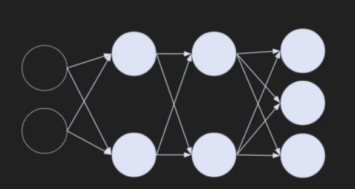

- Refers to the number of **layers** in the model, excluding the input and output layers.
- The **hidden layers** between the input   and output layers define the depth.
- There is **no specific cutoff** for what constitutes a "deep" model; rather, it is relative. A model with more layers can be considered **deeper** than one with fewer layers.

### Breadth

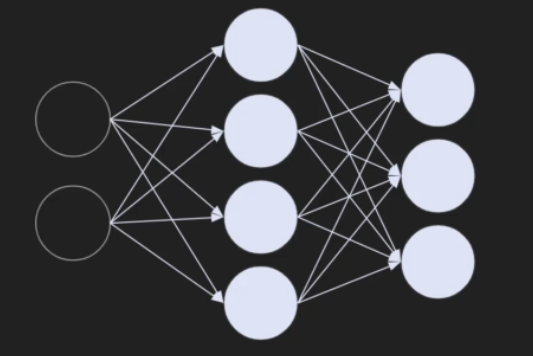

- Refers to the number of **nodes** in a given layer.
- The **width** of a model can vary across layers, meaning the number of nodes can be different at each layer.

> Note: "Width" and "breadth" are often used interchangeably.

---

### Key Points:
- The **wide model** has more nodes in the hidden layers (higher breadth).
- The **deep model** has more hidden layers (higher depth).
  
---

## Trainable Parameters

### Number of Nodes and Parameters
- The **total number of nodes** in a model can be estimated by counting the **bias terms**. Each node corresponds to one bias term.
- The **total number of trainable parameters** in a model is the sum of:
  - The weights (connections) between layers.
  - The bias terms in each layer.

### Example:

#### Wide Model:


- **Number of nodes**: 7
- **Total parameters**: 27 (20 weights + 7 bias terms)

#### Deep Model:


- **Number of nodes**: 7
- **Total parameters**: 21 (17 weights + 4 bias terms)

---

## Observations on Depth vs. Breadth
- **Deeper models** (with more layers) can represent more abstract and complex representations, even though they may have **fewer trainable parameters**.
- **Wider models** (with more nodes per layer) tend to have more parameters to train, leading to potentially higher computational complexity.

---

## Counting Parameters in PyTorch

### How to Count Parameters in PyTorch:
1. **Accessing Weights**: The weights between layers are typically stored in `nn.Linear` layers.
2. **Bias Terms**: Each node in a layer has an associated bias term, which is also a trainable parameter.
3. **Parameters with Gradients**: Parameters that require gradients (i.e., those that are being trained) are included in the total count of trainable parameters.

### Example Code:
- To access model parameters in PyTorch, use `.named_parameters()` or `.parameters()`.
  
#### Counting Parameters:
- Use a loop over `named_parameters` to access weights and bias terms.
- Count **only parameters with `requires_grad=True`**, as these are trainable.

---

## PyTorch Code Implementation:
While the specific code is omitted here, the full implementation for counting parameters can be found in the "ANN_Code_Notes.ipynb", "Model depth vs. breadth" Section.
---


# Experimenting with Depth vs. Breadth
.

### 1. **Experiment Overview**
   - The experiment involves varying:
     - **Number of hidden units** in each layer.
     - **Number of hidden layers**.
   - The goal is to observe how changing both parameters affects model performance.
   
### 3. **Model Architecture**
   - To implement this experiment, we define a flexible **Deep Learning model class** called `ANNIris`:
     - **`nUnits`**: Number of units in each hidden layer.
     - **`nLayers`**: Number of hidden layers in the model.
   
   - The model architecture is created as follows:
     - **Input layer**: Linear transformation from input features to the specified number of units.
     - **Hidden layers**: Each hidden layer is a linear transformation followed by a non-linear activation function (ReLU).
     - **Output layer**: Final layer that outputs the class probabilities (3 categories for the Iris dataset).

### 4. **Model Flexibility**
   - The model's flexibility comes from the ability to specify **both the number of layers** and **the number of units per layer** dynamically.
   - This flexibility is achieved using a **dictionary** to store the layers and defining a loop to create each hidden layer.

## Implementation

- The code for implementing the model, testing, and experimentation can be found in the Jupyter notebook titled **`ANN_Code_Notes.ipynb`** under the section called "Model depth vs. breadth Experiment".

## Experimental Results

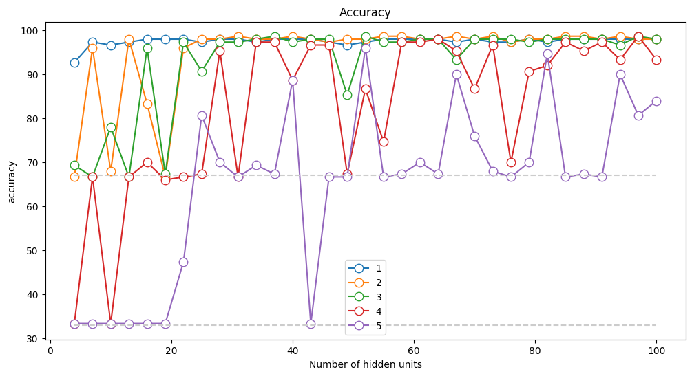

### 1. **Model Training and Performance**
   - After training, we observe that the model with only **one hidden layer** generally performs better and learns faster than deeper models.
   - Increasing the number of layers doesn't always lead to better performance, and deeper models sometimes underperform compared to shallower ones.

### 2. **Impact of Number of Parameters**
   - The hypothesis that **more parameters = better performance** is tested:
     - The total number of trainable parameters does not strongly correlate with model accuracy.
     - Both deep models and shallow models can perform similarly, despite having different numbers of parameters.

### 3. **Conclusions from Experiment**
   - **Deeper models** do not guarantee better performance.
     - The number of layers and units should be chosen carefully based on the task.
     - Other factors such as the **optimizer**, **learning rate**, and **training epochs** significantly affect model performance.
   
   - **Shallow models** tend to **train faster**, but **deeper models** are better at learning complex representations.
   
   - The key takeaway is that **model architecture** (depth and breadth) alone does not determine performance. It must be combined with other model parameters and careful tuning to achieve optimal results.


---

# Code Exercise: Rewriting Models Using Custom Classes in PyTorch

## Objective
- The goal of this exercise is to convert a model that uses `nn.Sequential` to a custom class.
- This practice helps reinforce your understanding of PyTorch's model-building workflow and provides more experience with object-oriented programming.


## Steps for the Code Challenge

### 1. **Prepare a New Notebook**
   - **Copy the `Trying Multi-layer Model` section from the `ANN_Code_Notes` notebook**
   - **Recreate the Model**: Reconstruct the model using a custom class, not `nn.Sequential`.

### 2. **Key Differences in Approach**
   - Replace the use of `nn.Sequential` with a custom class.


## Solution Implementation
Check the `ANN Multi-Layer Using Classes` Section in the `ANN_Code_Exercises.ipynb` notebook

# Understanding Deep Learning Models and Interpretability

## Overview
- In this Section, we explore the interpretability of deep learning models, discussing both the challenges and the importance of understanding how and why these models work.
- The focus is on raising important questions about the nature of deep learning models, their decision-making capabilities, and how these issues intersect with real-world applications.

---

## Key Concepts

### 1. **Deep Learning Models: Simplicity vs. Complexity**
   - **Simple Model**: 
     - At the core, each node in a deep learning network implements a **weighted linear combination** of inputs, followed by a **non-linear activation function**.
     - These operations are simple and could theoretically be computed by hand.
   - **Complexity**: 
     - The overall model is complex due to:
       - **Non-linearities**: Interactions across hundreds of parameters or weights.
       - **Interactions**: Layers of transformations that are difficult to explain mechanistically.
   
### 2. **Interpretability of Deep Learning Models**
   - **What are these models "thinking"?**
     - Models do not have consciousness, awareness, or independent thought.
     - They perform computations based on the inputs they receive, but do not "understand" the data in a human-like manner.
     - Asking "what is this unit thinking about?" is a misleading way of framing the model’s behavior.

   - **Mystery vs. Simplicity**: 
     - While individual units are simple (e.g., just computing weighted sums), the overall behavior of the network is difficult to interpret due to the vast number of parameters and interactions.

---

## Challenges in Deep Learning Interpretability

### 1. **Do We Understand How Deep Learning Models Work?**
   - **The Two Schools of Thought**:
     - **Mathematical and Code-Based Approach**: 
       - Some believe we fully understand deep learning, as the core operations are based on well-defined mathematical equations that can be translated into code.
     - **Lack of Complete Understanding**:
       - Others argue that while deep learning models work well, we still don't fully understand why they perform the way they do or how they arrive at specific decisions.

   - **Current Status**:
     - Deep learning models perform tasks very effectively, but the exact reasoning behind their success is often opaque. We may not always know why they work or why they fail in certain situations.

### 2. **Active Research on Model Interpretability**
   - **Efforts to Improve Understanding**:
     - There is ongoing research into understanding how deep learning models represent their inputs and how to gain insights into their decision-making processes.
     - Some methods are already available to examine individual units and layers within the network. However, the field is still developing, and deeper interpretability is an area of active exploration.

---

## Practical Considerations

### 1. **Ethical Implications**
   - **Should Deep Learning Models Make Important Decisions?**
     - **Applications in High-Stakes Domains**:
       - For example, should deep learning models be trusted to make decisions about university admissions, grant approvals, or emergency medical diagnoses?
     - **Ethical Dilemmas**: 
       - These models may be effective at classification, but their lack of transparency raises ethical questions, especially when used in critical decision-making scenarios.


### 2. **Deep Learning for Classification vs. Mechanistic Insights**
   - **Deep Learning for Complex Classification**:
     - Deep learning is particularly well-suited for **complex classification tasks**, where the model’s ability to classify data is more important than understanding how it arrives at its decision.
   
   - **Mechanistic Understanding**:
     - For problems where understanding the underlying system behavior is crucial, deep learning models may not be the best fit. Traditional statistical models (e.g., **ANOVA**, **multiple regression**) are often easier to interpret mechanistically.

---

## Engineering vs. Science

| **Aspect**             | **Engineering**                           | **Science**                                  |
|------------------------|-------------------------------------------|----------------------------------------------|
| **Goal**               | Get the system to work (pragmatic focus)  | Gain mechanistic insights (theoretical focus)|
| **Deep Learning**      | Primarily used for engineering tasks, focusing on performance and prediction accuracy | Less suitable for understanding why or how systems behave |
| **Interpretability**   | May not be a priority                     | More focused on understanding underlying processes |

- **Engineering**: Deep learning excels in engineering tasks, where the goal is to make a system work reliably (e.g., classification, predictions).
- **Science**: Traditional models are often more suitable for scientific tasks that require mechanistic insights into the system's behavior.

---

### Discussion Questions

1. Do you think deep learning models will ever be fully interpretable, or will they remain a "black box"?
2. In what situations should deep learning models not be used, given their lack of transparency?
3. How do you think advancements in model interpretability will affect real-world applications, such as healthcare or finance?

